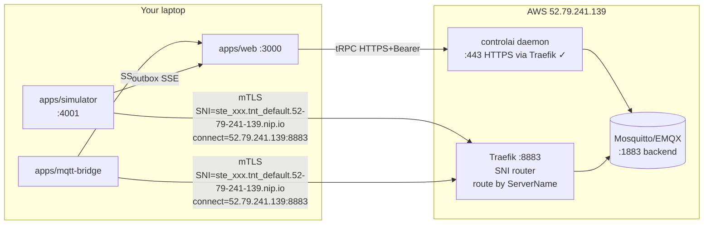

# AWS Gateway Simulator — Session Handoff

## TL;DR for the next agent

The previous session implemented the gateway simulator subsystem entirely (DB model, Prisma migration applied to Neon, simulator service, tRPC router, mqtt-bridge CBOR decode, Gateways UI tab, canvas integration, Sensor I/O Stream widget, "Issue from daemon" button). It works conceptually but cannot connect to the project's actual broker because the project points at an **AWS daemon** whose MQTT port 8883 is closed to the public and whose tenant has no `Domain` set (so SNI routing is broken). The user picked **Option A**: open AWS, set domain, add SNI override fields to Gateway, wire SNI in simulator + bridge.

Critical context the next agent **must internalize before any code changes**:

1. **The project's daemon is at `https://api.52-79-241-139.nip.io`**, NOT localhost. ControlaiInstance row id `cmpjyi83600099ayk5vc2gwh1` (`aws-seoul`). There is a local daemon process running on a unix socket only — ignore it.
2. **Broker port 8883 is currently closed** on the AWS instance — verified via `nc -zv 52.79.241.139 8883 → Connection refused`. Some of this work is on the user (security group + Traefik listener); some is on you (code).
3. **Tenant `tnt_default` has `"Domain": ""`** on the AWS daemon. SNI hostname formula in `/Users/8bitnyan/Documents/ThinkTank/controlai/internal/daemon/server.go:860` is `{siteId}.{tenantId}.{tenant.Domain}`. Empty domain → unroutable hostname. Must be set to `52-79-241-139.nip.io` (recommended — wildcard DNS covers any subdomain) before re-apply.
4. **The Apply path bugs are fixed** in `packages/api/src/lib/apply-planner.ts` and `packages/api/src/routers/apply.ts` (paths corrected, daemon-state fetch shared between preview/commit, Site row auto-created, callDaemon tolerates empty bodies). The user has **not yet re-run Apply on AWS** after the tenant domain is set — that is part of the user's work below.
5. **Reference modules_cloud-main `/internal/mqtt/client.go:170-203`** for the canonical mTLS + SNI client config pattern — that's the spec the simulator and bridge must match.

---

## Architecture (target state)



The key insight: TCP connect goes to the public IP / public hostname, but TLS SNI **must** carry the per-site SNI hostname for Traefik to route to the right backend AND for the broker's server cert to validate (cert SAN includes the SNI hostname).

---

## USER WORK (blocking — must happen before agent's code work matters)

### `aws-sg-8883` — Open TCP 8883 on the AWS security group

```bash
# Find the instance + SG (run on your laptop with aws cli configured for ap-northeast-2)
INSTANCE_ID=$(aws ec2 describe-instances \
  --filters "Name=ip-address,Values=52.79.241.139" \
  --query 'Reservations[0].Instances[0].InstanceId' --output text)
SG_ID=$(aws ec2 describe-instances --instance-ids "$INSTANCE_ID" \
  --query 'Reservations[0].Instances[0].SecurityGroups[0].GroupId' --output text)

# Open 8883 (TLS-MQTT) to the world. Tighten to your laptop's IP if you prefer.
aws ec2 authorize-security-group-ingress \
  --group-id "$SG_ID" --protocol tcp --port 8883 --cidr 0.0.0.0/0
```

Verify after:
```bash
nc -zv 52.79.241.139 8883   # expect "succeeded"
```

### `aws-traefik-mqtt` — Ensure Traefik on AWS has the :8883 entrypoint

SSH into the box and check `/etc/traefik/traefik.yml` (or wherever the project deploys it) has:

```yaml
entryPoints:
  mqtts:
    address: ":8883"
    # optional: tls-passthrough on the TCP router so per-site server cert is presented
```

And that the daemon-generated TCP routers per site exist under `/etc/traefik/dynamic/sites/*.yml` with rules like `HostSNI(\`ste_xxx.tnt_default.52-79-241-139.nip.io\`)`. If not, the daemon's `renderAndWriteSite` may need to be invoked after `tenant-set-domain` below — re-apply triggers this.

### `tenant-set-domain` — Set `Domain` on the AWS `tnt_default` tenant

```bash
# Get the bearer token (already encrypted in Neon Postgres; easiest is to read it via the inspect script pattern from chat history)
# Then:
TOKEN='<paste>'
curl -X PATCH https://api.52-79-241-139.nip.io/v1/tenants/tnt_default \
  -H "Authorization: Bearer $TOKEN" \
  -H "Content-Type: application/json" \
  -d '{"domain":"52-79-241-139.nip.io"}'

# Verify:
curl https://api.52-79-241-139.nip.io/v1/tenants/tnt_default -H "Authorization: Bearer $TOKEN"
# Expect: "Domain":"52-79-241-139.nip.io"
```

Why `52-79-241-139.nip.io`? It's a wildcard public DNS — any subdomain (`ste_xxx.tnt_default.52-79-241-139.nip.io`) resolves to the AWS public IP automatically. No DNS work needed.

### `apply-pipeline-aws` — Re-run Apply on the project after the above

In the web UI, open `/orgs/cmpjlhxq20003mc3idytw2ica/projects/cmpjyscdh000bb4lxs8ol711z/site-groups/cmpjyzwrz000db95tu9uusq4b`, click **Apply** → **Confirm**. With the domain now set and Apply path fixes in place, expect:
- All ops succeed (createSite is idempotent on 409, updateTsdb works at `/v1/tenants/{tid}`)
- Postgres Site row created with `controlaiTenantId=tnt_default`, `controlaiSiteId=ste_<uuid>`
- Daemon re-renders broker compose with new cert SANs matching `{siteId}.tnt_default.52-79-241-139.nip.io`
- Reconciler restarts broker containers

If apply still fails, copy the exact ApplyRun row from Neon Postgres (id, success, resultJson) and surface to next agent.

---

## AGENT WORK (do these in order; each step has a hard checkpoint)

### `db-add-sni-fields` — Add SNI override fields to Gateway model

**File:** `packages/db/prisma/schema.prisma`

Add three optional fields to the existing `Gateway` model (do NOT touch any other field):

```prisma
model Gateway {
  // ... existing fields ...
  tlsServername    String?  // SNI ServerName override; if null, simulator/bridge uses URL host
  brokerHost       String?  // TCP connect target; if null, derived from endpointURL
  brokerPort       Int?     // TCP connect port; if null, derived from endpointURL (default 8883)
}
```

Why three: in the SNI-routing world, **TCP connect target** (public IP / nip.io hostname) is decoupled from **TLS ServerName** (per-site SNI). `endpointURL` should remain the canonical URL displayed to users; the new fields are advanced overrides.

Apply with:
```bash
INSTANCE_TOKEN_KEY=... DATABASE_URL=... pnpm -F @controlai-web/db exec prisma db push
```
(Migrations are managed via `db push` — Neon was never baselined. There's a stale migration folder at `packages/db/prisma/migrations/20260525000000_add_gateway/` that can stay as historical reference; do NOT add new ones, just push.)

**Checkpoint:** `grep -A3 'tlsServername' packages/db/prisma/schema.prisma` shows the new fields. `pnpm -F @controlai-web/db typecheck` clean.

---

### `gateway-router-sni` — Accept new fields in tRPC create/update + return in DTO

**File:** `packages/api/src/routers/gateway.ts`

- `create` input zod: add `tlsServername: z.string().optional()`, `brokerHost: z.string().optional()`, `brokerPort: z.number().int().min(1).max(65535).optional()`. Pass through to prisma.create.
- `update` input zod: same three as optional.
- `list` / `get` projection: include the three fields in the DTO returned.
- `GatewayDTO` in `packages/shared-types/src/gateway.ts`: add `tlsServername: string | null; brokerHost: string | null; brokerPort: number | null;` and update all the places that construct a DTO (search for `GatewayDTO[\`'"]` patterns).
- `simulator-client.ts`: no changes (the simulator reads from DB directly).

**Checkpoint:** `pnpm -F @controlai-web/api typecheck` clean; `pnpm -F @controlai-web/shared-types typecheck` clean.

---

### `simulator-sni` — Wire SNI in simulator MQTT connect

**File:** `apps/simulator/src/manager.ts`

Find the `mqtt.connect(gw.endpointURL, { ... })` call. Currently it relies on the URL hostname for both TCP connect and TLS servername.

Replace with:

```ts
// Parse endpointURL for default TCP target + servername
const url = new URL(gw.endpointURL);
const tcpHost = gw.brokerHost ?? url.hostname;
const tcpPort = gw.brokerPort ?? (url.port ? Number(url.port) : 8883);
const servername = gw.tlsServername ?? url.hostname;

// mqtt.js connect URL is what determines TCP target; pass servername via tls opts
const connectUrl = `mqtts://${tcpHost}:${tcpPort}`;

const client = mqtt.connect(connectUrl, {
  clientId: gw.clientId,
  clean: true,
  reconnectPeriod: 5000,
  ca: rootCaPem,
  cert: clientCertPem,
  key: clientKeyPem,
  rejectUnauthorized: true,
  servername,             // SNI override — critical for Traefik SNI routing + cert SAN validation
  // existing LWT block stays as-is
  ...
});
```

Also: load the three new fields in `loadGateway()` so they're on the runtime DTO.

**Checkpoint:** `pnpm -F @controlai-web/simulator typecheck` clean. Manual smoke: start simulator, create a gateway with `brokerHost=52.79.241.139`, `brokerPort=8883`, `tlsServername=ste_<...>.tnt_default.52-79-241-139.nip.io`, paste daemon-issued cert, Start. Tail simulator logs — should reach `'Gateway connected'` if AWS work is done.

---

### `bridge-sni` — Same SNI fix in mqtt-bridge

**File:** `apps/mqtt-bridge/src/broker-registry.ts` (build the BrokerConfig) and `apps/mqtt-bridge/src/mqtt-manager.ts` (consume it).

The bridge currently builds `mqtts://{instance.baseURL.hostname}:8883` and has no SNI override. Mirror the simulator's pattern: BrokerConfig gains `servername`, `host`, `port`; manager uses them in `mqtt.connect(url, {servername, ...})`.

Source of these overrides for the bridge: read from the Site row (the AWS site exposes the SNI hostname via daemon GET → derive). Easiest: store on Site row when Apply succeeds (extend the auto-create-Site branch in `packages/api/src/routers/apply.ts` to also compute and stamp `tlsServername = '${siteId}.${tenantId}.${tenant.Domain}'` after fetching the tenant). Tenant domain needs to be fetched from the daemon — add a one-off `callDaemon` to `/v1/tenants/{tid}` inside the createSite-success branch.

**Checkpoint:** `pnpm -F @controlai-web/mqtt-bridge typecheck` clean. Bridge connects after Apply.

---

### `dialog-sni-ui` — Expose new fields in GatewayDialog

**File:** `apps/web/components/gateways/gateway-dialog.tsx`

In the Identity tab, under `endpointURL`, add a collapsible "Advanced (SNI routing)" section with three inputs:
- `brokerHost` — placeholder "52.79.241.139 (overrides endpointURL host)"
- `brokerPort` — placeholder "8883"
- `tlsServername` — placeholder "ste_xxx.tnt_default.52-79-241-139.nip.io"

Pass through to the create/update mutation. Show a small help tooltip explaining "Required when broker public hostname differs from SNI cert hostname (Traefik SNI routing)."

**Bonus:** add a "Detect from project" button — calls a new tRPC procedure `gateway.detectBrokerEndpoint({orgId, siteGroupId})` that:
1. Queries the project's Site row → gets `controlaiTenantId`, `controlaiSiteId`
2. Calls daemon `GET /v1/tenants/{tid}` → reads `Domain`
3. Returns `{brokerHost: <instance.baseURL.hostname>, brokerPort: 8883, tlsServername: '${siteId}.${tid}.${domain}'}`
This auto-fills all three.

**Checkpoint:** `pnpm -F web typecheck` clean. Visual: new fields render, "Detect from project" pre-fills correctly.

---

### `discover-broker-url` — Surface broker endpoint to UI

**File:** new tRPC procedure in `packages/api/src/routers/gateway.ts`:

```ts
detectBrokerEndpoint: orgProcedure
  .input(z.object({ orgId: z.string().cuid(), siteGroupId: z.string().cuid() }))
  .query(async ({ ctx, input }) => {
    // (1) find Site; (2) fetch tenant from daemon; (3) build SNI hostname
    // return { brokerHost, brokerPort, tlsServername, endpointURL }
  }),
```

Wire to the "Detect from project" button above.

---

### `e2e-verify` — Manual end-to-end verification

1. (User work above complete: SG open, Traefik :8883 up, tenant domain set, Apply succeeds)
2. (Agent work above complete: SNI fields + UI shipped)
3. Create gateway:
   - Label: "AWS sim 1"
   - Mode: `cbor-modules-cloud`
   - groupId: `sim-grp-1`
   - clientId: `simgw1`
   - endpointURL: `mqtts://52.79.241.139:8883` (display only after our changes)
   - Click "Detect from project" → fills brokerHost/Port/tlsServername
   - Credentials → "Issue from daemon" → fills 3 PEMs
   - Sensors → add temp-1 (15-35 °C, walk 0.5, 1000ms)
   - Save
4. Start the gateway. Tail simulator logs; expect:
   ```
   Gateway connected
   NBIRTH published
   NDATA published x N
   ```
5. Open dashboard → Add widget "Sensor I/O Stream" → pick the gateway:
   - Left pane (outbox) shows NBIRTH + NDATA at 1Hz
   - Right pane (inbound via mqtt-bridge) shows the same messages after a few seconds (CBOR decoded)
6. Stop the gateway → NDEATH appears in outbox; inbound stops.

**If left pane is empty**: simulator never connected. Check simulator logs for TLS handshake errors. Common causes: wrong SNI (cert SAN mismatch), wrong rootCA (not the daemon's CA), broker not reachable (firewall).

**If left has but right doesn't**: mqtt-bridge isn't subscribing. Check bridge logs. Likely the bridge also needs SNI override (step `bridge-sni`).

**If both panes show but no decode**: CBOR decode path in `apps/mqtt-bridge/src/mqtt-manager.ts` mishandles the payload. Inspect a raw message buffer in the bridge log.

---

## Files touched in the previous session (so the next agent can grep for context)

```
packages/db/prisma/schema.prisma                         (Gateway model)
packages/db/prisma/migrations/20260525000000_add_gateway/migration.sql
packages/shared-types/src/gateway.ts                     (DTO + payload shapes)
packages/shared-types/src/index.ts                       (re-export)
apps/simulator/                                          (entire app — new)
packages/api/src/routers/gateway.ts                      (tRPC router + previewIssueFromDaemon added this session)
packages/api/src/routers/apply.ts                        (fetchDaemonState helper, auto-create Site, this session)
packages/api/src/lib/apply-planner.ts                    (path fixes, this session)
packages/api/src/lib/daemon-client.ts                    (empty-body tolerance, this session)
packages/api/src/lib/simulator-client.ts                 (HTTP forwarder to apps/simulator)
packages/api/src/root.ts                                 (gateway router registered)
apps/mqtt-bridge/src/mqtt-manager.ts                     (CBOR decode added)
apps/web/components/gateways/gateway-dialog.tsx          (Issue-from-daemon button added this session)
apps/web/components/gateways/gateways-client.tsx
apps/web/components/dashboard/widgets/sensor-io-stream.tsx
apps/web/components/dashboard/add-widget-dialog.tsx
apps/web/app/(app)/orgs/[orgId]/projects/[projectId]/site-groups/[siteGroupId]/gateways/page.tsx
apps/web/components/canvas/canvas-context.tsx
apps/web/components/canvas/canvas.tsx                    (manual Save button, original session)
apps/web/components/canvas/nodes/node-config-dialog.tsx
apps/web/.env.local                                      (SIMULATOR_API_TOKEN appended)
apps/simulator/.env.local                                (created with shared secrets)
```

## Anti-patterns to avoid (re-stating the platform rules for the next agent)

- **Do NOT** spawn `bgagent_task({agent:'ralph-agent'})` directly; only `ralph_loop_start` may spawn it.
- **Do NOT** modify `/Users/8bitnyan/Documents/ThinkTank/controlai/**` (the Go daemon source) or `/Users/8bitnyan/Documents/ThinkTank/modules_cloud-main/**` (reference). Both are read-only.
- **Do NOT** silence type errors with `as any`, `@ts-ignore`, `@ts-expect-error`.
- **Do NOT** add prisma migrations — use `db push` against Neon.
- **Always** verify with `pnpm -r run typecheck` after edits.

## Open design question for the next session

The current Gateway model treats `clientId` as a single MQTT client identifier. modules_cloud's `EDGE_NODE_ID` is a 24-char hex UUID. The simulator dialog lets users type anything. Decide whether to enforce a 24-char hex regex on `clientId` when `mode='cbor-modules-cloud'` to mimic the spec faithfully, or stay permissive. Defer to user input.
