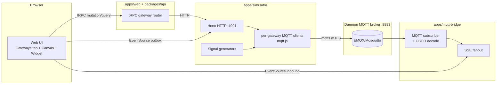

# Gateway Simulator — Implementation Plan

## Goal

Add a **gateway simulator** subsystem to controlai-web that mimics a physical board connecting to the controlai MQTT broker via mTLS. The simulator must:

1. Accept manual credential input (rootCA + clientCert + clientKey + endpointURL) just like a physical board would — modeled after `/Users/8bitnyan/Documents/ThinkTank/modules_cloud-main`'s gateway onboarding.
2. Optionally pre-fill those creds by invoking the daemon's PKI issuance endpoint.
3. Publish realistic sensor data (random-walk per configured sensor) to the broker in either `cbor-modules-cloud` (Sparkplug-style NBIRTH/NDATA/NDEATH) or `json` mode.
4. Surface live outbound (simulator → broker) and inbound (broker → mqtt-bridge → SSE) data side-by-side in a new dashboard widget.

## Reference: modules_cloud-main credential surface

From the explorer pass (full evidence in chat history above):

- Topic: `modules/{GROUP_ID}/{MSG_TYPE}/{EDGE_NODE_ID}[/{DEVICE_ID}]`
- Payload: CBOR with fields `{id, type, version, state, stateMSG, info, settings}`
- Message types: NBIRTH (QoS 1, on connect), NDATA (QoS 0, periodic), NDEATH (QoS 1, LWT), DBIRTH/DDATA/DDEATH (per-device)
- Auth: per-group mTLS, CN = GROUP_ID
- Minimal surface: `{rootCA, clientCert, clientKey, endpointURL, groupID, clientID}`
- Reference files (DO NOT modify, read-only context):
  - `/Users/8bitnyan/Documents/ThinkTank/modules_cloud-main/internal/mqtt/client.go:18-110`
  - `/Users/8bitnyan/Documents/ThinkTank/modules_cloud-main/internal/mqtt/topic.go:1-58`
  - `/Users/8bitnyan/Documents/ThinkTank/modules_cloud-main/docs/mqtt-spec.md`

## Architectural decisions (user-confirmed)

| Decision                     | Choice                                                                                                                                                  |
| ---------------------------- | ------------------------------------------------------------------------------------------------------------------------------------------------------- |
| Runtime location             | New `apps/simulator` Node service. Real MQTT publish to broker.                                                                                         |
| Protocol modes               | Both `cbor-modules-cloud` (full NBIRTH/NDATA/NDEATH lifecycle, LWT) AND `json` (arbitrary topic, JSON payload). Per-gateway `mode` field.               |
| Credential UI                | Canvas gateway-node config dialog AND new `/site-groups/[id]/gateways` tab — both bound to the same `Gateway` Postgres row.                             |
| Visualization                | New "Sensor I/O Stream" dashboard widget: left pane = simulator outbox (own SSE), right pane = existing mqtt-bridge SSE inbound.                        |
| Data model                   | New `Gateway` Prisma model. FK → SiteGroup. Encrypted PEMs at rest using existing `crypto.ts` helper (CERT_ENC_KEY).                                    |
| Process model                | Single long-running `apps/simulator` service, multi-gateway. tRPC `gateway.start/stop/status` proxy to its HTTP API.                                    |
| Cert input                   | Paste textareas + "Issue from daemon" button (re-uses existing PKI flow: `POST /v1/tenants/{tid}/sites/{sid}/pki/certs`).                               |
| Signal generator             | Bounded random walk with Gaussian step: `value = clamp(prev + gauss(0, walkStep), min, max)`. Per-sensor seed. Initial = midpoint.                      |
| Sensor config                | `Gateway.sensors: Json` = array of `{id, type: 'temperature'\|'pressure'\|'humidity'\|'vibration', min, max, walkStep, intervalMs, unit?}`.             |
| Web↔sim communication        | Simulator runs Hono HTTP server on `SIMULATOR_PORT` (default 4001). tRPC mutations forward via fetch. Status SSE on `/events`. Outbox SSE on `/gateways/:id/outbox`. |
| Token auth (browser → sim)   | Reuse existing JWT pattern from `packages/api/src/routers/stream.ts`. New tRPC `simulator.streamToken({gatewayId})` mints HS256 JWT.                     |
| Cert rotation                | Block "Issue from daemon" when gateway is running. UI must show clear error if attempted.                                                               |
| Gateway delete               | On delete: if running and `mode='cbor-modules-cloud'`, publish NDEATH (QoS 1, retain false) before disconnect. Then remove row. Audit log entry.        |
| Widget rate-limit            | Each pane holds last 100 messages in browser state. Throttle DOM updates to 5 Hz (batch every 200ms).                                                   |
| Ingestion path               | Simulator publishes to the SAME broker mqtt-bridge subscribes to. mqtt-bridge gains CBOR decode path so existing widgets light up.                      |
| Dev runner                   | `pnpm dev` at root spawns simulator alongside web/mqtt-bridge via turbo `dev` task.                                                                     |

## Architecture



## Implementation Steps

### Step `db` — Prisma model + migration

`packages/db/prisma/schema.prisma`:

```prisma
model Gateway {
  id            String   @id @default(cuid())
  siteGroupId   String
  siteGroup     SiteGroup @relation(fields: [siteGroupId], references: [id], onDelete: Cascade)
  label         String
  kind          String   // 'simulator' | 'physical'
  mode          String   // 'cbor-modules-cloud' | 'json'
  endpointURL   String   // e.g. "mqtts://broker.example.com:8883"
  groupId       String   // modules_cloud GROUP_ID — used as CN in cert and topic segment
  clientId      String   // MQTT client id — for cbor mode this is also EDGE_NODE_ID
  rootCaPemEnc  Bytes    // encrypted via crypto.ts encryptToken
  clientCertPemEnc Bytes
  clientKeyPemEnc  Bytes
  sensors       Json     // [{id, type, min, max, walkStep, intervalMs, unit?, seed?}]
  jsonTopicTemplate String? // optional, e.g. "sites/{siteId}/sensors/{sensorId}"; used only when mode='json'
  desiredState  String   @default("stopped") // 'stopped' | 'running'
  lastStatus    String   @default("stopped") // last reported runtime status
  lastError     String?
  createdAt     DateTime @default(now())
  updatedAt     DateTime @updatedAt
  @@index([siteGroupId])
}

// Add reverse relation on existing SiteGroup model:
// gateways      Gateway[]
```

Add a Prisma migration (`packages/db/prisma/migrations/<ts>_add_gateway/migration.sql`). Run `pnpm -F @controlai-web/db exec prisma generate`.

### Step `shared` — shared-types

`packages/shared-types/src/gateway.ts` (new file, exported from `index.ts`):

```ts
export type GatewayKind = 'simulator' | 'physical';
export type GatewayMode = 'cbor-modules-cloud' | 'json';
export type GatewayStatus = 'stopped' | 'connecting' | 'connected' | 'error' | 'disconnected';
export type SensorType = 'temperature' | 'pressure' | 'humidity' | 'vibration';

export interface SensorConfig {
  id: string;
  type: SensorType;
  min: number;
  max: number;
  walkStep: number;
  intervalMs: number;
  unit?: string;
  seed?: number;
}

export interface GatewayDTO {
  id: string;
  siteGroupId: string;
  label: string;
  kind: GatewayKind;
  mode: GatewayMode;
  endpointURL: string;
  groupId: string;
  clientId: string;
  sensors: SensorConfig[];
  jsonTopicTemplate: string | null;
  desiredState: 'stopped' | 'running';
  lastStatus: GatewayStatus;
  lastError: string | null;
}

// modules_cloud-main CBOR payload schema (top-level fields):
export interface CborBirthPayload {
  id: Buffer;          // 12-byte gateway uuid
  type: string;        // 'MAIN'
  version: number;     // u32 firmware version
  state: 'NORMAL';
  stateMSG: string;
  info: Record<string, unknown>;
  settings: Record<string, unknown>;
}

export interface CborDataPayload extends Omit<CborBirthPayload, 'settings'> {
  // settings omitted on NDATA
  readings: Array<{ sensorId: string; value: number; ts: number }>;
}
```

### Step `simulator` — `apps/simulator` Node service

Create `apps/simulator/` with:
- `package.json` (private, name `@controlai-web/simulator`, deps: `mqtt`, `cbor-x`, `hono`, `@hono/node-server`, `@controlai-web/db`, `@controlai-web/shared-types`, `pino`, `jose`)
- `tsconfig.json` extending root
- `src/index.ts` — boot Hono server on `process.env.SIMULATOR_PORT ?? 4001`, mount routes
- `src/manager.ts` — `SimulatorManager` class:
  - `Map<gatewayId, GatewayRuntime>` of active clients
  - `start(gatewayId)`: load Gateway row from DB, decrypt PEMs, create mqtt.js client with TLS opts `{ca, cert, key, rejectUnauthorized: true}`, set LWT (`willMessage`) to NDEATH bytes if cbor mode, on `connect` publish NBIRTH (cbor) and start sensor intervals, emit status `connected`
  - `stop(gatewayId)`: graceful — publish NDEATH explicitly (cbor mode), end client, clear intervals, update DB `desiredState='stopped'`, `lastStatus='stopped'`
  - `status(gatewayId)`: read from internal map; fallback to DB `lastStatus`
  - emits `gatewayStatus` and `gatewayOutbox` events through an internal `EventEmitter` for SSE fanout
- `src/cbor-codec.ts` — `encodeNbirth(g, sensors)`, `encodeNdata(g, readings)`, `encodeNdeath()`, with topic builders `topicFor(g, msgType)` returning `modules/{groupId}/{msgType}/{clientId}`
- `src/signal-generator.ts` — `class SignalGenerator { constructor(cfg: SensorConfig) {} next(): number }` using bounded gaussian random walk; deterministic with seeded PRNG (`mulberry32` or similar) when `cfg.seed` provided
- `src/routes.ts` — Hono routes:
  - `POST /gateways/:id/start` → manager.start
  - `POST /gateways/:id/stop` → manager.stop
  - `GET /gateways/:id/status` → manager.status
  - `GET /events` → SSE of all status changes (requires `?token=` JWT, same HS256 secret as web stream router)
  - `GET /gateways/:id/outbox` → SSE of that gateway's outbound publish events (token-gated)
- `src/jwt.ts` — verify HS256 JWT using `process.env.STREAM_JWT_SECRET` (same env var as `packages/api/src/routers/stream.ts`)
- `src/boot-reconcile.ts` — on startup, load all `Gateway` rows where `desiredState='running'` and call `manager.start` for each
- `src/dev.ts` — entry point used by `pnpm dev` (tsx watch); production entry is `dist/index.js`

Scripts: `dev` (tsx watch src/index.ts), `build` (tsc), `start` (node dist/index.js), `typecheck`, `lint`.

### Step `trpc` — tRPC gateway router

`packages/api/src/routers/gateway.ts` (new file). Register in `packages/api/src/root.ts` as `gateway: gatewayRouter`.

Procedures (all `orgProcedure`):
- `list({ orgId, siteGroupId })` → `GatewayDTO[]` (omit PEMs)
- `get({ orgId, gatewayId })` → `GatewayDTO`
- `create({ orgId, siteGroupId, label, kind, mode, endpointURL, groupId, clientId, rootCaPem, clientCertPem, clientKeyPem, sensors, jsonTopicTemplate? })` — encrypt PEMs, insert
- `update({ orgId, gatewayId, ...partial })` — encrypt any new PEMs, update non-cred fields freely; if status not 'stopped' refuse PEM/endpoint changes
- `delete({ orgId, gatewayId })` — if running, call simulator stop first (which publishes NDEATH for cbor mode), then delete row, audit
- `issueFromDaemon({ orgId, gatewayId, siteId })` — refuse if gateway.lastStatus !== 'stopped'; calls daemon `POST /v1/tenants/{tid}/sites/{sid}/pki/certs` body `{gateway: gateway.groupId}`; daemon returns `{cert_pem, key_pem, fingerprint, ...}`; also fetch root CA via existing daemon endpoint (or, if no public endpoint, store on instance row — confirm by reading daemon source); update gateway's encrypted PEM fields; return only `{fingerprint, not_after}` to UI
- `start({ orgId, gatewayId })` → forward to simulator HTTP `POST /gateways/:id/start`; set `desiredState='running'`
- `stop({ orgId, gatewayId })` → forward to simulator HTTP `POST /gateways/:id/stop`; set `desiredState='stopped'`
- `status({ orgId, gatewayId })` → fetch from simulator HTTP `GET /gateways/:id/status`; fall back to DB on error
- `streamToken({ orgId, gatewayId })` → mint HS256 JWT (5min expiry) with claims `{gatewayId, kind: 'outbox'}` so browser can open EventSource directly to simulator outbox endpoint; return `{token, outboxUrl, eventsUrl}` where URLs come from `SIMULATOR_PUBLIC_URL` env

Forward helper: `lib/simulator-client.ts` does `fetch(`${process.env.SIMULATOR_INTERNAL_URL}/gateways/${id}/start`, {method: 'POST', headers: {authorization: `Bearer ${process.env.SIMULATOR_API_TOKEN}`}})`. SIMULATOR_API_TOKEN is a shared secret env (added to `.env.example`).

### Step `bridge-cbor` — mqtt-bridge CBOR decode

`apps/mqtt-bridge/src/mqtt-manager.ts`: when a message arrives on a topic matching `modules/+/+/+` (or generally any topic), attempt CBOR decode if topic starts with `modules/`; otherwise fall through to JSON parse. The decoded message must be re-shaped to the existing `{nodeId, siteId, topic, payload, timestamp}` envelope so downstream SSE clients don't change. Add dep `cbor-x`.

Edge case: invalid CBOR/JSON → log warn, still forward the raw base64-encoded buffer with a `parseError` field set, so widgets can show "malformed payload" instead of swallowing.

### Step `ui-gw-tab` — Gateways tab

`apps/web/app/(app)/orgs/[orgId]/projects/[projectId]/site-groups/[siteGroupId]/gateways/page.tsx` (new page):
- Layout: heading + "New gateway" button + table of gateways
- Columns: label, kind, mode, status badge (color-coded), endpoint, last error, actions (Start/Stop toggle, Edit, Delete)
- "New gateway" opens `<GatewayDialog>` (new component): tabs "Identity" (label, kind, mode, groupId, clientId, endpointURL) / "Credentials" (3 textarea: rootCA / clientCert / clientKey, + "Issue from daemon" button next to the latter two — disabled when status != stopped, tooltip explaining why) / "Sensors" (table with add/remove rows, fields: type select, min, max, walkStep, intervalMs, unit) / "JSON topic" (only when mode='json'; template field with `{siteId}`/`{sensorId}` token help)
- Same dialog re-used from canvas (step `ui-canvas`)
- Add nav link "Gateways" in the SiteGroup detail page header next to existing tabs

### Step `ui-canvas` — Canvas gateway-node integration

`apps/web/components/canvas/nodes/gateway-node.tsx`: extend the node-config-dialog to either pick an existing Gateway row (dropdown of `gateway.list`) or create a new one inline (re-uses the `<GatewayDialog>` from `ui-gw-tab`). The selected `gatewayId` is stored in the node's `data` blob. StatusDot color now derives from `gateway.status` query (5s poll) instead of the placeholder.

### Step `ui-widget` — Sensor I/O Stream widget

`apps/web/components/dashboard/widgets/sensor-io-stream.tsx`:
- Two-column split (left: Outbound, right: Inbound)
- Per-side: gateway picker (dropdown of gateways for current siteGroup), connection status pill, scrolling list of last 100 messages: `{ts, topic, summary}` where summary is `mode='json' ? JSON.stringify(payload).slice(0,80) : '<CBOR ' + readings.length + ' readings>'`
- Outbound source: `EventSource` to simulator `/gateways/:id/outbox?token=<jwt>` (token from `simulator.streamToken`)
- Inbound source: existing `useSiteStream` hook, filtered to topics matching the gateway's topic-prefix (`modules/{groupId}/` for cbor, jsonTopicTemplate prefix for json)
- DOM update throttle: batch incoming messages and flush at 200ms intervals (use `useThrottledListAppender` helper — write inline if needed)

`apps/web/components/dashboard/add-widget-dialog.tsx`: register the new widget type `sensor-io-stream` with label "Sensor I/O Stream" and default layout size `{w:8, h:4}`.

### Step `dev-script` — turbo + env

- Root `turbo.json`: ensure `dev` pipeline includes `@controlai-web/simulator`
- Root `package.json`: `pnpm dev` script must spawn the new app (likely via existing turbo dev task)
- `apps/web/.env.example` and `apps/simulator/.env.example`: document `SIMULATOR_INTERNAL_URL` (default `http://localhost:4001`), `SIMULATOR_PUBLIC_URL` (default same — browser also hits localhost in dev), `SIMULATOR_API_TOKEN` (shared secret), `STREAM_JWT_SECRET` (already exists; reuse), `CERT_ENC_KEY` (already exists; reuse), `SIMULATOR_PORT` (default 4001)
- Add a top-level README section "Running the simulator" (3-5 lines, where to look in this plan)

### Step `verify` — final verification (deterministic gates below)

## Success Criteria (deterministic)

These are the criteria the Ralph verifier will check. Every must pass for the run to be considered done.

1. **typecheck** all packages: `pnpm -r run typecheck` exits 0
2. **lint** all packages: `pnpm -r run lint` exits 0
3. **build** all packages (web build is the slow gate): `DATABASE_URL='postgresql://x:x@localhost:5432/x' pnpm -r run build` exits 0
4. New app exists: `apps/simulator/package.json` present
5. New Prisma model: `grep -q '^model Gateway' packages/db/prisma/schema.prisma`
6. New router file: `packages/api/src/routers/gateway.ts` present
7. Router registered in root: `grep -q 'gateway:' packages/api/src/root.ts`
8. Shared types: `packages/shared-types/src/gateway.ts` present and re-exported in `packages/shared-types/src/index.ts`
9. Bridge CBOR path: `grep -q 'cbor' apps/mqtt-bridge/src/mqtt-manager.ts` (case-insensitive OK)
10. Widget file: `apps/web/components/dashboard/widgets/sensor-io-stream.tsx` present
11. Widget registered: `grep -q 'sensor-io-stream' apps/web/components/dashboard/add-widget-dialog.tsx`
12. Gateways tab page: `apps/web/app/(app)/orgs/[orgId]/projects/[projectId]/site-groups/[siteGroupId]/gateways/page.tsx` present

## Constraints

- DO NOT modify `/Users/8bitnyan/Documents/ThinkTank/modules_cloud-main/**` (read-only reference).
- DO NOT modify the controlai Go daemon at `/Users/8bitnyan/Documents/ThinkTank/controlai/**`.
- DO NOT add `as any`, `@ts-ignore`, `@ts-expect-error` to silence type errors.
- DO NOT break existing functionality — verify by typecheck/lint/build.
- DO use the existing `packages/api/src/lib/crypto.ts` for PEM encryption/decryption.
- DO follow the existing tRPC procedure naming conventions (see `packages/api/src/routers/site.ts`, `nodeConfig.ts`).
- DO follow the existing Prisma model conventions (cuid IDs, createdAt/updatedAt, FK relations).
