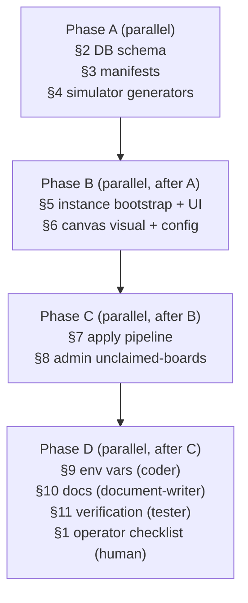

# Plan: Default Daemon Sandbox Implementation

## Background & Research

This plan executes the OpenSpec change `add-default-daemon-sandbox` whose proposal/design/tasks are already authored at `openspec/changes/add-default-daemon-sandbox/`. Full design context lives in `.slash/workspace/plans/spec/add-default-daemon-sandbox/briefing.md` (35 locked Q/A decisions + research references). All scope, naming, port topology, and decision rationale is fixed — no further interview is required.

The implementation extends an existing mature canvas (React-Flow + Zustand `canvas-store` + `ApplyModal` preview/commit) and a standalone Hono+mqtt `apps/simulator` process. The daemon side requires **zero** new endpoints — reset semantics are achieved by `DELETE /v1/tenants/{orgId}` + reapply of existing `createTenant` / `createSite` / `configureDriver` / `updateSite` ops in the existing `apply-planner.ts` + `apply-executor.ts`. The 5 synthetic generators (~300 LOC total pure TypeScript) implement the math models documented in `.slash/workspace/research/spec-default-daemon-sandbox-mqtt-faker.md` §3. Multi-tenancy uses `tenantId = Organization.id` (direct 1:1) plus a special `factory-qa-unclaimed` tenant for factory boards.

External research already saved (reference, do not re-run):
- `.slash/workspace/research/spec-default-daemon-sandbox-flowbuilder-ux.md` — UX recommendations R1–R8 (dashed-border, preview-before-apply, sparkline status).
- `.slash/workspace/research/spec-default-daemon-sandbox-mqtt-faker.md` — Math models per generator type.
- `.slash/workspace/research/spec-default-daemon-sandbox-hot-reload.md` — Reset semantics + sandbox shortcuts.

**Key affected file pointers** (from briefing §"Affected code"):
- DB: `packages/db/prisma/schema.prisma` (add `legacy Boolean @default(false)` to `ControlaiInstance`) + migration folder.
- Manifests: `packages/shared-types/src/device-types/manifests/core/generic-*.ts` (7 new files) + `index.ts` registration + `registration.ts` connection rules.
- Simulator: `apps/simulator/src/generators/*.ts` (new), `apps/simulator/src/sensor-config.ts` (extend `SensorConfig` with `pattern` discriminator), `apps/simulator/src/manager.ts` (dispatch on `deviceTypeId`).
- API: `packages/api/src/routers/instance.ts` (add `bootstrapDefault`), `packages/api/src/routers/admin.ts` (new or extend, add `unclaimedBoards.list`), `packages/api/src/lib/apply-planner.ts` + `apply-executor.ts` (3 new ops).
- Auth hook: `apps/web/lib/auth/hooks.ts` (or `packages/api/src/auth/`) — better-auth `org.created`.
- Web: `apps/web/app/(app)/orgs/[orgId]/instances/page.tsx`, `apps/web/app/(app)/admin/unclaimed-boards/page.tsx` (new), `apps/web/components/canvas/nodes/device-node.tsx`, `apps/web/components/canvas/nodes/node-config-dialog.tsx`, `apps/web/components/canvas/nodes/node-sparkline.tsx` (new), `apps/web/components/canvas/apply-modal.tsx`, `apps/web/stores/canvas-store.ts`.
- Env: `apps/web/.env.example` add `DEFAULT_DAEMON_BASE_URL`, `DEFAULT_DAEMON_BEARER_TOKEN`.
- Docs: `docs/default-daemon-deployment.md` (new), `docs/instance-provisioning.md`, `docs/admin-unclaimed-boards.md` (new), `docs/instance-byo-vs-managed.md`.

**Existing patterns to preserve** (do not re-invent):
- `apply-executor.ts` already handles 409 idempotent conflict → reuse for new ops.
- `apply.preview` 10-min plan-hash cache TTL → preserve.
- `Device.parentDeviceKey` already exists → reuse for noise-meter attachment (no schema change).
- `Site.brokerKind` already supports `'mosquitto' | 'emqx'` → just expose in dropdown.
- `Gateway.clientCertPemEnc` already issued by `gateway.issueFromDaemon` → simulator reads as-is (no new auth).
- Existing `canvas-store.updateNodeTelemetry` SSE plumbing → extend, do not replace.

## Testing Plan

TDD ordering is encoded in tasks.md and preserved here verbatim. Three suites must be written-first / RED-then-GREEN:

- [ ] `t3.10`: Write `packages/shared-types/src/__tests__/device-types-new-manifests.test.ts` — assert all 7 manifests load, `assertKnownDeviceType` resolves, `validateConnection` enforces noise-meter→sensor-input parent rule + tilt-linear self-chaining.
- [ ] `t3.11`: Run shared-types test suite → GREEN.
- [ ] `t4.1`: Write `apps/simulator/src/__tests__/typed-generators.test.ts` covering 6 scenarios (TiltGenerator chainLength=2, VibrationGenerator sinusoidal, CrackEncoderGenerator Poisson bursts, NoiseMeterGenerator dBA envelope, VibratingWireGenerator resonance, SensorConfig discriminator parsing).
- [ ] `t4.2`: Confirm typed-generators tests RED.
- [ ] `t4.6`: typed-generators tests GREEN after implementing generators.
- [ ] `t5.2`: Write `packages/api/src/routers/__tests__/instance.test.ts` cases — bootstrapDefault creates, returns idempotent, throws on missing env vars.
- [ ] `t5.4`: Write test for `org.created` better-auth hook firing `bootstrapDefault`.
- [ ] `t5.8`: Write `apps/web/__tests__/instances-page.test.tsx` — verify hidden create button + health pill renders.
- [ ] `t6.5`: Write `apps/web/components/canvas/__tests__/device-node.spec.tsx` (dashed/solid border) + `node-config-dialog.spec.tsx` (synthetic config fields appear when UNREGISTERED).
- [ ] `t7.1`: Write `packages/api/src/routers/__tests__/apply.test.ts` cases — setBrokerKind/setRetentionDays op synthesis, preview diff entries, commit ordering (Site updates before device bindings), idempotency on second apply.
- [ ] `t7.2`: Confirm apply tests RED.
- [ ] `t7.6`: apply tests + apply-modal tests GREEN.
- [ ] `t8.4`: Write `packages/api/src/routers/__tests__/admin.test.ts` — non-admin 403 + query shape.
- [ ] `t11.1`–`t11.9`: Final monorepo typecheck + test sweep.

## Implementation Plan

Tasks are grouped by section per `tasks.md`. Every actionable checkbox below mirrors a frontmatter `todos[].id`. **§1 (operator) and §12 (post-merge) are flagged at the top and excluded from agent execution.**

### §1 Operator manual deployment — NOT agent-executable (skip from code execution batches)
- [ ] `t1.1`: [OPERATOR] Provision t3.medium EC2 in ap-northeast-2.
- [ ] `t1.2`: [OPERATOR] Install Caddy with LE for `default.daemons.controlai.io` → `localhost:8080`.
- [ ] `t1.3`: [OPERATOR] Install `controlai` binary via `../controlai/deploy/install/install.sh` + systemd unit.
- [ ] `t1.4`: [OPERATOR] Bootstrap `factory-qa-unclaimed` tenant via daemon admin API; capture bearer token.
- [ ] `t1.5`: [OPERATOR] Add `daemons.controlai.io` A-record at DNS registrar.
- [ ] `t1.6`: [OPERATOR] Populate prod env vars `DEFAULT_DAEMON_BASE_URL`, `DEFAULT_DAEMON_BEARER_TOKEN`.

### §2 DB schema additions
- [ ] `t2.1`: Add `legacy Boolean @default(false)` column to `ControlaiInstance` in Prisma schema.
- [ ] `t2.2`: `pnpm --filter @controlai-web/db migrate dev --name add_legacy_column`.
- [ ] `t2.3`: Write `packages/db/backfill/backfill-legacy-instances.ts` (mark all existing rows legacy=true).
- [ ] `t2.4`: Verify migration runs cleanly on dev reset / staging.

### §3 Device-type manifests
- [ ] `t3.1`: `generic-main-gateway.ts` — id `core-generic-main-gateway`, gateway category, RS-485x2.
- [ ] `t3.2`: `generic-sensor-input.ts` — sensor, supports noise-meter attach via `parentDeviceKey`.
- [ ] `t3.3`: `generic-tilt-linear.ts` — `chainLength` config 1–16 default 4.
- [ ] `t3.4`: `generic-vibration-tilt-standalone.ts` — accel + tilt combo.
- [ ] `t3.5`: `generic-control-485x2.ts` — 2 RS-485 child slots.
- [ ] `t3.6`: `generic-vibrating-wire-sensor.ts` — resonance frequency + damping.
- [ ] `t3.7`: `generic-noise-meter.ts` — attached child only (no standalone drop).
- [ ] `t3.8`: Wire all 7 manifests into `packages/shared-types/src/device-types/index.ts`.
- [ ] `t3.9`: Update `registration.ts` connection rules (noise-meter parent constraint + tilt-linear self-chain).
- [ ] `t3.10`: Write manifest test suite (load, assertKnown, validateConnection).
- [ ] `t3.11`: shared-types test run GREEN.
- [ ] `t3.12`: `pnpm -r typecheck` GREEN at shared-types boundary.

### §4 Synthetic signal generators (TDD)
- [ ] `t4.1`: Write `typed-generators.test.ts` (6 scenarios).
- [ ] `t4.2`: Confirm RED.
- [ ] `t4.3`: Implement 5 generator classes per research §3.
- [ ] `t4.4`: Extend `SensorConfig` with `pattern` discriminator + pattern-specific fields.
- [ ] `t4.5`: Wire generators into `manager.ts` (per-gateway dispatch on `deviceTypeId`).
- [ ] `t4.6`: Confirm GREEN.

### §5 ControlaiInstance bootstrap + UI
- [ ] `t5.1`: tRPC `instance.bootstrapDefault(orgId)` procedure (idempotent).
- [ ] `t5.2`: Write `instance.test.ts` cases.
- [ ] `t5.3`: Wire better-auth `org.created` hook to call `bootstrapDefault` (swallow errors).
- [ ] `t5.4`: Write hook test.
- [ ] `t5.5`: Write backfill script `packages/api/src/scripts/backfill-default-instances.ts`.
- [ ] `t5.6`: Modify `/orgs/[orgId]/instances/page.tsx` (filter `legacy=false`, hide create button, health pill).
- [ ] `t5.7`: Add `legacy=false` filter to all instance list queries; optional `includeLegacy` flag for admin.
- [ ] `t5.8`: Write `instances-page.test.tsx`.

### §6 Canvas visual + config
- [ ] `t6.1`: `device-node.tsx` dashed/solid border + ghost icon based on `registrationState`.
- [ ] `t6.2`: New `node-sparkline.tsx` (30s rolling) reading `canvas-store` telemetry, SSE-driven.
- [ ] `t6.3`: Extend `node-config-dialog.tsx` Synthetic Signal Config section (`intervalMs`, `valueMin`, `valueMax`, `brokerKind`, `retentionDays`).
- [ ] `t6.4`: Update `canvas-store.ts` (telemetry rolling array + `updateNodeTelemetry` action).
- [ ] `t6.5`: Write `device-node.spec.tsx` + `node-config-dialog.spec.tsx`.

### §7 Apply pipeline extensions (TDD)
- [ ] `t7.1`: Write `apply.test.ts` cases (new ops + preview + ordering + idempotency).
- [ ] `t7.2`: Confirm RED.
- [ ] `t7.3`: Extend `apply-planner.ts` with `setBrokerKind`/`setRetentionDays`/`setIngestMode` ops + synthesis + ordering.
- [ ] `t7.4`: Extend `apply-executor.ts` handlers → `PATCH /v1/tenants/{tid}/sites/{sid}` with 409 idempotency.
- [ ] `t7.5`: Update `apply-modal.tsx` to render new op types with labels.
- [ ] `t7.6`: Confirm GREEN.

### §8 Admin unclaimed-boards route
- [ ] `t8.1`: Create `/admin/unclaimed-boards/page.tsx` with `requireRole(ORG_ADMIN)` guard.
- [ ] `t8.2`: tRPC `admin.unclaimedBoards.list({ orgId })` calling daemon factory-qa-unclaimed tenant.
- [ ] `t8.3`: Render filterable table (realUuid, lastSeenAt, lastSignalPreview).
- [ ] `t8.4`: Write `admin.test.ts`.

### §9 Env vars
- [ ] `t9.1`: Update `apps/web/.env.example`.
- [ ] `t9.2`: Update dev `.env.local` guidance.
- [ ] `t9.3`: Update env README section.

### §10 Documentation
- [ ] `t10.1`: Create `docs/default-daemon-deployment.md` (EC2 + Caddy + systemd + DNS + factory-qa bootstrap + mermaid).
- [ ] `t10.2`: Update `docs/instance-provisioning.md` with Default Daemon (Sandbox) section.
- [ ] `t10.3`: Create `docs/admin-unclaimed-boards.md`.
- [ ] `t10.4`: Update `docs/instance-byo-vs-managed.md` Sandbox tier row.

### §11 Verification
- [ ] `t11.1`–`t11.9`: Per-package typecheck + test, then monorepo-wide `pnpm -r typecheck && pnpm -r test` GREEN.
- [ ] `t11.10`: [OPERATOR] Manual end-to-end staging smoke test.

### §12 Post-merge (OUT OF SCOPE for this plan)
- `12.1`–`12.5`: documented in tasks.md only; NOT scheduled in any phase. Will be authored as separate OpenSpec follow-up changes after this spec archives.

## Delegation Notes

File/dir allowlists below are strict — no two coder agents may touch the same file in the same phase. Each phase MUST complete before the next begins (cross-phase dependencies noted under "Dependencies").

### Phase dependency diagram

### Phase A — fully parallel (3 coder agents, disjoint file trees)

- [ ] **Coder A1 — §2 DB schema** → files: `packages/db/prisma/schema.prisma`, `packages/db/prisma/migrations/**`, `packages/db/backfill/backfill-legacy-instances.ts`. Tasks: `t2.1`, `t2.2`, `t2.3`, `t2.4`.
- [ ] **Coder A2 — §3 device-type manifests** → files: `packages/shared-types/src/device-types/manifests/core/generic-*.ts` (7 new), `packages/shared-types/src/device-types/index.ts`, `packages/shared-types/src/registration.ts`, `packages/shared-types/src/__tests__/device-types-new-manifests.test.ts`. Tasks: `t3.1`–`t3.12`.
- [ ] **Coder A3 — §4 simulator generators (TDD)** → files: `apps/simulator/src/__tests__/typed-generators.test.ts`, `apps/simulator/src/generators/*.ts` (new), `apps/simulator/src/sensor-config.ts`, `apps/simulator/src/manager.ts`. Tasks: `t4.1`–`t4.6`. **MUST write tests first (`t4.1`) and confirm RED (`t4.2`) before implementing (`t4.3`).**

### Phase B — depends on Phase A (2 coder agents, disjoint trees)

- [ ] **Coder B1 — §5 instance bootstrap + auth hook** → files: `packages/api/src/routers/instance.ts`, `packages/api/src/routers/__tests__/instance.test.ts`, `apps/web/lib/auth/hooks.ts` (or wherever better-auth `org.created` lives — Coder B1 must locate via grep before editing), `packages/api/src/scripts/backfill-default-instances.ts`, `apps/web/app/(app)/orgs/[orgId]/instances/page.tsx`, `apps/web/__tests__/instances-page.test.tsx`. Tasks: `t5.1`–`t5.8`. Depends on `t2.1` (legacy column must exist).
- [ ] **Coder B2 — §6 canvas visual + config** → files: `apps/web/components/canvas/nodes/device-node.tsx`, `apps/web/components/canvas/nodes/node-sparkline.tsx` (new), `apps/web/components/canvas/nodes/node-config-dialog.tsx`, `apps/web/stores/canvas-store.ts`, `apps/web/components/canvas/__tests__/device-node.spec.tsx`, `apps/web/components/canvas/__tests__/node-config-dialog.spec.tsx`. Tasks: `t6.1`–`t6.5`. Depends on `t3.1`–`t3.9` (manifests must exist to render new node types) and `t4.4` (`SensorConfig` discriminator shape stable so dialog config matches).

### Phase C — depends on Phase B (2 coder agents, disjoint trees)

- [ ] **Coder C1 — §7 apply pipeline (TDD)** → files: `packages/api/src/routers/__tests__/apply.test.ts`, `packages/api/src/lib/apply-planner.ts`, `packages/api/src/lib/apply-executor.ts`, `packages/api/src/routers/apply.ts`, `apps/web/components/canvas/apply-modal.tsx`. Tasks: `t7.1`–`t7.6`. **MUST write tests first (`t7.1`) and confirm RED (`t7.2`) before implementing.** Depends on Phase B (canvas config fields and instance bootstrap must produce the Site state that the planner reads).
- [ ] **Coder C2 — §8 admin unclaimed-boards** → files: `apps/web/app/(app)/admin/unclaimed-boards/page.tsx` (new), `packages/api/src/routers/admin.ts` (new or extend), `packages/api/src/routers/__tests__/admin.test.ts`. Tasks: `t8.1`–`t8.4`. Depends on Phase B `t5.1` (uses same daemon client / bearer token pattern).

### Phase D — final batch (mixed agent types)

- [ ] **Coder D1 — §9 env vars** → files: `apps/web/.env.example`, `apps/web/.env.local.example` (if present), root env README section. Tasks: `t9.1`–`t9.3`.
- [ ] **Document-writer D2 — §10 docs** → files: `docs/default-daemon-deployment.md` (new), `docs/instance-provisioning.md`, `docs/admin-unclaimed-boards.md` (new), `docs/instance-byo-vs-managed.md`. Tasks: `t10.1`–`t10.4`. Must reference the mermaid diagram from `openspec/changes/add-default-daemon-sandbox/design.md` §"Multi-tenant diagram" verbatim in `t10.1`.
- [ ] **Tester D3 — §11 verification** → executes (does NOT modify code): `pnpm --filter ... typecheck`, `pnpm --filter ... test`, monorepo `pnpm -r typecheck && pnpm -r test`. Tasks: `t11.1`–`t11.9`. Reports first failing suite back to mad-agent for triage. NO file writes other than test result logs under `.slash/workspace/verifications/`.
- [ ] **Human / operator — §1 + `t11.10`** → outside agent scope. Plan surfaces these as a checklist for the human operator at end of run.

### Dependencies

- **A → B**: B1 reads the `legacy` column added in `t2.1`; B2 renders the manifests added in §3 and consumes the `SensorConfig` shape extended in `t4.4`.
- **B → C**: C1's planner synthesizes ops from canvas Site state shaped by B2's config dialog and B1's `ControlaiInstance` bootstrap; C2 reuses the daemon-client/bearer pattern stabilized in B1.
- **C → D**: documentation (D2) references the apply pipeline behavior + admin route shipped in Phase C; verification (D3) must wait until all code lands.
- **TDD intra-phase**: A3 must complete `t4.1` + `t4.2` (RED) before `t4.3`; C1 must complete `t7.1` + `t7.2` (RED) before `t7.3`.

### Risk Areas

- **Better-auth hook location** (B1): the hook file is not pinned in the briefing — Coder B1 MUST `grep -rn "org.created\|createOrganization\|onOrganizationCreate" apps/web packages/api` before editing. If absent, create under `apps/web/lib/auth/hooks.ts` and wire into the existing better-auth config.
- **Sparkline library choice** (B2 / `t6.2`): briefing notes recharts vs uPlot vs inline SVG is an open call. Default recommendation: inline SVG (zero new dep). If recharts is already a dep, prefer reusing it. Coder B2 should NOT add a new charting dep without escalation.
- **Daemon REST endpoint for unclaimed boards** (C2 / `t8.2`): the exact endpoint URL (`GET /v1/tenants/factory-qa-unclaimed/sites` vs an enumerate-devices endpoint) needs confirmation from the daemon contract. Coder C2 should check `packages/api/src/lib/daemon-client.ts` for the existing surface and pick the closest match; if none exists, surface as a daemon-side follow-up (do NOT add a new daemon endpoint — that is out of scope per design Decision 5).
- **Apply ordering** (C1 / `t7.3`): Site CRUD MUST precede device-binding ops to avoid 404 on missing site. Test `t7.1.4` covers this; do not relax.
- **Backfill safety** (A1 / `t2.3` + B1 / `t5.5`): backfill scripts must be idempotent (re-runnable). A1's script marks rows `legacy=true`; B1's seeds default `ControlaiInstance` for orgs without one — both must skip rows that already match the desired state.
- **§12 follow-up specs**: explicitly OUT OF SCOPE for this plan. Do not author them in this run; mad-agent will queue them as separate OpenSpec changes post-archive.

## Done Criteria

- [ ] All `todos` in frontmatter with non-`[OPERATOR]` prefix are `status: done` and matching body checklists are `[x]`.
- [ ] §1 and `t11.10` (operator/human tasks) presented as a checklist to the human operator with no agent execution expected.
- [ ] §12 tasks explicitly noted as deferred follow-up specs (not implemented in this run).
- [ ] All Testing Plan suites GREEN (manifests, generators, instance, hooks, instances-page, device-node, node-config-dialog, apply, admin).
- [ ] `pnpm -r typecheck && pnpm -r test` GREEN (`t11.9`).
- [ ] OpenSpec tasks file `openspec/changes/add-default-daemon-sandbox/tasks.md` updated with `[x]` for every completed §2–§11 atomic item (operator §1 + §12 left unchecked with notes).
- [ ] Acceptance gate (per proposal): canvas drag-drop of 1 main-gateway + 3 sensor-input (with attached noise-meter) + 1 tilt-linear → Apply → preview → commit → synthetic signals visible in inline sparklines within 10s end-to-end (validated by operator under `t11.10`).
