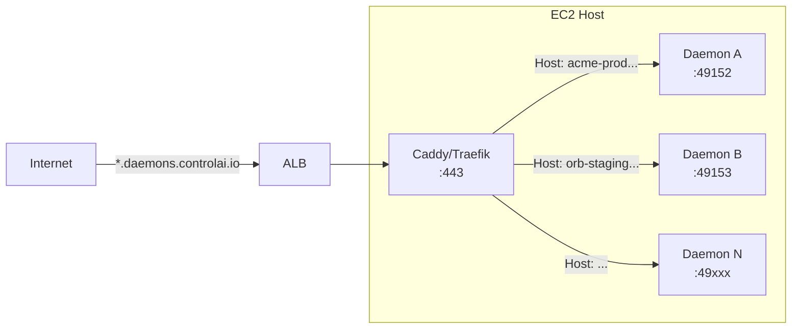

# EC2 Container Provisioner — Design Trade-offs

**Date:** 2026-05-28  
**Context:** Follow-up to `add-instance-auto-provisioning` spec. Evaluates AWS-native backends for spawning ~256 MB / 0.25 vCPU daemon containers, one per customer org, target density 50+ per host.

---

## 1. Comparison Table

| Dimension | **ECS on EC2 (binpack)** | **Fargate** | **App Runner** |
|---|---|---|---|
| **Cost/daemon/mo** | ~$0.60 (50/t3.medium) | ~$7.30 (256 CPU / 512 MB) | ~$8.03 (0.25 vCPU / 0.5 GB provisioned) |
| **Ops complexity** | Medium — manage ASG, capacity provider, placement strategy, port allocation, ingress | Low — no host mgmt; just register task def + create service | Lowest — create service, domain, done |
| **Time to implement** | 3–6 weeks (ingress + scheduler + port allocation + lifecycle) | 1–2 weeks (mostly plumbing + cost shock) | N/A — **not suitable** (see below) |
| **Ingress story** | ALB host-header routing (100-rule limit), path-routing + SNI, NLB+Cloud Map DNS, or Caddy/Traefik reverse-proxy on each host | ALB per service or Service Connect; each task gets its own ENI | Built-in HTTPS + custom domain (up to 5/services); no programmatic multi-domain |
| **Secret handling** | SecretsManager `secrets` array in task def + task execution role IAM policy | Same as EC2 — `secrets` array + execution role | Environment variables from SecretsManager via console/API; less flexible for per-daemon secrets |
| **Density ceiling** | ~50–60 per t3.medium (ephemeral port range 32768–61000; ~28K usable ports = limiting factor at 1 port/daemon) | 1 task per Fargate task (no host sharing) | 1 service per daemon (no multi-tenant) |
| **Cold start** | Seconds (container already pulled on host) | ~20–60s (image pull + ENI attach) | ~30–90s (build + deploy cycle if not warmed) |
| **Auto-scaling hosts** | Yes — capacity provider + managed scaling with target capacity | Built-in (Fargate manages capacity) | Built-in (concurrency-based) |
| **Per-daemon TLS** | Wildcard `*.daemons.controlai.io` ACM cert on ALB | Wildcard ACM on ALB | Auto-managed per-domain ACM |
| **Audit trail** | Task definition revisions, CloudTrail for all `RegisterTaskDefinition`, `CreateService` calls | Same | CloudTrail for `CreateService`, but less granular |
| **Long-running fit** | Excellent — ECS Services supervise, auto-restart | Excellent | Good — but designed for request-driven web apps, not daemons |
| **AWS status** | Mature, GA since 2015 | Mature, GA since 2017 | **Maintenance mode** — no new customers after April 30, 2026 ([source](https://docs.aws.amazon.com/apprunner/latest/relnotes/relnotes.html)) |

### Cost Breakdown

**ECS on EC2 (t3.medium, us-east-1):**
- Instance: ~$30.22/mo (on-demand, no reservation)
- 50 daemons per instance → **~$0.60/daemon/mo**
- With Compute Savings Plan (1yr): ~$20/mo → **~$0.40/daemon/mo**
- Add ALB (~$22/mo + LCU) shared across all daemons: +~$0.50/daemon → total **~$1.10/daemon/mo** with ingress

**Fargate (us-east-1):**
- 256 CPU (0.25 vCPU) @ $0.04048/vCPU-hr = $0.01012/hr
- 512 MB @ $0.004445/GB-hr = $0.00222/hr
- Per-hour: $0.01234 → per-month (730h): **~$9.01/daemon/mo**
- Minimum Fargate task size is 256 CPU / 512 MB — our 256 MB daemon must pay for 512 MB
- **~15×** binpacked EC2 cost

**App Runner (us-east-1):**
- 0.25 vCPU @ $0.064/vCPU-hr = $0.016/hr
- 0.5 GB @ $0.007/GB-hr = $0.0035/hr
- Per-hour: $0.0195 → per-month (730h): **~$14.24/daemon/mo** (provisioned — always-on)
- No multi-daemon per service; each daemon = 1 App Runner service
- Maintenance mode — **not recommended for new builds**

---

## 2. ECS on EC2 — Deep Dive

### 2.1 Binpack Placement Strategy

The `binpack` strategy places tasks to minimize the number of container instances in use. You specify either `"field": "cpu"` or `"field": "memory"` — ECS considers **reservations** (what the task definition requests), not actual runtime utilization.

For our daemons (256 MB, 0.25 vCPU), a `t3.medium` (2 vCPU, 4 GB RAM) can theoretically hold:

- **CPU-bound packing:** 2 vCPU / 0.25 vCPU = 8 tasks (if other overhead is minimal)
- **Memory-bound packing:** 4 GB / 256 MB = ~15–16 tasks
- **Real-world mix:** ~50–60 tasks/instance when using `bridge` network mode with dynamic port mapping (port range is the actual limiter)

> **Key insight:** The `binpack` field matters. `field: "memory"` will fill instances by memory first, which is our bottleneck. But with `awsvpc` network mode each task gets its own ENI, so ENI limits on the instance type become the constraint instead. For `bridge` mode + dynamic ports, the ephemeral port range (~28K usable on ECS-optimized AMI) is the practical ceiling.

### 2.2 Port Allocation — Dynamic Port Mapping

```json
{
  "portMappings": [
    {
      "containerPort": 443,
      "hostPort": 0,
      "protocol": "tcp"
    }
  ]
}
```

- `hostPort: 0` tells Docker to pick a random unused port from the host's ephemeral range (32768–61000 on Amazon ECS-optimized AMI).
- The assigned port appears in the `networkBindings` field of the `DescribeTasks` API response.
- **Only works with `bridge` network mode** (not `host` or `awsvpc`).
- Multiple tasks from the same or different services can run on one host because each gets its own random host port.

**How callers learn the port:**

1. After `CreateService` / `RunTask`, poll `DescribeTasks` until status is `RUNNING`.
2. Read `tasks[0].containers[0].networkBindings[0].hostPort`.
3. The caller (dashboard) stores `{ host: <instance-private-ip>, port: <hostPort> }` — or better, routes through an ALB so the host:port is abstracted.

### 2.3 Capacity Provider Strategies

**Managed Scaling (recommended):**

```json
{
  "managedScaling": {
    "status": "ENABLED",
    "targetCapacity": 80,
    "minimumScalingStepSize": 1,
    "maximumScalingStepSize": 2,
    "instanceWarmupPeriod": 120
  }
}
```

- ECS creates a CloudWatch metric `CapacityProviderReservation` and a target-tracking scaling policy on the ASG.
- `targetCapacity: 80` means "keep 20% headroom" — ECS will scale out before the cluster is completely full.
- `targetCapacity: 100` means "fill completely before scaling" — most cost-efficient but tasks may briefly wait for instance launch.
- ECS manages ASG desired capacity automatically.
- **When no host has capacity:** tasks enter `PROVISIONING` state. The capacity provider computes `M` = minimum instances needed, scales ASG to `min(current + minStepSize, M, maxStepSize)`, and loops until tasks land.

**ASG-only (no managed scaling):**
- You manage ASG desired capacity via your own scaling policies.
- Tasks that can't be placed stay in `PROVISIONING` until capacity appears or timeout (~10 min).
- Cheaper if you're already running other workloads on the ASG, but adds operational burden.

**What happens on placement failure:**

| No capacity? | Managed scaling ON | Managed scaling OFF |
|---|---|---|
| ASG can scale | ECS launches new instance(s) automatically | Task stays PROVISIONING; your scaling policy must react |
| ASG at max | Task stays PROVISIONING; CloudWatch alarm fires | Same — no automation |
| Instance exists but port conflict | Task fails with `MISSING_PORT`; ECS retries on another instance | Same |

### 2.4 Service Mode vs Task Mode

| | **Service mode** | **Task mode** |
|---|---|---|
| API call | `CreateService` | `RunTask` |
| Lifecycle | Supervised — ECS restarts on failure | Run-once; task stops when container exits |
| Placement strategy | Set at service level | Set per `RunTask` call |
| Load balancer | Can attach ALB/NLB | Cannot attach LB |
| Service discovery | Built-in via Cloud Map | Manual registration |
| Best for | Long-running daemons (our use case) | One-off batch jobs |

**Decision:** Use **Service mode** for daemons. Each org's daemon is an ECS service with `desiredCount: 1`.

### 2.5 Service Discovery / Ingress Options

**Option A: ALB with host-header routing (recommended for ≤100 daemons)**

```
Listener *.daemons.controlai.io:443
├── Rule: Host header equals "acme-prod.daemons.controlai.io"
│   └── Forward to target group for acme-prod daemon
├── Rule: Host header equals "orbital-staging.daemons.controlai.io"
│   └── Forward to target group for orbital-staging daemon
└── ... (up to 100 rules per ALB, adjustable via quota increase)
```

- **Pros:** Simple, ALB handles TLS termination with wildcard ACM cert
- **Cons:** Default 100-rule limit per ALB ([source](https://docs.aws.amazon.com/elasticloadbalancing/latest/application/load-balancer-limits.html)); each daemon needs a dedicated target group
- **Scaling:** ~3 ALBs needed for 250 daemons (with default limit); one ALB if you get a quota increase to 500+

**Option B: ALB with path-based routing + SNI**

- Single ALB, multiple listeners on different ports, each forwarding to a target group
- Less clean than host-header; not recommended for this use case

**Option C: NLB + Cloud Map (DNS-based)**

```
NLB (static IP) → Caddy/Traefik sidecar (per host)
  → Routes by Host header to local daemon containers
```

- NLB forwards TCP traffic to a reverse-proxy running on each EC2 host (e.g., Caddy, Traefik, nginx)
- The reverse-proxy reads `Host` header and proxies to `localhost:<dynPort>`
- Cloud Map registers each daemon's `<org>-<env>.daemons.controlai.io` → `A` record pointing to the host's private IP
- **Pros:** No ALB rule limit; Cloud Map provides DNS-level service discovery; NLB is cheaper than ALB
- **Cons:** Need to manage reverse-proxy config per host; Caddy/Traefik config must be updated when daemons are added/removed

**Option D: Caddy/Traefik per-host (dynamic config)**



- Caddy/Traefik container runs on each host with a dynamic backend configuration
- When a new daemon is provisioned, the provisioner:
  1. Calls Caddy Admin API (`POST /config/apps/http/servers/...`) to add a new route
  2. Or updates a shared config file that Caddy watches
- **Pros:** No ALB rule limit; sub-ms routing updates; native ACME support (Caddy can auto-provision per-daemon certs)
- **Cons:** Operational complexity of managing the reverse-proxy; state must be synchronized if running multi-host

**Recommended ingress path for the spec:**

> Use **ALB with host-header rules**, starting with a quota increase request to bump the per-ALB rule limit to 500. This gives you a clean, well-understood ingress path for the first 500 daemons. When you exceed that, migrate to **NLB + Caddy per-host** or **Traefik with dynamic config** — the provisioner interface abstracts the ingress backend, so switching doesn't change the daemon provisioning contract.

### 2.6 TLS Termination

**Wildcard ACM certificate:**

```
arn:aws:acm:us-east-1:123456789012:certificate/xxxxxxxx-xxxx-xxxx-xxxx-xxxxxxxxxxxx
CN: *.daemons.controlai.io
```

- Created once, attached to the ALB HTTPS listener
- Covers all subdomains `acme-prod.daemons.controlai.io`, `orbital-staging.daemons.controlai.io`, etc.
- ACM auto-renews; no per-daemon cert management
- **If you need per-daemon certs later** (e.g., BYO-domain feature): use Caddy/Traefik with on-the-fly ACME — the per-daemon domain `custom.acme.com` gets its own cert via Caddy's automatic TLS.

### 2.7 Token Injection (DAEMON_BEARER_TOKEN)

**AWS-blessed pattern: SecretsManager + task execution role**

1. **Provisioning time:** The provisioner generates a bearer token, stores it in SecretsManager:
   ```bash
   aws secretsmanager create-secret \
     --name daemon/acme-prod/bearer-token \
     --secret-string "ctrl-xxxxxxxxxxxx"
   ```

2. **Task definition references the secret:**
   ```json
   {
     "containerDefinitions": [{
       "name": "daemon",
       "secrets": [{
         "name": "DAEMON_BEARER_TOKEN",
         "valueFrom": "arn:aws:secretsmanager:us-east-1:123456789012:secret:daemon/acme-prod/bearer-token"
       }]
     }]
   }
   ```

3. **Task execution role** needs `secretsmanager:GetSecretValue` on that secret ARN.

**Trade-offs:**

| Method | Audit visibility | Rotation cost | Complexity |
|---|---|---|---|
| **Plaintext env var** in task def | Visible in `DescribeTaskDefinition` (CloudTrail) | High — must register new revision | Zero |
| **SecretsManager** + `secrets` array | ARN visible, value hidden | Medium — update secret, force new deployment | Low |
| **Parameter Store (SecureString)** | Same as SecretsManager | Medium | Low |
| **SSM Session Manager + startup fetch** | Secret never in task def | Low — fetch from secret store on boot | Medium (requires SSM agent + IAM) |

**Recommendation:** Start with SecretsManager + `secrets` array for production. SecretsManager costs $0.40/secret/mo — at 250 daemons that's $100/mo. If that matters, use Parameter Store SecureString (free, same pattern). Never use plaintext env vars for bearer tokens in production.

---

## 3. AWS App Runner — Not Suitable

Critical factors that disqualify App Runner for this use case:

1. **Maintenance mode** — No new customers after April 30, 2026 ([source](https://docs.aws.amazon.com/apprunner/latest/relnotes/relnotes.html)). AWS has stopped active development.
2. **One service per daemon** — No multi-tenancy. 250 daemons = 250 App Runner services. Each has a separate CloudFormation stack, deployment pipeline, etc.
3. **Custom domain limit** — Only 5 custom domains per service ([source](https://docs.aws.amazon.com/apprunner/latest/dg/manage-custom-domains.html)). You can't give each daemon a unique subdomain on the same service.
4. **CPU/memory floor** — 0.25 vCPU requires minimum 0.5 GB memory ([source](https://aws.amazon.com/apprunner/pricing/)). Our 256 MB daemon pays for 512 MB.
5. **No background processing** — App Runner is designed for request-driven web apps, not long-running daemon processes that may not serve HTTP on a predictable port.
6. **Cost** — At $0.0195/hr ($14.24/mo) for the smallest config, it's ~24× the binpack-EC2 cost.

---

## 4. Fargate — Simplest but ~15× Cost Premium

**When to choose Fargate:**
- You have fewer than 20 daemons and value ops simplicity over cost
- You don't have existing EC2 capacity management expertise
- You want per-task IAM roles without managing instance profiles
- You're already on a consolidated billing plan that absorbs the premium

**When to avoid Fargate:**
- At our target scale (250+ daemons), the cost delta exceeds **$2,000+/mo** vs binpacked EC2
- Fargate minimum memory is 512 MB — our 256 MB daemon pays for double the memory it uses
- No bin-packing across tasks — each task is billed independently

**Fargate valid combinations at our daemon size:**

| CPU | Memory | Price/hr | Price/mo |
|---|---|---|---|
| 256 (0.25 vCPU) | 512 MB | $0.01234 | **$9.01** |
| 256 (0.25 vCPU) | 1 GB | $0.01459 | **$10.65** |
| 256 (0.25 vCPU) | 2 GB | $0.01908 | **$13.93** |

---

## 5. TypeScript Code Snippets

### 5.1 `provision()` — Create a daemon on ECS-on-EC2

```typescript
import {
  ECSClient,
  RegisterTaskDefinitionCommand,
  CreateServiceCommand,
  DescribeTasksCommand,
  type Task,
} from "@aws-sdk/client-ecs";

const ecs = new ECSClient({ region: "us-east-1" });

interface DaemonSpec {
  orgSlug: string;
  env: "prod" | "staging" | "dev";
  bearerToken: string;    // already generated & encrypted
  imageUri: string;       // e.g., "ghcr.io/controlai/daemon:stable"
  clusterArn: string;
  subnetIds: string[];
  securityGroupIds: string[];
  targetGroupArn: string; // ALB target group for this daemon
}

interface ProvisionedDaemon {
  taskArn: string;
  hostPort: number;       // dynamic port (bridge mode)
  containerInstanceArn: string;
}

async function provision(spec: DaemonSpec): Promise<ProvisionedDaemon> {
  const family = `daemon-${spec.orgSlug}-${spec.env}`;

  // 1. Register task definition (new revision each time)
  const td = await ecs.send(new RegisterTaskDefinitionCommand({
    family,
    networkMode: "bridge",
    requiresCompatibilities: ["EC2"],
    cpu: "256",       // 0.25 vCPU reservation
    memory: "256",    // 256 MB hard limit
    executionRoleArn: "arn:aws:iam::123456789012:role/ecsTaskExecutionRole",
    taskRoleArn: "arn:aws:iam::123456789012:role/daemonTaskRole",
    containerDefinitions: [{
      name: "daemon",
      image: spec.imageUri,
      cpu: 256,
      memory: 256,
      essential: true,
      portMappings: [{
        containerPort: 443,
        hostPort: 0,         // dynamic port mapping
        protocol: "tcp",
      }],
      environment: [{
        name: "DAEMON_BEARER_TOKEN",
        value: spec.bearerToken,         // plaintext in task def (see §2.7)
      }],
      logConfiguration: {
        logDriver: "awslogs",
        options: {
          "awslogs-group": `/ecs/daemon/${spec.orgSlug}-${spec.env}`,
          "awslogs-region": "us-east-1",
          "awslogs-stream-prefix": "daemon",
        },
      },
    }],
  }));
  const taskDefArn = td.taskDefinition!.taskDefinitionArn!;

  // 2. Create service (long-running, supervised)
  const svc = await ecs.send(new CreateServiceCommand({
    cluster: spec.clusterArn,
    serviceName: `daemon-${spec.orgSlug}-${spec.env}`,
    taskDefinition: taskDefArn,
    desiredCount: 1,
    launchType: "EC2",
    placementStrategy: [{ type: "binpack", field: "memory" }],
    loadBalancers: [{
      targetGroupArn: spec.targetGroupArn,
      containerName: "daemon",
      containerPort: 443,
    }],
    networkConfiguration: {
      awsvpcConfiguration: {
        subnets: spec.subnetIds,
        securityGroups: spec.securityGroupIds,
        assignPublicIp: "DISABLED",
      },
    },
    // Let ECS roll on failure:
    deploymentConfiguration: {
      minimumHealthyPercent: 0,
      maximumPercent: 100,
    },
  }));
  const serviceArn = svc.service!.serviceArn!;

  // 3. Wait for task to reach RUNNING
  const taskArn = await pollForTask(spec.clusterArn, serviceArn);

  // 4. Read the dynamic port from DescribeTasks
  const desc = await ecs.send(new DescribeTasksCommand({
    cluster: spec.clusterArn,
    tasks: [taskArn],
  }));
  const task = desc.tasks![0];
  const hostPort = task!.containers![0].networkBindings![0].hostPort!;
  const containerInstanceArn = task!.containerInstanceArn!;

  return { taskArn, hostPort, containerInstanceArn };
}

async function pollForTask(
  clusterArn: string,
  serviceArn: string,
  maxWaitMs = 120_000,
): Promise<string> {
  const { ECSClient, ListTasksCommand } = await import("@aws-sdk/client-ecs");
  const deadline = Date.now() + maxWaitMs;
  while (Date.now() < deadline) {
    const listed = await ecs.send(new ListTasksCommand({
      cluster: clusterArn,
      serviceName: serviceArn,
    }));
    const taskArns = listed.taskArns;
    if (taskArns && taskArns.length > 0) {
      const desc = await ecs.send(new DescribeTasksCommand({
        cluster: clusterArn,
        tasks: [taskArns[0]],
      }));
      if (desc.tasks![0].lastStatus === "RUNNING") return taskArns[0];
    }
    await new Promise((r) => setTimeout(r, 2_000));
  }
  throw new Error(`Task did not reach RUNNING within ${maxWaitMs}ms`);
}
```

### 5.2 `deprovision()` — Teardown a daemon

```typescript
import {
  ECSClient,
  UpdateServiceCommand,
  DeleteServiceCommand,
  DescribeTasksCommand,
} from "@aws-sdk/client-ecs";

interface DeprovisionSpec {
  orgSlug: string;
  env: "prod" | "staging" | "dev";
  clusterArn: string;
}

async function deprovision(spec: DeprovisionSpec): Promise<void> {
  const serviceName = `daemon-${spec.orgSlug}-${spec.env}`;

  // 1. Scale service to 0 (stops tasks gracefully)
  await ecs.send(new UpdateServiceCommand({
    cluster: spec.clusterArn,
    service: serviceName,
    desiredCount: 0,
  }));

  // 2. Wait for tasks to stop
  await pollForStoppedTasks(spec.clusterArn, serviceName);

  // 3. Delete the service
  await ecs.send(new DeleteServiceCommand({
    cluster: spec.clusterArn,
    service: serviceName,
  }));

  // Note: The task definition is retained (task defs are versioned;
  // you can deregister it if no other service references that family+revision).
  // The ALB target group and SecretsManager secret also need cleanup
  // (handled by the higher-level orchestrator, not this snippet).
}

async function pollForStoppedTasks(
  clusterArn: string,
  serviceName: string,
  maxWaitMs = 60_000,
): Promise<void> {
  const { ECSClient, ListTasksCommand } = await import("@aws-sdk/client-ecs");
  const deadline = Date.now() + maxWaitMs;
  while (Date.now() < deadline) {
    const listed = await ecs.send(new ListTasksCommand({
      cluster: clusterArn,
      serviceName,
    }));
    if (!listed.taskArns || listed.taskArns.length === 0) return;
    await new Promise((r) => setTimeout(r, 2_000));
  }
  throw new Error(`Tasks for ${serviceName} did not stop within ${maxWaitMs}ms`);
}
```

### 5.3 Supporting Operations

```typescript
// Update service (e.g., new image version)
import { UpdateServiceCommand } from "@aws-sdk/client-ecs";
async function updateDaemon(
  clusterArn: string,
  orgSlug: string,
  env: string,
  newTaskDefArn: string,
) {
  await ecs.send(new UpdateServiceCommand({
    cluster: clusterArn,
    service: `daemon-${orgSlug}-${env}`,
    taskDefinition: newTaskDefArn,
    forceNewDeployment: true,
  }));
}

// Deregister an old task definition revision
import { DeregisterTaskDefinitionCommand } from "@aws-sdk/client-ecs";
async function deregisterTaskDef(taskDefArn: string) {
  await ecs.send(new DeregisterTaskDefinitionCommand({
    taskDefinition: taskDefArn,
  }));
}
```

---

## 6. Recommendation

**Use ECS on EC2 with `binpack` placement strategy (field: memory) as the provisioner backend.**

Rationale:
1. **Cost** — ~$0.60/daemon/mo vs ~$9.01 on Fargate = **15× cheaper** at scale. For 250 daemons, that's ~$150/mo vs ~$2,250/mo.
2. **Density** — 50+ daemons per t3.medium is achievable with `bridge` network mode + dynamic port mapping.
3. **Ingress** — Start with ALB + host-header rules (quota increase to 500 rules); migrate to NLB + Caddy per-host when exceeding that.
4. **Token injection** — SecretsManager + task execution role for production; plaintext env var acceptable for dev/staging (with audit awareness).
5. **Lifecycle** — ECS Services provide auto-restart, rolling updates, and CloudWatch integration.

**Architecture at 250 daemons:**

```
5× t3.medium (50 daemons each)
  ├── bridge network mode
  ├── hostPort: 0 (dynamic port mapping)
  └── 1× Caddy/Traefik per host OR 1× ALB for all

Capacity provider:
  ├── Managed scaling, targetCapacity: 85
  ├── ASG min: 1, max: 10
  └── Instance warmup: 120s

Ingress:
  ALB (HTTPS listener, wildcard ACM cert)
  ├── 250 host-header rules → 1 per daemon
  └── Each rule forwards to a dedicated target group

Token:
  SecretsManager (or Parameter Store) + ECS task execution role
```

**Implementation order:**
1. Create ECS cluster + capacity provider + ASG (one-time infra)
2. Create ALB + wildcard ACM cert + listener (one-time infra)
3. Implement `provision()` per snippet §5.1 — register TD, create service, wait for RUNNING
4. Implement `deprovision()` per snippet §5.2 — scale to 0, delete service
5. Wire into the `InstanceProvisioner` interface defined in the spec
6. Add SecretsManager secret creation + cleanup to the provisioner flow
7. Add ALB target group + listener rule management to the provisioner flow

---

## 7. Citations

| Source | URL |
|---|---|
| ECS binpack placement strategy (AWS Docs) | https://docs.aws.amazon.com/AmazonECS/latest/developerguide/task-placement-strategies.html |
| Dynamic port mapping (hostPort:0) | https://docs.aws.amazon.com/AmazonECS/latest/developerguide/alb.html |
| DescribeTasks API → networkBindings | https://docs.aws.amazon.com/AmazonECS/latest/APIReference/API_DescribeTasks.html |
| ECS capacity provider managed scaling | https://docs.aws.amazon.com/AmazonECS/latest/developerguide/cluster-auto-scaling.html |
| Capacity provider deep dive (AWS Blog) | https://aws.amazon.com/blogs/containers/deep-dive-on-amazon-ecs-cluster-auto-scaling/ |
| ALB quotas (100 rules default) | https://docs.aws.amazon.com/elasticloadbalancing/latest/application/load-balancer-limits.html |
| SecretsManager + ECS env vars | https://docs.aws.amazon.com/AmazonECS/latest/developerguide/specifying-sensitive-data.html |
| Fargate pricing (us-east-1) | https://aws.amazon.com/fargate/pricing/ |
| Fargate task size valid combos | https://docs.aws.amazon.com/AmazonECS/latest/developerguide/task-cpu-memory-error.html |
| App Runner compute configs (0.25 vCPU min) | https://aws.amazon.com/apprunner/pricing/ |
| App Runner maintenance mode notice | https://docs.aws.amazon.com/apprunner/latest/relnotes/relnotes.html |
| App Runner custom domain limit (5/services) | https://docs.aws.amazon.com/apprunner/latest/dg/manage-custom-domains.html |
| ECS service discovery with Cloud Map | https://docs.aws.amazon.com/AmazonECS/latest/developerguide/service-discovery.html |
| AWS SDK v3 client-ecs README | https://github.com/aws/aws-sdk-js-v3/tree/main/clients/client-ecs |
| ECS CPU allocation (re:Post) | https://repost.aws/knowledge-center/ecs-cpu-allocation |
| SecretsManager + ECS tutorial | https://docs.aws.amazon.com/AmazonECS/latest/developerguide/specifying-sensitive-data-tutorial.html |

---

*This report feeds into the `add-ec2-container-provisioner` follow-up spec. See [the design doc](../../openspec/changes/archive/2026-05-28-add-instance-auto-provisioning/design.md) for the provisioner interface contract.*
