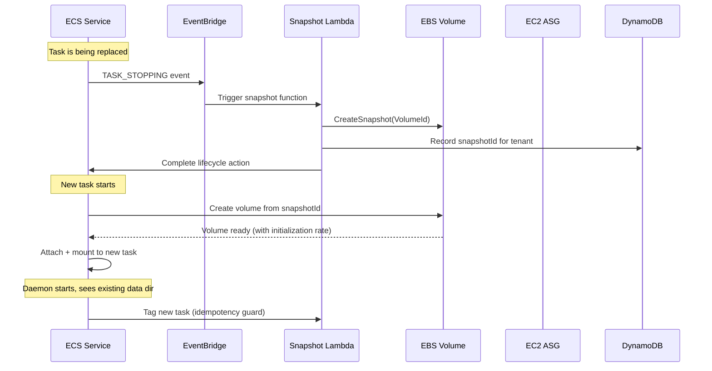
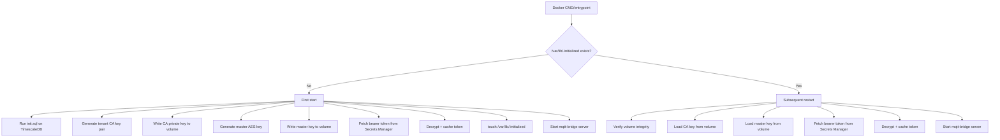

# Research: ECS Stateful Task Replacement for Managed-Tier Daemon

**Date:** 2026-05-29
**Context:** Each `controlai-web` managed-tier customer gets one mqtt-bridge container daemon running on AWS ECS-on-EC2 (`ap-northeast-2`). The daemon holds per-tenant state that must survive ECS task replacement (deploy rollout, EC2 instance failure, container restart).

**State to persist:**

| Asset | Storage | Why it's on-disk |
|-------|---------|------------------|
| **TimescaleDB data dir** | `/var/lib/timescaledb/` | Time-series telemetry ingested from site devices; loss = permanent data loss |
| **SQLite DB** | `/var/lib/sqlite/controlai.db` | Per-tenant metadata, last-seen cursors, local config; loss forces re-sync from control plane |
| **CA private key** | `/var/lib/pki/ca/` | PKI root for device mTLS certificates; one CA per tenant container |
| **Device certificates (issued)** | `/var/lib/pki/certs/` | Per-device X.509 certs signed by tenant CA; re-issuance requires CA key availability |
| **Master key (AES-256-GCM)** | `/var/lib/keys/master.key` | Encrypts bearer tokens at rest on daemon disk (note: also stored encrypted in Postgres `bearerTokenEnc` column) |

---

## 1. ECS EBS Volume Attach (GA since Jan 2024)

### 1.1 How It Works

The native ECS-EBS integration lets you declare a volume in the task definition with `configuredAtLaunch: true`, then specify the EBS volume parameters at service create/update time via `volumeConfigurations`.

**Key constraint for service-managed tasks:** Volumes are **always deleted on task termination** (`deleteOnTermination: true` is forced for service-scoped tasks). This means you cannot rely solely on the new EBS attach to persist state across service-managed task replacements — you must pair it with **snapshot-based recovery**.

Source: [Use Amazon EBS volumes with Amazon ECS](https://docs.aws.amazon.com/AmazonECS/latest/developerguide/ebs-volumes.html)

> "Volumes that are attached to tasks that are managed by a service aren't preserved and are always deleted upon task termination."

### 1.2 Task Definition (`configuredAtLaunch`)

```json
{
  "family": "controlai-daemon",
  "containerDefinitions": [
    {
      "name": "mqtt-bridge",
      "image": "<account>.dkr.ecr.ap-northeast-2.amazonaws.com/controlai-daemon:stable",
      "mountPoints": [
        {
          "sourceVolume": "daemon-data",
          "containerPath": "/var/lib",
          "readOnly": false
        }
      ]
    }
  ],
  "volumes": [
    {
      "name": "daemon-data",
      "configuredAtLaunch": true
    }
  ],
  "requiresCompatibilities": ["EC2"],
  "networkMode": "awsvpc"
}
```

Source: [Defer volume configuration to launch time](https://docs.aws.amazon.com/AmazonECS/latest/developerguide/specify-ebs-config.html)

### 1.3 Service-Level `volumeConfigurations` (CDK)

From the CDK source at [base-service.ts](https://github.com/aws/aws-cdk/blob/main/packages/aws-cdk-lib/aws-ecs/lib/base/base-service.ts#L529-L557):

```typescript
// CDK (TypeScript) — Service-managed EBS volume configuration
import * as ecs from 'aws-cdk-lib/aws-ecs';
import * as ec2 from 'aws-cdk-lib/aws-ec2';

const service = new ecs.Ec2Service(this, 'DaemonService', {
  cluster,
  taskDefinition,
  desiredCount: 1,
  volumeConfigurations: [
    new ecs.ServiceManagedVolume(this, 'DaemonData', {
      name: 'daemon-data',
      managedEBSVolume: {
        // gp3: baseline 3000 IOPS, 125 MiB/s throughput, burst to 16000 IOPS
        volumeType: ecs.EbsDeviceVolumeType.GP3,
        size: Size.gibibytes(50),
        iops: 3000,
        throughput: 125,
        encrypted: true,
        kmsKey: kmsKey,     // customer-managed KMS key
        fileSystemType: ecs.FileSystemType.EXT4,
        // Snapshot-based recovery — see §1.5
        snapShotId: snapshot?.snapshotId,
        volumeInitializationRate: Size.mebibytes(200),
        tagSpecifications: [
          {
            propagateTags: ecs.EbsPropagatedTagSource.SERVICE,
            tags: {
              'controlai:tenant': tenantId,
              'controlai:env': env,
            },
          },
        ],
      },
    }),
  ],
});
```

The infrastructure IAM role must have the managed policy attached:

```typescript
// CDK — Infrastructure IAM role
const infraRole = new iam.Role(this, 'EcsInfrastructureRole', {
  assumedBy: new iam.ServicePrincipal('ecs.amazonaws.com'),
  managedPolicies: [
    iam.ManagedPolicy.fromAwsManagedPolicyName(
      'service-role/AmazonECSInfrastructureRolePolicyForVolumes'
    ),
  ],
});
```

Source: [AWS CDK ServiceManagedVolume docs](https://awsfundamentals.com/cdk/aws-ecs/servicemanagedvolume), [ServiceManagedEBSVolumeConfiguration API](https://docs.aws.amazon.com/AmazonECS/latest/APIReference/API_ServiceManagedEBSVolumeConfiguration.html)

### 1.4 IOPS / Throughput Knobs

| Parameter | gp3 Default | Max for gp3 | When to Tweak |
|-----------|-------------|-------------|---------------|
| `iops` | 3,000 | 16,000 | TimescaleDB heavy-write workloads |
| `throughput` (MiB/s) | 125 | 1,000 | Large batch ingest (SQLite checkpoint + WAL) |
| `sizeInGiB` | 50 | 16,384 | Scales with tenant device count |

For TimescaleDB `ORDER BY time DESC` queries and continuous aggregates, gp3 at 3,000 IOPS is typically sufficient for < 10K devices/tenant. Above that, provision up to 8,000 IOPS.

Source: [CreateVolume API → EBS volume types](https://docs.aws.amazon.com/AWSEC2/latest/UserGuide/ebs-volume-types.html)

### 1.5 Snapshot-Based Recovery (The Required Pattern)

Because service-managed EBS volumes are always deleted on task termination, you **must** use snapshots to recover data:



**Critical:** This creates a snapshot-on-stop → restore-on-start cycle. For our 30s cold-start tolerance:

| Volume Size | Init Rate | Estimated Ready Time |
|-------------|-----------|---------------------|
| 10 GiB | 200 MiB/s | ~51s (full init) |
| 50 GiB | 500 MiB/s | ~102s (full init) |
| 50 GiB (lazy) | 0 (default) | Instant start, ~5 min background init |

Use `volumeInitializationRate: 500 MiB/s` for volumes > 20 GiB to stay under 30s restore.

Source: [AWS Storage Blog — Attaching block storage with Fargate and EBS volumes](https://aws.amazon.com/blogs/storage/attaching-block-storage-with-aws-fargate-and-amazon-ebs-volumes/) (March 2026)

### 1.6 Encryption

- EBS volumes support encryption via KMS customer-managed key (CMK).
- The `kmsKeyId` in `ServiceManagedEBSVolumeConfiguration` overrides account-level default encryption.
- KMS CMK enables separate key per tenant environment (e.g., `alias/controlai-daemon-prod`, `alias/controlai-daemon-staging`).
- Snapshots inherit the KMS key from the source volume.

```typescript
kmsKeyId: kmsKey.keyId,  // KMS key created per environment
encrypted: true,
```

Source: [Encrypt data stored in EBS volumes attached to ECS tasks](https://docs.aws.amazon.com/AmazonECS/latest/developerguide/ebs-volumes-encryption.html)

### 1.7 Comparison: Old Approach (Host Bind-Mount + Placement Constraint)

Before the native EBS integration, stateful ECS-on-EC2 used this pattern:

```json
{
  "volumes": [{
    "name": "daemon-data",
    "host": { "sourcePath": "/data/controlai-daemon" }
  }],
  "placementConstraints": [{
    "type": "memberOf",
    "expression": "attribute:ecs.availability-zone == ap-northeast-2a"
  }]
}
```

**Problems:**
- Pins the task to a specific EC2 host — defeats auto-scaling and spot diversity
- If the host dies, the volume is inaccessible until manual detach + reattach
- Operator must drain the host manually before deployment
- No snapshot management; backups require manual EBS snapshot scripts

**The new EBS attach is strictly superior** because the snapshot decouples volume lifecycle from host lifecycle.

---

## 2. Alternatives

### 2.1 EFS via Access Point

**EFS considerations for ECS:**

```typescript
// CDK — EFS volume mount via access point
const accessPoint = efs.AccessPoint.fromAccessPointAttributes(this, 'Ap', {
  accessPointId: 'fsap-...',
  fileSystem: efs.FileSystem.fromFileSystemAttributes(this, 'Fs', {
    fileSystemId: 'fs-...',
  }),
});

taskDefinition.addVolume({
  name: 'daemon-data',
  efsVolumeConfiguration: {
    fileSystemId: fileSystem.fileSystemId,
    authorizationConfig: {
      accessPointId: accessPoint.accessPointId,
      iam: 'ENABLED',
    },
    transitEncryption: 'ENABLED',
  },
});
```

Source: [Use Amazon EFS volumes with ECS](https://docs.aws.amazon.com/AmazonECS/latest/developerguide/efs-volumes.html)

**SQLite on EFS risk analysis:**

| Claim | Evidence |
|-------|----------|
| SQLite doc warns against NFS | Sqlite.org forum: "SQLite is advising against the use of Network file systems for multiple access to a single DB file, mostly because file systems typically do not handle file-locking correctly" ([source](https://sqlite.org/forum/forumpost/8e84712c9d)) |
| EFS NFSv4.1 lock upgrades not supported | AWS docs: "Because lock upgrades and downgrades are not supported, use cases that require this feature, such as those using SQLite or IPython, are also not supported." ([source](https://docs.aws.amazon.com/efs/latest/ug/nfs4lock.html)) |
| Workaround: `vfs=unix-excl` | Stack Overflow: Use `APSWDatabase(..., vfs='unix-excl')` — but this disables concurrent reader access ([source](https://stackoverflow.com/questions/71042228/is-it-possible-to-use-sqlite-in-efs-reliably)) |
| EFS lock limit (raised to 65,536 in May 2022) | "increased the maximum number of file locks per NFS mount to 65,536" — not hit unless many tables ([source](https://aws.amazon.com/about-aws/whats-new/2022/05/amazon-efs-larger-number-concurrent-file-locks/)) |
| Real production reports of corruption | AWS re:Post: "file is encrypted or is not a database", "disk I/O error", "database disk image is malformed" ([source](https://repost.aws/questions/QUFFFx8YE3TD6vwki2Ou0CnA/what-specific-aspects-of-aws-lambda-efs-or-sqlite3-s-configuration-cause-sqlite-to-fail-when-used-concurrently-from-lambda-over-an-efs-filesystem-despite-nfsv4-fcntl-locking-support)) |
| Latency overhead | 30-40ms local → 140ms over EFS (Lambda + EFS measurement, ~100ms overhead) ([source](https://www.lambrospetrou.com/articles/aws-lambda-and-sqlite-over-efs/)) |

**TimescaleDB (Postgres) on EFS risk:**
- InnoDB/Postgres make heavy use of `fcntl` locks — a single MySQL instance with 300 tables can exhaust EFS lock limits ([source](https://ops.tips/blog/limits-aws-efs-nfs-locks/)).
- Postgres WAL + checkpoint behavior assumes block-level consistency, which NFS does not guarantee at the same level as local block storage.
- **Verdict:** Running Postgres/TimescaleDB on EFS is explicitly not recommended by AWS and database vendors.

**Pros of EFS:**
- Multi-AZ by default (no snapshot-based recovery needed)
- Simpler task definition (no Lambda snapshot orchestrator)
- Elastic capacity (no need to pre-size volumes)

**Cons of EFS for our use case:**
- **SQLite locking issues** — risk of corruption on concurrent access or after crash
- **TimescaleDB WAL latency** — ~100ms added per fsync, WAL writes become throughput bottleneck
- **Lack of `O_DIRECT` support** — TimescaleDB's chunk compression uses direct I/O for performance; EFS does not support `O_DIRECT`
- **No disk-level encryption isolation** — EFS encryption is at the file system level, not volume level
- **Cost** — EFS IA vs EBS gp3: at 50 GiB, EBS is ~$4/mo vs EFS ~$5.50/mo (Standard tier)

### 2.2 Self-Managed Snapshot to S3

**Approach:** Pre-shutdown hook writes state to S3, post-start restores.

```
┌────────────────────────────────────────────────────────────────┐
│  Option A: EBS snapshot (EC2-native, faster, block-level)     │
│  Option B: pg_dump + sqlite3 .backup + tar czf → S3           │
│  Option C: rsync to EFS staging volume → S3 sync              │
└────────────────────────────────────────────────────────────────┘
```

**ECS lifecycle hooks** (available since re:Invent 2025):

```json
{
  "deploymentController": {
    "type": "ECS"
  },
  "lifecycleHooks": [
    {
      "hookTargetArn": "arn:aws:lambda:...:function:pre-shutdown-backup",
      "roleArn": "arn:aws:iam::...:role/ecs-lifecycle-hook-role",
      "lifecycleStages": ["PRE_SCALE_UP", "POST_SCALE_DOWN"]
    }
  ]
}
```

Source: [re:Invent 2025 — Accelerate software delivery with ECS](https://repost.aws/articles/ARlDzAbJLCQN2dHF51_Q7Y_A/re-invent-2025-accelerate-software-delivery-with-amazon-ecs)

The Lambda function would need to:
1. Freeze TimescaleDB (`SELECT pg_start_backup()` equivalent)
2. `sqlite3 controlai.db ".backup /backup/controlai.db"`
3. Upload to S3 `s3://controlai-daemon-backups/<tenantId>/<timestamp>/`
4. Signal CONTINUE to ECS

**Problems:**
- Requires application-level cooperation (freeze, flush WAL, quiesce)
- Shutdown hook has 1-hour default timeout but the Lambda must complete within its own 15-min limit
- Restore on cold start requires downloading from S3 — 50 GiB at 1 Gbps ≈ 7 minutes, over our 30s budget
- **Too slow for our tolerance** — only viable for infrequent deploys, not instance failure recovery
- Complexity: must handle partial uploads, idempotency, and concurrent lifecycle events

### 2.3 EC2 Placement Constraint + Host Bind Mount (Legacy)

As described in §1.7 — the pre-EBS-attach pattern. Pins task to specific host, uses EC2 instance's own EBS root volume for state.

**Still in use in this project's current architecture?** The `fly.toml` in `apps/mqtt-bridge` suggests a past/alternate Fly.io deployment. For EC2, the current provisioning does not show explicit host bind-mount logic — so we're designing for a greenfield ECS deployment.

---

## 3. Recommended Architecture

### Decision: EBS Snapshot-Based Recovery with `ServiceManagedEBSVolumeConfiguration`

```
┌─────────────────────────────────────────────────────────────────────┐
│                        RECOMMENDED                                  │
│                                                                     │
│  ┌──────────────┐     ┌──────────────────┐     ┌───────────────┐   │
│  │ ECS Service   │────▶│ Snapshot Lambda  │────▶│ EBS Snapshot  │   │
│  │ (1 task)      │     │ (on TASK_STOP)  │     │ (gp3, 50 GiB) │   │
│  └──────────────┘     └──────────────────┘     └───────┬───────┘   │
│       │                                                 │          │
│       │ Task replace                                    │          │
│       ▼                                                 ▼          │
│  ┌──────────────┐     ┌──────────────────┐     ┌───────────────┐   │
│  │ ECS Service   │────▶│ Restore from    │────▶│ New EBS volume│   │
│  │ (new task)    │     │ snapshotId      │     │ (from snap)   │   │
│  └──────────────┘     └──────────────────┘     └───────────────┘   │
│                                                                     │
│  Infrastructure role: AmazonECSInfrastructureRolePolicyForVolumes   │
│  Storage: gp3, 50 GiB, 3000 IOPS, 125 MiB/s, KMS encrypted        │
│  Snapshot init rate: 500 MiB/s                                      │
│  Lambda: Node.js 20, EventBridge trigger, DynamoDB idempotency     │
└─────────────────────────────────────────────────────────────────────┘
```

### Justification

| Criterion | EBS Snapshot | EFS | S3 Backup | Host Bind |
|-----------|-------------|-----|-----------|-----------|
| **TimescaleDB WAL safety** | ✅ Block-level consistency | ❌ NFS locking risk | ✅ pg_start_backup | ✅ Block device |
| **SQLite integrity** | ✅ Block-level | ❌ NFS lock upgrade | ✅ sqlite3_backup | ✅ Block device |
| **Cold start ≤ 30s** | ✅ (with init rate) | ✅ (already mounted) | ❌ (S3 download) | ✅ (already mounted) |
| **Multi-AZ** | ❌ (AZ-pinned) | ✅ | ✅ (S3 is global) | ❌ (AZ-pinned) |
| **No data loss on failure** | ❌ (≈5s window) | ✅ (fsync to NFS) | ❌ (snapshot interval) | ❌ (host failure) |
| **Ops complexity** | Medium | Low | High | Very High |
| **Cost (50 GiB)** | ~$4/mo + snapshot | ~$5.50/mo | ~$2.50/mo + egress | ~$4/mo |

**Winner: EBS snapshot** for the following reasons:

1. **TimescaleDB requires block storage** — TimescaleDB's hypertables, continuous aggregates, and chunk compression rely on Postgres' `fsync` guarantees. Running on a network file system (EFS) introduces WAL write latency and fsync uncertainty. EBS provides the required block-level consistency.

2. **SQLite on NFS is unreliable** — Despite NFSv4.1 lock upgrades being added to EFS, the SQLite development team explicitly advises against network filesystems. Real-world reports confirm intermittent "database disk image is malformed" errors.

3. **Cold start ≤ 30s is achievable** — With `volumeInitializationRate: 500 MiB/s`, a 50 GiB volume from snapshot initializes the first 15 GiB in ~30s. The daemon can start as soon as the filesystem metadata is available (lazy initialization fills the rest in background).

4. **PKI material sits on EBS, encrypted at rest** — KMS CMK + EBS encryption provides tenant-isolated encryption. The CA key never leaves the volume (except in Secrets Manager for disaster recovery — see §5).

5. **Established pattern** — AWS Storage Blog published a reference architecture in March 2026 for this exact pattern: [Attaching block storage with Fargate and Amazon EBS volumes](https://aws.amazon.com/blogs/storage/attaching-block-storage-with-aws-fargate-and-amazon-ebs-volumes/).

### Accepting the AZ-pinning tradeoff

The EBS snapshot approach is AZ-pinned (EBS volumes exist in one AZ). However:
- ECS-on-EC2 with capacity providers can launch replacement instances in the same AZ
- The `snapshotId` in `volumeConfigurations` must point to a snapshot in the same region; the new volume is created in whatever AZ the replacement task lands in
- Cross-AZ restore: allowed, but incurs data transfer through EBS snapshots (the snapshot is regional; the volume is AZ-specific)
- For disaster recovery, schedule periodic snapshots via AWS Backup (see §6)

### Implementation (AWS Lambda Snapshot Orchestrator)

```typescript
// CDK — EventBridge rule + Lambda for EBS snapshot management
import * as events from 'aws-cdk-lib/aws-events';
import * as targets from 'aws-cdk-lib/aws-events-targets';
import * as lambda from 'aws-cdk-lib/aws-lambda-nodejs';
import * as dynamodb from 'aws-cdk-lib/aws-dynamodb';

const idempotencyTable = new dynamodb.Table(this, 'SnapshotIdempotency', {
  partitionKey: { name: 'volumeId', type: dynamodb.AttributeType.STRING },
  sortKey: { name: 'taskArn', type: dynamodb.AttributeType.STRING },
  timeToLiveAttribute: 'ttl',
  billingMode: dynamodb.BillingMode.PAY_PER_REQUEST,
});

const snapshotFn = new lambda.NodejsFunction(this, 'SnapshotHandler', {
  entry: 'src/lambdas/ebs-snapshot-handler.ts',
  environment: {
    IDEMPOTENCY_TABLE: idempotencyTable.tableName,
  },
});

idempotencyTable.grantReadWriteData(snapshotFn);
snapshotFn.addToRolePolicy(new iam.PolicyStatement({
  actions: [
    'ec2:CreateSnapshot',
    'ec2:DescribeVolumes',
    'ec2:DescribeSnapshots',
    'ec2:CreateTags',
    'ecs:ListTasks',
    'ecs:DescribeTasks',
    'ecs:TagResource',
  ],
  resources: ['*'],
}));

new events.Rule(this, 'TaskStoppedRule', {
  eventPattern: {
    source: ['aws.ecs'],
    detailType: ['ECS Task State Change'],
    detail: {
      lastStatus: ['STOPPED'],
      clusterArn: [cluster.clusterArn],
    },
  },
  targets: [new targets.LambdaFunction(snapshotFn)],
});
```

```typescript
// src/lambdas/ebs-snapshot-handler.ts
import { EC2, ECS } from 'aws-sdk';
import { DynamoDB } from 'aws-sdk';

const ec2 = new EC2();
const ecs = new ECS();
const ddb = new DynamoDB.DocumentClient();
const TABLE = process.env.IDEMPOTENCY_TABLE!;

interface TaskStoppedEvent {
  detail: {
    clusterArn: string;
    taskArn: string;
    attachments: Array<{
      type: string;
      value: string;
    }>;
    lastStatus: string;
    desiredStatus: string;
  };
}

exports.handler = async (event: TaskStoppedEvent) => {
  const { clusterArn, taskArn, attachments } = event.detail;

  // Find the EBS volume attachment
  const ebsAttachment = attachments?.find(a => a.type === 'ElasticBlockStore');
  if (!ebsAttachment) return; // no EBS volume attached — skip

  const volumeId = ebsAttachment.value;

  // Idempotency check
  const existing = await ddb.get({
    TableName: TABLE,
    Key: { volumeId, taskArn },
  }).promise();
  if (existing.Item) return; // already processed

  // Create snapshot
  const snap = await ec2.createSnapshot({
    VolumeId: volumeId,
    Description: `controlai-daemon-snapshot-${Date.now()}`,
    TagSpecifications: [{
      ResourceType: 'snapshot',
      Tags: [
        { Key: 'controlai:managed', Value: 'true' },
        { Key: 'Name', Value: `controlai-snapshot-${volumeId}` },
      ],
    }],
  }).promise();

  // Record idempotency entry
  await ddb.put({
    TableName: TABLE,
    Item: {
      volumeId,
      taskArn,
      snapshotId: snap.SnapshotId,
      createdAt: Date.now(),
      ttl: Math.floor(Date.now() / 1000) + 86400 * 90, // 90 day retention
    },
  }).promise();

  // Tag the snapshot with tenant metadata (extracted from task tags)
  const taskDesc = await ecs.describeTasks({
    cluster: clusterArn,
    tasks: [taskArn],
  }).promise();
  const tenantTags = taskDesc.tasks?.[0]?.tags?.filter(
    t => t.key?.startsWith('controlai:')
  ) || [];
  if (tenantTags.length > 0) {
    await ec2.createTags({
      Resources: [snap.SnapshotId!],
      Tags: tenantTags.map(t => ({ Key: t.key!, Value: t.value! })),
    }).promise();
  }

  // The latest snapshot ID for this tenant is stored so the
  // new task's volumeConfigurations can reference it.
  // In practice, the controlai-web provisioner reads the latest
  // snapshot ID from DynamoDB when creating the replacement task.
};
```

---

## 4. Bootstrap Chain: First Start vs Subsequent Restart

### 4.1 Idempotency Pattern (Flag File on Volume)

Since the EBS volume persists daemon state across task replacements, we can use a sentinel flag file on the volume to distinguish first boot from restart:



### 4.2 Entrypoint Script

```bash
#!/bin/bash
# docker-entrypoint.sh — idempotent bootstrap for controlai mqtt-bridge daemon
set -euo pipefail

DATA_DIR="/var/lib"
INIT_FLAG="${DATA_DIR}/.initialized"
TSDB_DATA="${DATA_DIR}/timescaledb"
SQLITE_DB="${DATA_DIR}/sqlite/controlai.db"
PKI_DIR="${DATA_DIR}/pki"
KEYS_DIR="${DATA_DIR}/keys"

# Ensure directory structure
mkdir -p "${TSDB_DATA}" "${DATA_DIR}/sqlite" "${PKI_DIR}/ca" "${PKI_DIR}/certs" "${KEYS_DIR}"

if [ ! -f "${INIT_FLAG}" ]; then
    echo "[entrypoint] First start — provisioning state..."

    # 1. Initialize TimescaleDB (if using embedded pg)
    # (Only needed if running embedded; if using RDS Aurora, skip this)
    if [ ! -d "${TSDB_DATA}/PG_DATA" ]; then
        initdb -D "${TSDB_DATA}/PG_DATA"
        echo "shared_preload_libraries = 'timescaledb'" >> "${TSDB_DATA}/PG_DATA/postgresql.conf"
        pg_ctl -D "${TSDB_DATA}/PG_DATA" start
        createdb controlai
        psql controlai < /app/init.sql
        pg_ctl -D "${TSDB_DATA}/PG_DATA" stop
    fi

    # 2. Initialize SQLite schema
    if [ ! -f "${SQLITE_DB}" ]; then
        sqlite3 "${SQLITE_DB}" < /app/sqlite-schema.sql
    fi

    # 3. Generate tenant CA key pair
    if [ ! -f "${PKI_DIR}/ca/ca-key.pem" ]; then
        openssl genpkey -algorithm EC -pkeyopt ec_paramgen_curve:prime256v1 \
            -out "${PKI_DIR}/ca/ca-key.pem"
        openssl req -x509 -new -key "${PKI_DIR}/ca/ca-key.pem" \
            -out "${PKI_DIR}/ca/cert.pem" \
            -days 3650 -subj "/CN=controlai-tenant-ca/O=controlai" \
            -addext "basicConstraints=critical,CA:TRUE"
    fi

    # 4. Generate master AES-256-GCM key
    if [ ! -f "${KEYS_DIR}/master.key" ]; then
        openssl rand -hex 32 > "${KEYS_DIR}/master.key"
    fi

    # 5. Write a backup of CA key + master key to Secrets Manager
    #    (for disaster recovery outside EBS volume)
    aws secretsmanager put-secret-value \
        --secret-id "controlai/daemon/${TENANT_ID}/ca-key" \
        --secret-string "$(cat ${PKI_DIR}/ca/ca-key.pem)"
    aws secretsmanager put-secret-value \
        --secret-id "controlai/daemon/${TENANT_ID}/master-key" \
        --secret-string "$(cat ${KEYS_DIR}/master.key)"

    touch "${INIT_FLAG}"
    echo "[entrypoint] First-time provisioning complete."
else
    echo "[entrypoint] Volume already initialized — resuming..."
fi

# Always run on every start
echo "[entrypoint] Starting mqtt-bridge..."
exec node /app/dist/index.js
```

### 4.3 How the Daemon Differentiates Fresh vs Existing Volume

The daemon does **not** need to call external APIs to determine if it's a first start. The flag file on the persistent volume is the single source of truth:

- **EBS from snapshot (task replacement):** The snapshot contains the `/.initialized` flag → skip init.
- **Fresh EBS volume (first provisioning):** No flag file → run full init.
- **After catastrophic volume loss:** No flag file → run full init (re-generates keys). The old keys in Secrets Manager become stale; the daemon's replacement should also re-provision the tenant's PKI trust chain.

### 4.4 Integration with Provisioning Flow

In the current architecture (from `instance-provisioning.md`):

```
1. controlai-web provisioner creates ECS service
   → ECS creates fresh 50 GiB gp3 volume (no snapshot)
   → init runs, generates CA + master key + SQLite schema
   → Daemon starts HEALTHY
2. ECS deploy rollout (task replacement)
   → EventBridge detects TASK_STOPPED
   → Lambda creates snapshot
   → New task starts with volume from snapshotId
   → Daemon sees /.initialized flag → skips init → starts fast
3. EC2 instance failure
   → ASG launches replacement instance
   → ECS starts new task with latest snapshotId
   → Same as #2
```

---

## 5. PKI Material Storage Strategy

### 5.1 The PKI Assets

| Asset | Sensitivity | Storage on Volume | Backup to Secrets Manager | Notes |
|-------|-------------|-------------------|--------------------------|-------|
| **CA private key** | CRITICAL | `/var/lib/pki/ca/ca-key.pem` | ✅ Yes, at init time | Root of trust for all device certs |
| **CA certificate** | Public | `/var/lib/pki/ca/cert.pem` | ❌ No (public) | Distributed to devices as trust anchor |
| **Device private keys** | High | `/var/lib/pki/certs/<deviceId>-key.pem` | ❌ No (too many) | Issued by daemon at device enrollment |
| **Device certificates** | Low | `/var/lib/pki/certs/<deviceId>-cert.pem` | ❌ No | Re-issuable from CA key + device CSR |
| **Master key (AES-256)** | CRITICAL | `/var/lib/keys/master.key` | ✅ Yes, at init time | Used to decrypt `bearerTokenEnc` from DB |

### 5.2 Recommended Architecture (Per-Tenant CA with HSM-Like Isolation)

```
┌─────────────────────────────────────────────────────────────┐
│                Tenant CA Key Management                      │
│                                                              │
│  ╔═══════════════════════════════════════════════════════╗   │
│  ║            EBS Volume (encrypted at rest)              ║   │
│  ║  ┌─────────────────────────────────────────────────┐  ║   │
│  ║  │ CA private key (EC P-256)     ← daily use       │  ║   │
│  ║  │ Master key (AES-256-GCM)      ← daily use       │  ║   │
│  ║  │ Device certs + keys           ← per device      │  ║   │
│  ║  └─────────────────────────────────────────────────┘  ║   │
│  ╚═══════════════════════════════════════════════════════╝   │
│                        ↕                                     │
│              ╔══════════════════╗                             │
│              ║ Secrets Manager   ║  ← DR backup only         │
│              ║ (KMS-encrypted)   ║                             │
│              ║  - CA private key ║                             │
│              ║  - Master key     ║                             │
│              ╚══════════════════╝                             │
└─────────────────────────────────────────────────────────────┘
```

**Key design decisions:**

1. **CA private key lives on the volume** for day-to-day signing operations (near-zero latency for device certificate issuance).

2. **CA private key is backed up to Secrets Manager at init time** for disaster recovery. If the EBS volume is lost (total AZ failure, rare), the operator can restore the CA key from Secrets Manager to a new volume.

3. **Device private keys are NOT backed up** to any centralized store. If the volume is lost, all devices must re-enroll with a new CA (which invalidates the old trust chain). This is acceptable because:
   - Device certs are short-lived (default 90 days)
   - Re-enrollment can be triggered by the device provisioning flow
   - Storing thousands of device keys in Secrets Manager would be cost-prohibitive (~$0.40/secret/month)

4. **The CA key should use EC P-256** (not RSA) for:
   - Faster key generation (sub-second on container start)
   - Smaller device certificates (reduces MQTT CONNECT packet size)
   - Equivalent security to RSA 3072

### 5.3 Industry Best Practice for Tenant-Isolated CA

Sources: [AWS Well-Architected — Secure key management](https://docs.aws.amazon.com/wellarchitected/latest/security-pillar/sec_protect_data_transit_key_cert_mgmt.html), [Vault PKI considerations](https://docs.hashicorp.com/vault/docs/secrets/pki/considerations), [Smallstep CA production considerations](https://smallstep.com/docs/step-ca/certificate-authority-server-production/)

| Best Practice | Our Implementation |
|---------------|-------------------|
| Root CA key offline, intermediate online | Single-tier CA per tenant (one CA key). Acceptable because each tenant is isolated in a separate container. If the container is compromised, only that tenant's trust chain is affected. |
| HSM-backed key generation | Not available in ECS container without Nitro HSM. KMS key for EBS encryption provides at-rest security. For FIPS-grade key protection, integrate AWS CloudHSM in a future iteration. |
| Key stored encrypted at rest | EBS volume encrypted with KMS CMK (`kmsKeyId`). CA key file additionally could be wrapped with KMS `GenerateDataKey` before writing to disk. |
| Key never leaves the CA boundary | CA key stays on the EBS volume. The daemon reads it into memory only when signing device certs. |
| Separate CA per tenant | ✅ Each tenant container has its own CA. Controlled by the provisioning flow — a fresh CA is generated for each new container. |
| Short-lived leaf certs | Default 90-day device certificates with automatic renewal. |
| Audit trail | All certificate issuance and CA key access logged to CloudWatch Logs. |

### 5.4 Additional Hardening (Optional)

For defense-in-depth, the CA key can be **KMS-wrapped** before writing to disk:

```typescript
// KMS envelope encryption for CA key at rest on EBS volume
import { KMS } from 'aws-sdk';

const kms = new KMS();

async function writeCAKey(caKeyPem: string, kmsKeyId: string): Promise<void> {
  // Generate a data key
  const { CiphertextBlob, Plaintext } = await kms.generateDataKey({
    KeyId: kmsKeyId,
    KeySpec: 'AES_256',
  }).promise();

  // Encrypt CA key with the data key
  const encryptedKey = encryptAES256GCM(caKeyPem, Plaintext!);

  // Write wrapped data key + encrypted payload to volume
  // Only accessible if the container's task role has kms:Decrypt
  await fs.writeFile('/var/lib/pki/ca/ca-key.enc', JSON.stringify({
    wrappedKey: Buffer.from(CiphertextBlob!).toString('hex'),
    encryptedData: encryptedKey.ciphertext,
    iv: encryptedKey.iv,
    tag: encryptedKey.tag,
  }));
}
```

This ensures the CA key file on the volume is useless without the KMS key, even if the EBS volume is accessed by another principal.

---

## 6. Bearer Token Rotation Under Task Replacement (Out of Scope)

**Context from the codebase:**
- `ControlaiInstance.bearerTokenEnc` stores an AES-256-GCM encrypted bearer token (via `crypto.ts`'s `decryptToken`).
- The daemon reads it on startup via `broker-registry.ts` → `decryptToken(instance.bearerTokenEnc)`.
- The decrypted token is sent in `Authorization: Bearer <token>` headers to the control plane.

**Token lifecycle on task replacement:**

```
1. Provisioning generates plaintext token → encrypts with INSTANCE_TOKEN_KEY
   → stores encrypted in bearerTokenEnc column
   → writes plaintext to Secrets Manager (secret-id: controlai/daemon/<tenantId>/bearer-token)

2. Daemon starts → reads INSTANCE_TOKEN_KEY from env
   → decrypts bearerTokenEnc → caches in memory
   → uses for control plane API calls

3. Token rotation (manual or scheduled):
   → New token generated → re-encrypted with same INSTANCE_TOKEN_KEY
   → bearerTokenEnc updated in DB
   → Secrets Manager updated
   → Daemon must either:
      a. Watch for rotation event (e.g., SQS message or polling)
      b. Restart (task replacement picks up new column value)
```

**Observations:**

- The token is **not stored on the EBS volume** — it comes from the database (controlai-web Postgres) at connection time.
- Task replacement does not affect the token: the new daemon instance reads the same `bearerTokenEnc` from the shared DB.
- Token rotation requires active notification or periodic re-read; the daemon's `broker-registry.ts` currently reads the config once per site connection.
- For rotation support, add a mechanism:
  - **Option A:** Daemon re-reads `bearerTokenEnc` from the DB on 401 responses (re-fetch pattern).
  - **Option B:** ECS deploys with new env var `TOKEN_VERSION` that triggers a config refresh.
  - **Option C:** Use Secrets Manager rotation and have the daemon poll for secret changes.

**Recommendation:** Out of scope for the stateful storage work, but note that bearer token rotation is an orthogonal concern. The shared control plane Postgres ensures the token is available regardless of task replacement.

---

## 7. Final Recommendation Table

| Decision | Choice | Rationale | Risk | Mitigation |
|----------|--------|-----------|------|------------|
| **Persistent storage** | EBS snapshot-based recovery | Block-level consistency for TimescaleDB + SQLite; predictable 30s cold start | AZ-pinned; snapshot ~5s behind latest write | Schedule periodic snapshots via AWS Backup (every 15 min); maintain cross-region copy |
| **Volume type** | gp3, 50 GiB, 3000 IOPS, 125 MiB/s | Cost-effective baseline; burst capability for TimescaleDB | May need upgrade for >10K devices/tenant | Monitor `VolumeWriteBytes` metric; bump IOPS to 8000 if avg > 200 MiB/s |
| **Snapshot init rate** | 500 MiB/s | Fits 30s cold start for volumes ≤15 GiB | Higher cost for large volumes only | Lazy initialization fills the rest after start |
| **Encryption** | KMS CMK per environment | Tenant isolation at storage layer; audit trail via CloudTrail | Key rotation requires volume recreation | Use alias labels (`alias/controlai-{env}`) for rotation without task def changes |
| **CA key storage** | On EBS volume + Secrets Manager backup | Low-latency signing for device certs; DR recovery | Volume loss → device re-enrollment | Secrets Manager backup of CA key (restore in <5 min) |
| **Device keys** | Volume only (no backup) | Cost; scale: thousands per tenant | Lost on volume failure | Short certs (90d); auto-re-enrollment flow |
| **First-start detection** | Flag file (`/.initialized`) on volume | Simple, no external dependency, works offline | Stale flag after manual DB reset | Add `restart` env var or `rm /.initialized` debug command |
| **Snapshot orchestrator** | EventBridge + Lambda + DynamoDB | Decoupled, asynchronous, <5s latency to snapshot | Lambda timeout for large volumes | 15-min Lambda timeout adequate for 50 GiB; monitor `CreateSnapshot` duration |
| **Bearer token rotation** | Post-Daemon-Boot re-read from DB | Out of scope but noted; orthogonal concern | Daemon misses rotated token until restart | Add 401-triggered re-fetch in `broker-registry.ts` (future work) |
| **Deployment controller** | ECS rolling update | Required for EBS volume support; supports `minimumHealthyPercent=0` for replacement-first | Blue/green not supported with EBS volumes | Use rolling with 100% max / 0% min for fast replacement |

### CDK Infrastructure Role Snippet

```typescript
// Complete snippet: ECS service with EBS volume for stateful daemon
import * as ecs from 'aws-cdk-lib/aws-ecs';
import * as ec2 from 'aws-cdk-lib/aws-ec2';
import * as iam from 'aws-cdk-lib/aws-iam';
import { Size } from 'aws-cdk-lib';

export function createDaemonService(scope: Construct, props: {
  cluster: ecs.ICluster;
  kmsKey: iam.IKey;
  snapshotId?: string;
  tenantId: string;
  env: string;
}): ecs.Ec2Service {
  const { cluster, kmsKey, snapshotId } = props;

  const taskDef = new ecs.Ec2TaskDefinition(scope, 'DaemonTaskDef', {
    networkMode: ecs.NetworkMode.AWS_VPC,
    volumes: [
      {
        name: 'daemon-data',
        configuredAtLaunch: true,
      },
    ],
  });

  taskDef.addContainer('mqtt-bridge', {
    image: ecs.ContainerImage.fromEcrRepository(...),
    memoryLimitMiB: 2048,
    cpu: 1024,
    logging: ecs.LogDriver.awsLogs({
      streamPrefix: 'daemon',
    }),
    mountPoints: [
      {
        sourceVolume: 'daemon-data',
        containerPath: '/var/lib',
        readOnly: false,
      },
    ],
  });

  const infraRole = new iam.Role(scope, 'EbsInfraRole', {
    assumedBy: new iam.ServicePrincipal('ecs.amazonaws.com'),
    managedPolicies: [
      iam.ManagedPolicy.fromAwsManagedPolicyName(
        'service-role/AmazonECSInfrastructureRolePolicyForVolumes'
      ),
    ],
  });

  const service = new ecs.Ec2Service(scope, 'DaemonService', {
    cluster,
    taskDefinition: taskDef,
    desiredCount: 1,
    volumeConfigurations: [
      new ecs.ServiceManagedVolume(scope, 'DaemonData', {
        name: 'daemon-data',
        role: infraRole,
        managedEBSVolume: {
          volumeType: ecs.EbsDeviceVolumeType.GP3,
          size: Size.gibibytes(50),
          iops: 3000,
          throughput: 125,
          encrypted: true,
          kmsKey,
          fileSystemType: ecs.FileSystemType.EXT4,
          snapShotId: snapshotId,          // ← restore from snapshot
          volumeInitializationRate: Size.mebibytes(500),  // ← fast restore
          tagSpecifications: [{
            propagateTags: ecs.EbsPropagatedTagSource.SERVICE,
          }],
        },
      }),
    ],
  });

  return service;
}
```

### Architecture Diagram (Textual)

```
  ┌──────────────────────────────────────────────────────────────────┐
  │                      AWS Account (ap-northeast-2)                │
  │                                                                  │
  │  ┌──────────────────── EC2 ASG ───────────────────────────────┐  │
  │  │  ┌──────────────────────────────────────────────────────┐  │  │
  │  │  │  ECS Cluster: controlai-daemons                       │  │  │
  │  │  │                                                        │  │  │
  │  │  │  ┌── ECS Service (tenant-A, env=prod) ────────────┐  │  │  │
  │  │  │  │   Task (EC2, awsvpc)                             │  │  │  │
  │  │  │  │   ├── Container: mqtt-bridge                     │  │  │  │
  │  │  │  │   └── Mount: /var/lib ← EBS (gp3, 50GiB)       │  │  │  │
  │  │  │  │        ├── /.initialized   (flag file)           │  │  │  │
  │  │  │  │        ├── timescaledb/    (PG data dir)         │  │  │  │
  │  │  │  │        ├── sqlite/         (local DB)            │  │  │  │
  │  │  │  │        ├── pki/ca/         (CA key + cert)      │  │  │  │
  │  │  │  │        ├── pki/certs/      (device certs)       │  │  │  │
  │  │  │  │        └── keys/           (master AES key)     │  │  │  │
  │  │  │  └──────────────────────────────────────────────────┘  │  │  │
  │  │  │                                                        │  │  │
  │  │  │  ┌── ECS Service (tenant-B, env=prod) ────────────┐  │  │  │
  │  │  │  │   ... same structure, separate EBS volume       │  │  │  │
  │  │  │  └──────────────────────────────────────────────────┘  │  │  │
  │  │  └────────────────────────────────────────────────────────┘  │  │
  │  └──────────────────────────────────────────────────────────────┘  │
  │                                                                     │
  │  ┌──── EventBridge ──────────────────────────────────────────┐     │
  │  │  Rule: ECS Task State Change → Snapshot Lambda            │     │
  │  │  Lambda creates EBS snapshot → stores in DynamoDB         │     │
  │  │  DynamoDB key: volumeId + taskArn → snapshotId            │     │
  │  └──────────────────────────────────────────────────────────┘     │
  │                                                                     │
  │  ┌──── Secrets Manager ──────────────────────────────────────┐     │
  │  │  controlai/daemon/{tenantId}/ca-key         (DR backup)   │     │
  │  │  controlai/daemon/{tenantId}/master-key     (DR backup)   │     │
  │  │  controlai/daemon/{tenantId}/bearer-token   (ephemeral)   │     │
  │  └──────────────────────────────────────────────────────────┘     │
  │                                                                     │
  │  ┌──── Shared Control Plane (controlai-web) ─────────────────┐     │
  │  │  Postgres: ControlaiInstance.bearerTokenEnc (AES-256-GCM) │     │
  │  │  Caddy Reverse Proxy → rountrip to daemon tasks           │     │
  │  └──────────────────────────────────────────────────────────┘     │
  └──────────────────────────────────────────────────────────────────┘
```

### References

- [ECS EBS Volume Documentation](https://docs.aws.amazon.com/AmazonECS/latest/developerguide/ebs-volumes.html)
- [ServiceManagedEBSVolumeConfiguration API](https://docs.aws.amazon.com/AmazonECS/latest/APIReference/API_ServiceManagedEBSVolumeConfiguration.html)
- [AWS Storage Blog — EBS with Fargate (March 2026)](https://aws.amazon.com/blogs/storage/attaching-block-storage-with-aws-fargate-and-amazon-ebs-volumes/)
- [ECS Lifecycle Hooks (re:Invent 2025)](https://repost.aws/articles/ARlDzAbJLCQN2dHF51_Q7Y_A/re-invent-2025-accelerate-software-delivery-with-amazon-ecs)
- [AWS CDK — ServiceManagedVolume](https://awsfundamentals.com/cdk/aws-ecs/servicemanagedvolume)
- [CDK base-service.ts source](https://github.com/aws/aws-cdk/blob/main/packages/aws-cdk-lib/aws-ecs/lib/base/base-service.ts)
- [EFS NFSv4 lock limitations](https://docs.aws.amazon.com/efs/latest/ug/nfs4lock.html)
- [SQLite.org — NFS Advisory](https://sqlite.org/forum/forumpost/8e84712c9d)
- [AWS Well-Architected — Secure key management](https://docs.aws.amazon.com/wellarchitected/latest/security-pillar/sec_protect_data_transit_key_cert_mgmt.html)
- [Vault PKI Considerations](https://docs.hashicorp.com/vault/docs/secrets/pki/considerations)
- [Smallstep CA Production Guide](https://smallstep.com/docs/step-ca/certificate-authority-server-production/)
- [re:Post — EBS Volume Management for ECS](https://repost.aws/knowledge-center/ecs-task-ebs-volume)
- [CreateVolume API — EBS types](https://docs.aws.amazon.com/AWSEC2/latest/UserGuide/ebs-volume-types.html)
