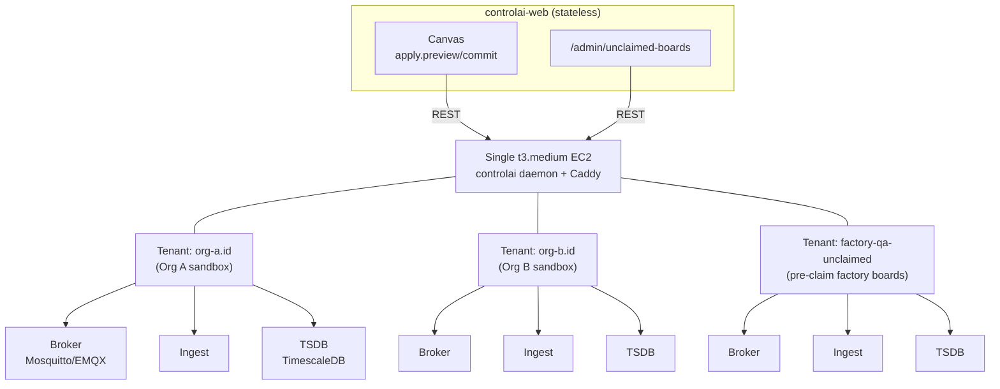

# Default Daemon Deployment Guide

**Audience:** Infrastructure operators deploying the shared default daemon  
**Duration:** ~45 minutes (one-time setup)  
**AWS Required:** No. This is a bare EC2 instance, not an AWS-managed service.

## Overview

The **Default Daemon** is a single shared EC2 instance that all ControlAI organizations can use immediately after signup. Unlike the managed auto-provisioning service (which creates per-org containers), the default daemon is manually deployed once and then serves every organization's sandbox environment.

Every organization automatically receives a singleton `ControlaiInstance` row pointing at this shared daemon when they sign up. Users can drag-drop canvas nodes (real or synthetic), hit Apply, and see signals flowing through the complete pipeline (broker → ingest → TSDB → dashboard) within seconds.

### Architecture



**Key Points:**
- **One EC2 instance** runs the `controlai` daemon binary + Caddy reverse proxy + Let's Encrypt.
- **Multi-tenant inside:** Each organization maps to a tenant with ID = `Organization.id`.
- **Special factory tenant:** Pre-claimed factory boards land in `factory-qa-unclaimed` until users claim them.
- **Operator-deployed:** Manually provisioned; no IaC in v1 (IaC via follow-up spec).

---

## Prerequisites

Before you begin, ensure you have:

1. **AWS Account Access** — EC2 console, ability to create instances, security groups, and elastic IPs.
2. **Domain & DNS Control** — You own (or can delegate) the domain `daemons.controlai.io` or a subdomain (e.g., `default.daemons.controlai.io`).
3. **SSH Access** — Ability to SSH into EC2 instances.
4. **Operator Credentials** — The `DEFAULT_DAEMON_BEARER_TOKEN` (encrypted bearer token) from your secret manager.

**Environment Variables You Will Set:**
```bash
DEFAULT_DAEMON_BASE_URL=https://default.daemons.controlai.io
DEFAULT_DAEMON_BEARER_TOKEN=<token from step 1.4 below>
```

---

## Step-by-Step Deployment

### 1.1 — Provision EC2 Instance

1. **Region & Size:**
   - Region: `ap-northeast-2` (Korea; adjust if you prefer a different location).
   - Instance type: **t3.medium** (2 vCPU, 4 GB RAM; sufficient for dev/staging; upgrade if you exceed ~100 concurrent orgs or see CPU throttling).

2. **Launch in EC2 Console:**
   - AMI: Use the latest Ubuntu 22.04 LTS (Jammy) or similar Linux distro.
   - VPC: Default or your standard VPC.
   - Security Group:
     - **Inbound:**
       - SSH (port 22) from your office/bastion IP (restrict; don't open to 0.0.0.0).
       - HTTP (port 80) from 0.0.0.0/0 (needed for Let's Encrypt validation).
       - HTTPS (port 443) from 0.0.0.0/0 (client-facing).
     - **Outbound:** Allow all (or at least HTTPS to Let's Encrypt CA + NTP).
   - Storage: 100 GB gp3 (sufficient for sandbox TSDB; monitor and expand if needed).
   - **DO NOT** use a spot instance (daemons should be stable).

3. **Tag it:**
   ```
   Name: default-daemon-prod
   Environment: production
   Owner: platform-team
   ```

4. **Allocate & Associate Elastic IP:**
   - Allocate a new Elastic IP.
   - Associate it with the EC2 instance.
   - Note the public IP (you'll delegate DNS to it in step 1.5).

5. **SSH in:**
   ```bash
   ssh -i your-key.pem ubuntu@<elastic-ip>
   ```

### 1.2 — Install Caddy (Reverse Proxy + Let's Encrypt)

Caddy will:
- Listen on port 443 (HTTPS, public-facing).
- Automatically obtain and renew TLS certificates from Let's Encrypt.
- Proxy requests to the daemon on `localhost:8080` (private port).

**Installation:**

```bash
# Update system
sudo apt update && sudo apt upgrade -y

# Add Caddy repository (official)
sudo apt install -y debian-keyring debian-archive-keyring apt-transport-https
curl https://dl.filippo.io/caddy/packages/debian/caddy-stable.gpg | sudo tee /usr/share/keyrings/caddy-archive-keyring.gpg >/dev/null
echo "deb [signed-by=/usr/share/keyrings/caddy-archive-keyring.gpg] https://dl.filippo.io/caddy/packages/debian stable main" | sudo tee /etc/apt/sources.list.d/caddy-stable.list
sudo apt update

# Install Caddy
sudo apt install -y caddy

# Enable and start Caddy (we'll configure the Caddyfile next)
sudo systemctl enable caddy
```

**Configure Caddyfile:**

Create `/etc/caddy/Caddyfile`:

```caddy
default.daemons.controlai.io {
  # Reverse proxy to daemon on localhost:8080
  reverse_proxy localhost:8080 {
    # Keep-alive and timeouts
    header_up Connection "upgrade"
    header_up Upgrade "websocket"
  }
  
  # Let's Encrypt auto-renewal (automatic with Caddy)
  # No explicit cert directive needed; Caddy handles it.
  
  # Optional: logging (inspect if issues arise)
  log {
    output stdout
    format json
  }
}
```

**Reload Caddy:**

```bash
sudo systemctl reload caddy
```

**Verify Caddy is running:**

```bash
sudo systemctl status caddy
curl http://localhost:8080/health  # Should return daemon health (we'll configure this in step 1.3)
```

At this point, Caddy should be attempting to get a Let's Encrypt cert. You can check logs:

```bash
sudo journalctl -u caddy -f
```

---

### 1.3 — Install `controlai` Daemon Binary

The `controlai` daemon is the core service. It's deployed via the systemd service file included in the repo.

**Prerequisite:** Ensure `../controlai` repo's `deploy/install/install.sh` is available. (You may need to fetch it or have it pre-staged.)

**Installation:**

```bash
# Create controlai user (if not exists)
sudo useradd -r -s /bin/bash -d /opt/controlai controlai || true

# Create directories
sudo mkdir -p /opt/controlai /var/log/controlai
sudo chown -R controlai:controlai /opt/controlai /var/log/controlai

# Download and run the install script (adjust path/URL as needed)
# Example: from a release or build artifact
# For dev, you might clone the controlai repo and run install from there
git clone https://github.com/your-org/controlai.git /tmp/controlai-repo
cd /tmp/controlai-repo
sudo ./deploy/install/install.sh --prefix /opt/controlai

# The script should:
# 1. Copy the controlai binary to /opt/controlai/bin/controlai
# 2. Copy systemd service file to /etc/systemd/system/controlai.service
# 3. Create the controlai user and directories

# Enable the service
sudo systemctl daemon-reload
sudo systemctl enable controlai

# (Do NOT start yet — we need to configure env vars first)
```

**Verify binary is in place:**

```bash
ls -la /opt/controlai/bin/controlai
```

### 1.4 — Bootstrap factory-qa-unclaimed Tenant

The factory-qa-unclaimed tenant is a special isolated slice where pre-claimed factory boards land before users claim them.

**Generate Bearer Token:**

Start the daemon momentarily to initialize its PKI and generate an admin token:

```bash
sudo systemctl start controlai
sleep 5  # Wait for startup

# Fetch the admin/bootstrap token from the daemon (depends on daemon's auth model)
# This is typically printed in logs or stored in a file like /opt/controlai/admin-token
sudo cat /opt/controlai/admin-token

# Or call the daemon's admin API to generate a token:
curl -X POST http://localhost:8080/v1/admin/tokens \
  -H "Content-Type: application/json" \
  -d '{"name": "default-daemon-operator"}' | jq .token

# Stop the daemon for now (we'll start it properly in step 1.6)
sudo systemctl stop controlai
```

**Save the bearer token securely** (e.g., in your secret manager, environment, or operator runbook).

**Bootstrap the factory tenant:**

```bash
# Start daemon again
sudo systemctl start controlai
sleep 5

# Create the factory-qa-unclaimed tenant
BEARER_TOKEN="<token from above>"
curl -X POST http://localhost:8080/v1/tenants \
  -H "Authorization: Bearer $BEARER_TOKEN" \
  -H "Content-Type: application/json" \
  -d '{
    "id": "factory-qa-unclaimed",
    "name": "Factory QA Unclaimed Boards"
  }'

# Create an initial site in that tenant (broker + ingest + TSDB)
curl -X POST http://localhost:8080/v1/tenants/factory-qa-unclaimed/sites \
  -H "Authorization: Bearer $BEARER_TOKEN" \
  -H "Content-Type: application/json" \
  -d '{
    "name": "factory-qa-default",
    "brokerKind": "mosquitto",
    "sensorGroupId": "factory-qa-unclaimed",
    "ingestDirection": "pull",
    "retentionDays": 30
  }'

# Verify the tenant was created
curl http://localhost:8080/v1/tenants/factory-qa-unclaimed \
  -H "Authorization: Bearer $BEARER_TOKEN" | jq .
```

**Store the bearer token securely:**
- Save it in your organization's secret manager (e.g., AWS Secrets Manager, HashiCorp Vault).
- You will set `DEFAULT_DAEMON_BEARER_TOKEN=<this token>` in step 1.6.

### 1.5 — Delegate DNS

Update your DNS registrar to point to the EC2 instance's Elastic IP.

**At your DNS registrar (Route53, Cloudflare, GoDaddy, etc.):**

Create an A record:
```
Name:  default.daemons.controlai.io
Type:  A
Value: <elastic-ip-address from step 1.1>
TTL:   300 (or lower for testing)
```

**Verify DNS resolution:**

```bash
nslookup default.daemons.controlai.io
# Should return the elastic IP

curl https://default.daemons.controlai.io/v1/health
# Should return daemon health status (HTTP 200)
```

**If HTTPS fails with cert error:**
- Wait a few minutes for Let's Encrypt to validate and issue the cert.
- Check Caddy logs: `sudo journalctl -u caddy -f`
- Ensure DNS is resolving correctly: `dig default.daemons.controlai.io`

---

### 1.6 — Configure Environment Variables

Update the daemon systemd service file to pass the bearer token and any other required env vars.

**Edit systemd service:**

```bash
sudo nano /etc/systemd/system/controlai.service
```

Ensure the `[Service]` section includes:

```ini
[Service]
Type=simple
User=controlai
WorkingDirectory=/opt/controlai
ExecStart=/opt/controlai/bin/controlai --bind 0.0.0.0:8080 --log-level info
Restart=always
RestartSec=10

# Set environment variables
Environment="DEFAULT_DAEMON_BEARER_TOKEN=<bearer-token>"
Environment="DAEMON_NAME=default-sandbox"
Environment="INSTANCE_TYPE=default"

# Log output
StandardOutput=journal
StandardError=journal
SyslogIdentifier=controlai
```

**Reload and restart:**

```bash
sudo systemctl daemon-reload
sudo systemctl restart controlai

# Verify it's running
sudo systemctl status controlai
curl https://default.daemons.controlai.io/v1/health
```

---

### 1.7 — Health Checks

**Daemon Health:**

```bash
# Should return HTTP 200 with status JSON
curl https://default.daemons.controlai.io/v1/health | jq .
```

Expected response:
```json
{
  "status": "healthy",
  "uptime_seconds": 123,
  "version": "0.1.0",
  "tenants_count": 1
}
```

**Caddy & TLS:**

```bash
# Check Caddy status
sudo systemctl status caddy

# Inspect cert expiry (should be ~90 days from now)
echo | openssl s_client -connect default.daemons.controlai.io:443 -servername default.daemons.controlai.io 2>/dev/null | openssl x509 -noout -dates
```

**Logs:**

```bash
# Daemon logs
sudo journalctl -u controlai -f

# Caddy logs
sudo journalctl -u caddy -f

# System-wide
sudo tail -f /var/log/syslog
```

---

## Setting ControlAI Web Environment Variables

Once the daemon is healthy, configure the ControlAI web app to use it.

**In your deployment environment** (production Kubernetes, CI/CD, or `.env` file):

```bash
DEFAULT_DAEMON_BASE_URL=https://default.daemons.controlai.io
DEFAULT_DAEMON_BEARER_TOKEN=<encrypted-bearer-token>
```

**Verification in the web app:**

1. Sign up a new organization (or use an existing test org).
2. Navigate to `/orgs/<orgId>/instances`.
3. You should see a new read-only instance with status **"Sandbox daemon: HEALTHY"**.
4. No "Create Instance" button should appear.

---

## Operations & Maintenance

### Monitoring

**CPU & Memory:**
```bash
# On the EC2 instance
top
htop  # If installed

# Or via CloudWatch if using AWS monitoring
```

**Disk Space:**
```bash
df -h /
# TimescaleDB TSDB data lives in /var/lib/controlai/tsdb/ (or configured path)
# Monitor for growth; delete old data if needed
```

**Uptime & Restarts:**
```bash
sudo systemctl status controlai
# Check "Active since" and restart count
```

### Backups

**TSDB Data Backup:**
The factory-qa-unclaimed tenant's TSDB contains factory board telemetry. Consider periodic backups:

```bash
# Backup TimescaleDB (requires pg_dump access)
sudo -u postgres pg_dump -d controlai_tsdb | gzip > /backups/tsdb-$(date +%Y%m%d).sql.gz
```

### Certificate Renewal

Caddy handles Let's Encrypt renewal automatically. Certificates are renewed ~30 days before expiry. You should not need to intervene, but monitor:

```bash
sudo journalctl -u caddy | grep -i "renew\|cert"
```

### Scaling Notes

**If you exceed capacity** (high CPU, memory, or disk):

1. **Upgrade instance type** (t3.large, t3.xlarge) — requires downtime for single-instance setup.
2. **Scale TSDB retention** — increase `retentionDays` on per-org sites to archive old data.
3. **Monitor organization count** — as you grow, consider follow-up HA/clustering spec.

---

## Troubleshooting

### Daemon Not Starting

```bash
sudo systemctl status controlai
sudo journalctl -u controlai -e | tail -50
```

**Common issues:**
- Port 8080 already in use: Kill the conflicting process or change daemon bind port.
- Binary missing: Verify `/opt/controlai/bin/controlai` exists and is executable.
- Permission denied: Ensure `controlai` user owns `/opt/controlai` directory.

### HTTPS / TLS Issues

```bash
# Caddy failing to get cert?
sudo journalctl -u caddy -e | tail -50

# Check DNS resolution
nslookup default.daemons.controlai.io
# If not resolving, wait a few minutes for DNS propagation

# Test manual ACME (if needed)
echo | openssl s_client -connect default.daemons.controlai.io:443
```

### ControlAI Web App Can't Reach Daemon

1. Verify daemon is running: `curl http://localhost:8080/v1/health`
2. Verify Caddy is proxying: `curl https://default.daemons.controlai.io/v1/health`
3. Check firewall security group: Ensure port 443 is open.
4. Verify env vars in web app: `DEFAULT_DAEMON_BASE_URL` and `DEFAULT_DAEMON_BEARER_TOKEN` are set.

### Stuck Synthetic Signal Generation

If signals aren't appearing in the canvas within 10 seconds:

1. Check daemon logs: `sudo journalctl -u controlai -f`
2. Verify simulator is running (if synthetic nodes are used).
3. Check broker logs: `docker logs <broker-container>` (broker runs in Docker Compose inside the daemon).
4. Verify ingest is consuming: Check TSDB data is being written.

---

## Next Steps

### Backfill Existing Organizations

If you deployed the default daemon after some organizations were already created, you can backfill them with `ControlaiInstance` rows:

```bash
# In the controlai-web app directory:
pnpm --filter @controlai-web/api exec ts-node packages/api/src/scripts/backfill-default-instances.ts
```

This script idempotently creates default daemon rows for all orgs that don't have one yet.

### Follow-Up Specs

- **add-board-claim-flow:** Enable users to claim unclaimed factory boards (OTA cert/URL push).
- **add-managed-tier-container-mode:** Per-org ECS provisioning (deferred EC2 provisioner).
- **add-default-daemon-ha:** Multi-AZ failover and load balancing.

---

## See Also

- [Instance Provisioning Guide](instance-provisioning.md) — Auto-provisioned managed daemons (different from this default daemon).
- [Instance BYO vs Managed](instance-byo-vs-managed.md) — Comparison of sandbox, BYO, and managed models.
- [Admin: Unclaimed Boards](admin-unclaimed-boards.md) — How to view factory boards in the admin panel.
- OpenSpec: [add-default-daemon-sandbox](../openspec/changes/add-default-daemon-sandbox/proposal.md) — Full technical specification.
