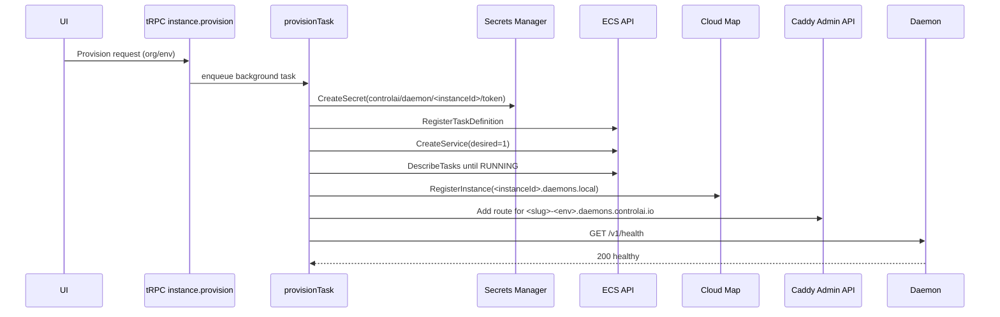

# EC2 Container Provisioner Setup (Operator Runbook)

## 1) Overview

This runbook is for operators enabling the EC2-backed managed daemon path in AWS (`INSTANCE_PROVISIONER=ec2`). It covers one-time account bootstrap, CDK deployment, DNS delegation, daemon image publication, environment wiring, smoke testing, and rollback.



## 2) One-time AWS account prep

Configure AWS CLI profile:

```bash
aws configure --profile controlai
aws sts get-caller-identity --profile controlai
```

Bootstrap CDK in ap-northeast-2:

```bash
cdk bootstrap aws://<account>/ap-northeast-2 --profile controlai
```

## 3) CDK deploy

Deploy in this order:

```bash
pnpm --filter @controlai-web/infra cdk deploy controlai-network --profile controlai
pnpm --filter @controlai-web/infra cdk deploy controlai-ecs --profile controlai
pnpm --filter @controlai-web/infra cdk deploy controlai-dns --profile controlai
pnpm --filter @controlai-web/infra cdk deploy controlai-ingress --profile controlai
pnpm --filter @controlai-web/infra cdk deploy controlai-monitoring --profile controlai
```

What each stack gives you:
- **Network**: VPC/subnets used by ECS + ingress.
- **Ecs**: ECS cluster, daemon task/execution roles, daemon SG, secrets KMS key, ECR repo, log group.
- **Dns**: `daemons.controlai.io` Route53 hosted zone + wildcard ACM cert.
- **Ingress**: ALB + Caddy service + Cloud Map namespace/service used for daemon routing.
- **Monitoring**: SNS topic + CloudWatch alarms.

## 4) DNS delegation

Get nameservers from the hosted zone created by `controlai-dns`:

```bash
aws route53 list-hosted-zones-by-name --dns-name daemons.controlai.io --profile controlai
aws route53 get-hosted-zone --id <hosted-zone-id> --profile controlai
```

Take the `DelegationSet.NameServers` values and create/update an **NS** record for `daemons.controlai.io` in your parent zone (where `controlai.io` is managed).

## 5) ECR image push

Authenticate Docker to ECR:

```bash
aws ecr get-login-password --region ap-northeast-2 --profile controlai \
  | docker login --username AWS --password-stdin <account>.dkr.ecr.ap-northeast-2.amazonaws.com
```

Tag and push `controlai-daemon:stable`:

```bash
docker tag controlai-daemon:stable <account>.dkr.ecr.ap-northeast-2.amazonaws.com/controlai-daemon:stable
docker push <account>.dkr.ecr.ap-northeast-2.amazonaws.com/controlai-daemon:stable
```

## 6) Env var mapping table

Map CDK SSM outputs (`/controlai/infra/*`) into `apps/web/.env.local`.

| CDK SSM output key | controlai-web env var |
|---|---|
| `/controlai/infra/ECS_CLUSTER_NAME` | `ECS_CLUSTER_NAME` |
| `/controlai/infra/ECS_TASK_ROLE_ARN` | `ECS_TASK_ROLE_ARN` |
| `/controlai/infra/ECS_EXECUTION_ROLE_ARN` | `ECS_EXECUTION_ROLE_ARN` |
| `/controlai/infra/ECS_SECURITY_GROUP_ID` | `ECS_SECURITY_GROUP_ID` |
| `/controlai/infra/ECS_SUBNETS` | `ECS_SUBNETS` |
| `/controlai/infra/CADDY_ADMIN_ENDPOINT` | `CADDY_ADMIN_ENDPOINT` |
| `/controlai/infra/SECRETS_KMS_KEY_ARN` | `SECRETS_KMS_KEY_ARN` |
| `/controlai/infra/DAEMON_LOG_GROUP` | `DAEMON_LOG_GROUP` |
| `/controlai/infra/CLOUD_MAP_NAMESPACE_ID` | `CLOUD_MAP_NAMESPACE_ID` |
| `/controlai/infra/CLOUD_MAP_SERVICE_ID` | `CLOUD_MAP_SERVICE_ID` |
| *(manual/account setting)* | `AWS_REGION=ap-northeast-2` |
| *(manual/account setting)* | `AWS_ACCOUNT_ID=<account>` |
| *(fixed for this change)* | `ECS_TASK_FAMILY=controlai-daemon` |
| *(from image pipeline)* | `DAEMON_IMAGE=<account>.dkr.ecr.ap-northeast-2.amazonaws.com/controlai-daemon:stable` |
| *(domain config)* | `DAEMON_BASE_DOMAIN=daemons.controlai.io` |
| *(frontend mirror)* | `NEXT_PUBLIC_DAEMON_BASE_DOMAIN=daemons.controlai.io` |
| *(backend selector)* | `INSTANCE_PROVISIONER=ec2` |

## 7) Smoke test checklist

1. **Provision test daemon** from the app UI.
2. Confirm it reaches **HEALTHY in <90s**.
3. Hit:
   - `https://<slug>-prod.daemons.controlai.io/v1/health`
4. **Deprovision** it, then verify cleanup:

```bash
aws ecs list-services --cluster controlai-daemons --region ap-northeast-2 --profile controlai
aws secretsmanager list-secrets --filters Key=name,Values=controlai/daemon/ --region ap-northeast-2 --profile controlai
aws servicediscovery list-instances --service-id <cloud-map-service-id> --region ap-northeast-2 --profile controlai
```

5. **Force-fail test**: set bad `DAEMON_IMAGE`, provision again, confirm failure shows `IMAGE_PULL_FAILED`.
6. Fix image, retry, confirm success.
7. **Orphan cleanup test**: provision successfully, manually delete DB row, verify hourly orphan reconciliation tears down AWS resources.

## 8) Rollback

- Immediate rollback path: set `INSTANCE_PROVISIONER=mock` and restart the app.
- If infra rollback is needed, destroy stacks in reverse dependency order:

```bash
pnpm --filter @controlai-web/infra cdk destroy controlai-monitoring --profile controlai
pnpm --filter @controlai-web/infra cdk destroy controlai-ingress --profile controlai
pnpm --filter @controlai-web/infra cdk destroy controlai-dns --profile controlai
pnpm --filter @controlai-web/infra cdk destroy controlai-ecs --profile controlai
pnpm --filter @controlai-web/infra cdk destroy controlai-network --profile controlai
```

## 9) Cost expectations

- Empty cluster baseline: 1× t3.medium (~$30/mo) + ALB (~$22/mo) + 1× NAT gateway (~$32/mo) + Route53 zone (~$0.50/mo) + 2× Caddy Fargate replicas (~$15/mo) ≈ **~$100/mo idle**.
- At 100 daemons: ~$0.60 × 100 + baseline + Secrets Manager (100 × $0.40 = $40) ≈ **~$200/mo**.
- At 1000 daemons: ~$0.60 × 1000 + baseline + Secrets Manager ($400) ≈ **~$1100/mo** (~$1.10/daemon).
- Secrets Manager is the dominant scaling cost.
