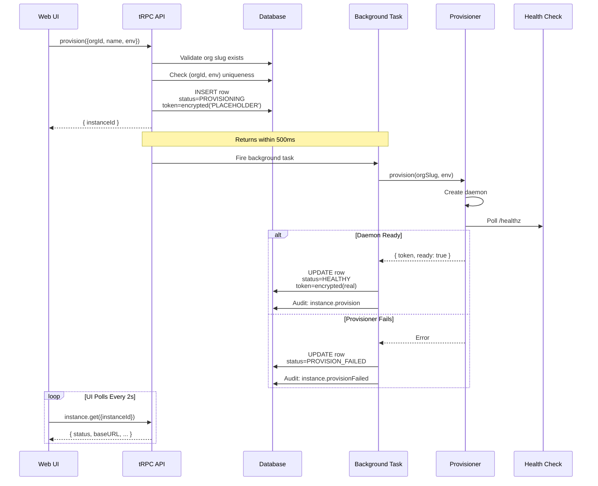
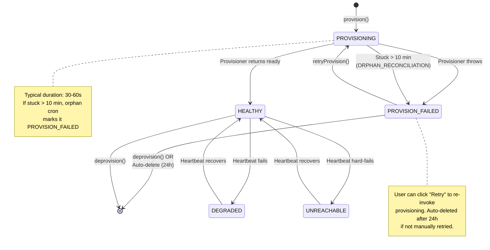

# Instance Provisioning Guide

## Overview

Instance provisioning is the automated process of spinning up a new ControlAI daemon container for your organization. When you provision a managed instance, ControlAI:

1. Creates a daemon running on derived infrastructure
2. Generates a secure bearer token automatically
3. Stores the token encrypted in the database
4. Makes the instance available to your projects

This feature is designed for **managed-tier customers** who want zero-touch daemon deployment. If you prefer to run daemons on your own infrastructure (on-prem, air-gapped, custom setup), use the **BYO (Bring Your Own)** registration flow instead — see [Instance BYO vs Managed](instance-byo-vs-managed.md).

## Prerequisites

Before provisioning a managed daemon, ensure the following are configured:

### AWS Infrastructure Setup (Operator Only)

The managed provisioning backend runs on AWS ECS-on-EC2 in the `ap-northeast-2` region. Your operator must complete one-time AWS setup:

1. Configure the AWS CLI with credentials for your ControlAI AWS account.
2. Run `cdk bootstrap aws://<account>/ap-northeast-2` (AWS CDK one-time bootstrap).
3. Deploy the CDK infrastructure stacks (Network → ECS → DNS → Ingress → Monitoring).
4. Delegate the DNS zone `daemons.controlai.io` to the Route53 hosted zone created by the DnsStack.
5. Push the daemon image `controlai-daemon:stable` to the ECR repository created by the EcsStack.

See [EC2 Container Provisioner Setup](ec2-container-provisioner-setup.md) for detailed operator instructions.

### Wildcard DNS & TLS (Automated)

The managed provisioning backend automatically handles DNS and TLS:

- **Wildcard DNS:** Route53 hosted zone `daemons.controlai.io` with alias record `*.daemons.controlai.io` → ALB in the controlai-web AWS account.
- **Wildcard TLS Certificate:** AWS Certificate Manager (ACM) auto-issues and manages the wildcard cert for `*.daemons.controlai.io`, validated via Route53 DNS records.

Once the operator delegates the DNS zone and deploys the infrastructure, daemon URLs like `acme-prod.daemons.controlai.io` automatically resolve to the ControlAI ALB and are encrypted with the wildcard TLS certificate.

### Required Environment Variables

Configure these environment variables on your ControlAI control app (production values set by operator via CDK outputs):

| Variable | Required When | Default | Example | Notes |
| --- | --- | --- | --- | --- |
| `DAEMON_BASE_DOMAIN` | Always (provisioning enabled) | (none) | `daemons.controlai.io` | Apex domain for derived daemon URLs |
| `NEXT_PUBLIC_DAEMON_BASE_DOMAIN` | Always (UI preview) | (none) | `daemons.controlai.io` | Mirror of above; exposed to client-side for URL preview |
| `INSTANCE_PROVISIONER` | Always | `mock` | `mock` or `ec2` | Backend implementation; `mock` for dev/demo, `ec2` for AWS ECS-on-EC2 provisioning |
| **AWS Infrastructure (When `INSTANCE_PROVISIONER=ec2`)** | | | | |
| `AWS_REGION` | When `INSTANCE_PROVISIONER=ec2` | (none) | `ap-northeast-2` | AWS region where ECS cluster and managed daemons run |
| `AWS_ACCOUNT_ID` | When `INSTANCE_PROVISIONER=ec2` | (none) | `123456789012` | AWS account ID for cross-account references and ECR auth |
| `ECS_CLUSTER_NAME` | When `INSTANCE_PROVISIONER=ec2` | (none) | `controlai-daemons` | ECS cluster name where daemons are provisioned |
| `ECS_TASK_FAMILY` | When `INSTANCE_PROVISIONER=ec2` | (none) | `controlai-daemon` | ECS task definition family name (versioned by provisioner) |
| `ECS_TASK_ROLE_ARN` | When `INSTANCE_PROVISIONER=ec2` | (none) | `arn:aws:iam::<account>:role/controlai-daemon-task-role` | IAM role for daemon containers to assume |
| `ECS_EXECUTION_ROLE_ARN` | When `INSTANCE_PROVISIONER=ec2` | (none) | `arn:aws:iam::<account>:role/controlai-daemon-execution-role` | IAM role for ECS to fetch secrets and pull images |
| `ECS_SECURITY_GROUP_ID` | When `INSTANCE_PROVISIONER=ec2` | (none) | `sg-0123456789abcdef0` | Security group ID for daemon containers (egress-only) |
| `ECS_SUBNETS` | When `INSTANCE_PROVISIONER=ec2` | (none) | `subnet-123456,subnet-789abc` | Comma-separated private subnet IDs for daemon placement |
| `CADDY_ADMIN_ENDPOINT` | When `INSTANCE_PROVISIONER=ec2` | (none) | `http://caddy.daemons.local:2019` | Internal Cloud Map DNS + port for Caddy reverse proxy admin API |
| `SECRETS_KMS_KEY_ARN` | When `INSTANCE_PROVISIONER=ec2` | (none) | `arn:aws:kms:ap-northeast-2:<account>:key/12345678` | KMS key ARN for encrypting daemon bearer tokens in Secrets Manager |
| `DAEMON_LOG_GROUP` | When `INSTANCE_PROVISIONER=ec2` | (none) | `/aws/ecs/controlai-daemons` | CloudWatch log group name where daemon logs are written |
| `DAEMON_IMAGE` | When `INSTANCE_PROVISIONER=ec2` | (none) | `<account>.dkr.ecr.ap-northeast-2.amazonaws.com/controlai-daemon:stable` | Container image URL in ECR (private registry) |

## End-to-End Provisioning Flow

The provisioning process is asynchronous and happens in two phases:



**Key Points:**
- **Fast return:** The API returns with an instance ID in <500ms, before the background task starts.
- **Polling:** Your UI polls `instance.get()` to watch for status changes (typically PROVISIONING → HEALTHY in 30-60s).
- **Token security:** The plaintext bearer token is never logged, never shown in the UI, and only encrypted for storage.

## State Machine

A provisioned daemon progresses through the following states:



### State Descriptions

| State | Meaning | Duration | Action |
| --- | --- | --- | --- |
| **PROVISIONING** | Daemon container is being created | ~30-60s | Wait or retry if stuck >10 min |
| **HEALTHY** | Daemon is ready and responding | Indefinite | Use for projects; deprovision to teardown |
| **PROVISION_FAILED** | Provisioning encountered an error | Until retry or 24h | Click "Retry Provision" or wait for auto-cleanup |
| **DEGRADED** | Daemon is responding but showing issues | Transient | Monitor; typically recovers automatically |
| **UNREACHABLE** | Daemon is not responding to health checks | Transient | Monitor; if persistent, investigate logs |

## Retry Semantics

If provisioning fails or gets stuck in `PROVISIONING`, you can retry:

```
instance.retryProvision({ instanceId })
```

**Conditions:**
- Only allowed when the instance is in `PROVISION_FAILED` state OR stuck in `PROVISIONING` for >10 minutes.
- Resets `provisioningStartedAt` to the current time.
- Re-invokes the provisioner from scratch.

**Example:**
1. You click "Provision Instance" → `PROVISIONING` starts.
2. After 45 seconds, provisioning fails → status becomes `PROVISION_FAILED`, error message shown.
3. You click "Retry Provision" → status back to `PROVISIONING`, background task fires again.
4. Provisioning succeeds → status becomes `HEALTHY`.

## Auto-Cleanup of Failed Provisions

The system automatically cleans up failed provisions to prevent database clutter:

- **Threshold:** Instances in `PROVISION_FAILED` state older than **24 hours**.
- **Action:** The provisioner attempts to tear down the underlying daemon (best-effort; errors are ignored). The database row is then deleted.
- **Audit log:** An `instance.autoCleanup` audit entry is written.
- **Safety:** If you click "Retry" while cleanup is running, the cleanup skips that row (checked atomically mid-transaction).

This is a best-effort cleanup — you do not need to intervene, but you can also manually deprovision at any time.

## Deprovision (Teardown)

To shut down and remove a provisioned daemon:

```
instance.deprovision({ instanceId })
```

**Conditions:**
- Only organization OWNER can deprovision.
- No projects can be attached to the instance (the UI lists them).
- If projects are attached, delete them first.

**What happens:**
1. Provisioner is called to tear down the underlying daemon (e.g., delete ECS service, deregister task definition revisions, remove Cloud Map service registration, delete Secrets Manager secret).
2. Database row is deleted.
3. Audit log entry `instance.deprovision` is written.

## Troubleshooting

Use this table to diagnose provisioning issues:

| Symptom | Error Code | Probable Cause | Investigation | Action |
| --- | --- | --- | --- | --- |
| Stuck in `PROVISIONING` for >1 min | (timeout) | ECS task never reached `RUNNING` state | Check CloudWatch logs in `/aws/ecs/controlai-daemons` for container startup errors; verify daemon image is accessible in ECR | Retry provisioning; if still fails, contact support |
| `PROVISION_FAILED` with timeout | `MACHINE_START_TIMEOUT` | Daemon startup exceeded 90-second budget | Check CloudWatch logs for image pull time; verify ECS capacity provider is scaling the ASG | Retry provisioning; if capacity is exhausted, operator must increase ASG max |
| `PROVISION_FAILED` | `INSUFFICIENT_CAPACITY` | EC2 ASG cannot spawn a new host or instance type not available in region | Check EC2 console for capacity issues; verify ASG min/max settings match current workload | Operator increases ASG max size; retry provisioning |
| `PROVISION_FAILED` | `IMAGE_PULL_FAILED` | Daemon image not found or not accessible in ECR | Verify the image URI in `DAEMON_IMAGE` matches actual ECR repository; confirm image is pushed with correct tag | Operator pushes image to ECR; retry provisioning |
| `PROVISION_FAILED` | `CADDY_ROUTE_ADD_FAILED` | Caddy reverse proxy service unhealthy or admin API unreachable | Check ECS service logs for Caddy failures; verify Caddy Cloud Map DNS name resolves | Operator checks Caddy service health in ECS console; restart if needed; retry provisioning |
| `PROVISION_FAILED` | `TASK_FAILED_TO_START` | ECS task definition or execution role misconfigured | Check CloudWatch logs for IAM permission errors; verify execution role has `secretsmanager:GetSecretValue` and `kms:Decrypt` permissions | Operator reviews IAM role permissions and CloudWatch logs; retry provisioning |
| Provision succeeds but UI shows `UNREACHABLE` | (no code) | Post-provision health check failed | Inspect daemon logs in CloudWatch; verify `DAEMON_BEARER_TOKEN` was injected via Secrets Manager | Check daemon logs; if token injection failed, deprovision and retry |
| All provision attempts fail | (auth error) | controlai-web task role missing AWS permissions | Verify the controlai-web task role has `ecs:RegisterTaskDefinition`, `ecs:CreateService`, `secretsmanager:CreateSecret` and other required permissions scoped to the daemon cluster | Operator reviews IAM policy; add missing permissions; retry |
| Daemon appears `HEALTHY` but projects report connection errors | (no code) | Daemon is running but not connected to projects properly, or bearer token mismatch | Verify daemon logs in CloudWatch; confirm projects are using the correct bearer token from the UI | Check daemon logs; if token was not injected, deprovision and provision new |

## Finding Audit Logs

To audit all provisioning actions, query the `AuditLog` table for these action types:

| Action | When | Useful For |
| --- | --- | --- |
| `instance.provision` | Daemon successfully provisioned | Track successful provisions |
| `instance.provisionFailed` | Provisioning failed | Diagnose failures |
| `instance.retryProvision` | User retried a failed provision | Track retry attempts |
| `instance.deprovision` | Daemon was torn down | Audit teardowns |
| `instance.autoCleanup` | System auto-deleted failed row after 24h | Verify cleanup ran |

Example query:
```sql
SELECT * FROM "AuditLog"
WHERE action IN ('instance.provision', 'instance.provisionFailed', 'instance.retryProvision', 'instance.deprovision', 'instance.autoCleanup')
ORDER BY "createdAt" DESC
LIMIT 20;
```

## Further Reading

- [Instance BYO vs Managed](instance-byo-vs-managed.md) — Compare BYO and auto-provisioned models.
- [EC2 Container Provisioner Setup](ec2-container-provisioner-setup.md) — Operator guide for one-time AWS infrastructure setup and deployment.
- [OpenSpec: add-instance-auto-provisioning](../openspec/changes/add-instance-auto-provisioning/proposal.md) — Full technical specification for managed instance feature.
- [OpenSpec: add-ec2-container-provisioner](../openspec/changes/add-ec2-container-provisioner/proposal.md) — Technical specification for EC2 backend implementation.
