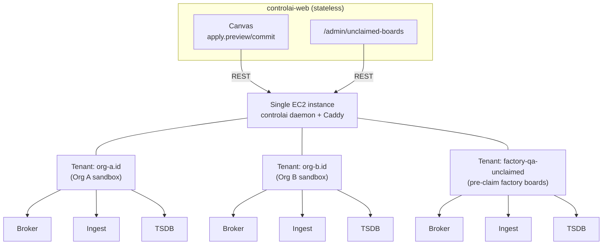

# Design: Default Daemon Sandbox

## Context

The canvas (`apps/web/components/canvas/`) is mature: React-Flow-based with broker/device/gateway/ingest/monitoring/sensor/timescaledb node types (all unified under `DeviceNode` component), drag-drop via `deviceTypeId`, and an `ApplyModal` preview/commit workflow. Three archived specs provide the foundation: `add-plugin-device-type-registry` (manifests + catalog), `add-unregistered-device-lifecycle` (Device table + registration state machine), and `extend-gateway-register-handshake` (Web Serial board provisioning). The apply pipeline (`apply-planner.ts` + `apply-executor.ts`) already synthesizes ordered daemon ops and pushes registration changes.

However, today's system has three critical gaps:
1. Canvas does **not** push broker/ingest/tsdb config to the daemon — only device registration.
2. There is **no default daemon** all users can target; they're stuck with mock provisioning.
3. Factory boards (pre-flashed with default cert/URL/group_id) have **no landing place** and no admin visibility for QA.

This spec fills those gaps by introducing a singleton shared default daemon per organization, extending the canvas to configure the full pipeline, and adding synthetic signal generation for testing before hardware arrives.

## Goals / Non-Goals

### Goals
- Every organization auto-receives a singleton default daemon at signup with zero configuration.
- Users can configure broker kind (Mosquitto/EMQX), TimescaleDB retention, and ingest settings directly from the canvas.
- Synthetic signal generators (5 types: tilt, vibration, crack-encoder, noise-meter, vibrating-wire) let users test the full pipeline end-to-end with no hardware.
- Factory boards land in a visible admin view (`/admin/unclaimed-boards`) for QA workflow.
- Mixed real+synthetic nodes on one canvas = first-class, enabling gradual hardware bring-up.
- Reset semantics: Apply wipes and reconfigures only the current org's tenant slice; other orgs untouched.

### Non-Goals
- Per-org ECS-provisioned daemons (deferred `add-ec2-container-provisioner` stays unused until daemon containerization lands).
- Daemon containerization (separate `../controlai` spec).
- Board claim/OTA flow (follow-up `add-board-claim-flow` spec).
- Per-board mTLS isolation (factory-wide shared cert accepted; per-board deferred).
- Subscription tiering or per-tenant retention enforcement.
- Multi-region failover or HA daemon clustering.

## Decisions

**Decision 1: Default daemon deployed on single EC2 via systemd, not containerized**
- What: `controlai` binary runs directly on a t3.medium EC2 instance, managed by systemd (reuse `../controlai/deploy/install/` + systemd units), NOT via Docker/ECS.
- Why: Daemon is designed as a host agent (manages docker compose, local sqlite, unix sockets). Containerizing it requires significant refactor (`../controlai` spec). A bare EC2 instance is simplest for v1; operator overhead is minimal (single `systemctl start controlai`).
- Alternatives: (a) Container + ECS — requires daemon refactor (out of scope). (b) Fly.io managed VM — expensive at scale (~$150+/mo); single EC2 is cheaper and operator-owned.

**Decision 2: TLS via Caddy + Let's Encrypt at default.daemons.controlai.io**
- What: Daemon listens HTTP-only on a private port; Caddy reverse-proxy on the same EC2 terminates TLS, caches, and forwards to daemon. LE auto-renews certs.
- Why: Daemon's TLS code is simple HTTP; Caddy handles certificate rotation and renewal automatically. Simplest operational model.
- Alternatives: (a) Daemon's own TLS + manual cert rotation — higher operator burden. (b) AWS ALB + ACM — adds cost and infra complexity for single daemon.

**Decision 3: Multi-tenant model: tenantId = Organization.id (direct 1:1)**
- What: Inside the daemon, each ControlAI organization maps directly to one tenant. No generated tenant UUID; reuse org's ID.
- Why: Simplifies audit trail and role-based access (OWNER can only mutate their own tenant). Matches existing `apply.ts` pattern (already does `createTenant` per Site).
- Alternatives: (a) Single global tenant, routing by group_id only — no isolation; security risk. (b) Per-site-group tenant IDs — added complexity; most orgs have 1 site-group.

**Decision 4: Special factory-qa-unclaimed tenant for pre-claimed factory boards**
- What: Factory boards ship with hardcoded firmware pointing to `group_id: 'factory-qa-unclaimed'`. This maps to a daemon tenant reserved for unclaimed boards.
- Why: Separates unclaimed boards from org sandboxes; admin can see all unclaimed boards in one view without polluting each org's canvas.
- Alternatives: (a) Boards land in a per-org shared tenant — complicates multi-org sharing. (b) No special tenant — unclaimed boards scattered across tenants.

**Decision 5: Reset semantics: per-org slice only; reuse existing CRUD ops, no new /v1/reload endpoint**
- What: Apply idempotently uses `DELETE /v1/tenants/{orgId}` (wipe) + `POST /v1/tenants` (recreate) + existing `createSite/configureDriver/updateSite` ops. No new daemon endpoint.
- Why: Existing apply-executor + apply-planner already handle idempotent ops with 409 collision handling. Reusing them avoids new daemon contract; ops are scoped per-tenant by design.
- Alternatives: (a) New `/v1/reload` endpoint — adds daemon contract surface. (b) Stage directory + atomic swap (research §4) — transactional safety (overkill for sandbox where data-loss is acceptable).

**Decision 6: Singleton ControlaiInstance bootstrap via better-auth org.created hook**
- What: When a new org is created, a better-auth lifecycle hook auto-inserts a `ControlaiInstance` row with `baseURL = DEFAULT_DAEMON_BASE_URL` and `bearerTokenEnc = DEFAULT_DAEMON_BEARER_TOKEN` (from env vars).
- Why: Zero user action; all orgs immediately have a daemon. Better-auth hooks are already the pattern for org creation logic.
- Alternatives: (a) Manual admin CLI to seed row — requires operator action per org. (b) Lazy init on first canvas load — timing issues and confusing UX.

**Decision 7: Hide Create instance UI; replace with read-only health pill**
- What: `/orgs/[orgId]/instances` page hides the existing `Create instance` button when a default daemon row exists. Shows a status pill: "Sandbox daemon: HEALTHY / DEGRADED / UNREACHABLE, last-seen 2m ago".
- Why: Reduces confusion (instance creation is deferred). Health pill provides reassurance that the daemon is up.
- Alternatives: (a) Keep button but disable with tooltip — clearer intent but visual clutter. (b) Hide instances page entirely — lost visibility into daemon status.

**Decision 8: Soft-archive mock instances via new legacy boolean column**
- What: Add `ControlaiInstance.legacy Boolean @default(false)` column. At migration, set all existing rows to `legacy=true`. Queries for instances default to `WHERE legacy=false`. No hard delete.
- Why: Preserves audit history (can query legacy rows for troubleshooting) without confusing the UI.
- Alternatives: (a) Hard delete old rows — loses history. (b) Separate legacy table — more complex.

**Decision 9: Factory-wide shared MQTT mTLS cert for unclaimed boards; per-board isolation deferred**
- What: All factory boards ship with the same MQTT client cert + key pre-flashed. This cert is used to authenticate all boards to the factory-qa-unclaimed tenant's broker.
- Why: Factory burn-time cert generation is complex and out of scope. Shared cert is acceptable for unclaimed boards (physical possession + factory-qa isolation). Per-board cert rotation/revocation deferred to `add-board-claim-flow` spec.
- Alternatives: (a) Per-board cert at factory — requires cert infrastructure upfront (deferred). (b) Username/password only — weaker auth for test mode.

**Decision 10: Explicit Apply button with preview/diff; no autosave-apply**
- What: Reuse existing `ApplyModal` workflow. User must click "Apply" to push changes to daemon. Canvas autosaves every 30s (already exists) but does NOT push to daemon automatically.
- Why: Matches research recommendation R2 (preview before apply). Prevents accidental wipes during draft iterations.
- Alternatives: (a) Autosave-apply every 30s — risky; unwanted pushes to daemon. (b) No preview, instant apply — irreversible without warning.

**Decision 11: Best-effort rollback on apply failure; sandbox data-loss acceptable**
- What: If daemon op fails mid-flight, the daemon is left in partial/broken state; error is surfaced to user; user can fix canvas and retry. No transactional staging (research §4 Pattern 2).
- Why: Sandbox mode = user accepts data-loss (per research §7). Best-effort is lighter than transactional and matches user expectations.
- Alternatives: (a) Full transactional rollback — heavier daemon logic, slower operations. (b) Auto-reset to empty on failure — forces clean retry but loses context.

**Decision 12: Dashed border + ghost icon for UNREGISTERED; solid for REGISTERED**
- What: `DeviceNode` component extends to show: UNREGISTERED nodes have dashed border + faded icon; REGISTERED nodes have solid border. (Textual badge already exists.)
- Why: Research R1 + R8 recommend visual differentiation. Dashed borders are standard UI convention for "draft" / "simulated".
- Alternatives: (a) Color only (gray vs. normal) — less distinctive. (b) Text badge only — not visually scannable.

**Decision 13: Mixed real+synthetic nodes on same canvas = first-class**
- What: One canvas can have 3 real boards + 2 synthetic nodes emitting signals. No mode toggle. Each node's `registrationState` determines behavior.
- Why: Enables gradual hardware bring-up (prototyping with simulated nodes while real boards arrive staggered). Matches research findings + operator need.
- Alternatives: (a) Hard toggle: entire canvas is "sandbox" or "live" — inflexible. (b) Synthetic-only mode for MVP — defers real-board testing.

**Decision 14: 5 typed signal generators in apps/simulator; no new package, no new deps**
- What: Add `TiltGenerator`, `VibrationGenerator`, `CrackEncoderGenerator`, `NoiseMeterGenerator`, `VibratingWireGenerator` classes (~300 LOC pure TS) to `apps/simulator/src/generators/`. Reuse existing Hono + mqtt v5.15.1 infrastructure.
- Why: Math models are simple enough to implement in-house (research §3). Existing simulator is already the right architecture (standalone process, not embedded in web app). Zero new npm deps.
- Alternatives: (a) New separate `apps/sandbox-simulator` package — more boilerplate. (b) Embed in Next.js instrumentation — research advises against (process management, scaling issues).

**Decision 15: mTLS authentication via existing per-gateway cert provisioning; no new auth code**
- What: When canvas Apply creates a synthetic gateway, the existing `gateway.issueFromDaemon` flow already issues mTLS certs via daemon PKI. Simulator reads `Gateway.clientCertPemEnc` and uses those certs to connect to broker.
- Why: Zero new auth code; reuses proven pattern. Generators authenticate the same way real boards do.
- Alternatives: (a) Username/password for synthetic gateways — weaker auth. (b) New simulator auth token endpoint — adds daemon contract surface.

**Decision 16: MQTT only for v1; no HTTP-direct-ingest alternative**
- What: Synthetic generators publish to daemon's broker via MQTT. No parallel HTTP POST path to ingest.
- Why: Matches real board behavior (all boards use MQTT). Single pipeline = easier to debug. Research recommends avoiding path divergence.
- Alternatives: (a) HTTP direct-ingest for quick smoke tests — adds complexity, separate code path. (b) Both — operator choice — still adds code.

**Decision 17: Per-node rate/range config in node-config-dialog: intervalMs, valueMin, valueMax**
- What: `DeviceNode` config dialog gains 3 fields: `intervalMs` (default 1000), `valueMin`, `valueMax`. Stored in `Device.config` JSON. Generators apply these per node.
- Why: Allows tuning synthetic signals without touching code. Matches research recommendation.
- Alternatives: (a) Global per-canvas rate only — less flexible. (b) Hardcoded defaults per type — no user tuning.

**Decision 18: 6 device manifests in core/generic-*; vendor-neutral; noise-meter as attached child**
- What: New manifest IDs (vendor-neutral): `generic-main-gateway`, `generic-sensor-input`, `generic-tilt-linear`, `generic-vibration-tilt-standalone`, `generic-control-485x2`, `generic-vibrating-wire-sensor-input`. `generic-noise-meter` is modeled as an attached child of `generic-sensor-input` only (existing `Device.parentDeviceKey` FK reused).
- Why: Vendor-neutral names allow operator to map real hardware later. Attached-child model leverages existing schema.
- Alternatives: (a) Named per physical board (e.g. daejak-tilt-v2) — vendor-specific; harder to reuse. (b) Noise meter as a sibling port — less clear semantically.

**Decision 19: Sensible default port topology; refine in follow-up**
- What: `generic-sensor-input` declares 2 RS-485 child slots + 1 attached noise-meter slot. `generic-control-485x2` has 2 RS-485 slots. `generic-tilt-linear` is chainable (config field `chainLength: 1..16`). Exact protocol mappings + port counts = follow-up spec.
- Why: Enough structure for MVP testing; hardware-specific refinements deferred to avoid blocking.
- Alternatives: (a) Fully detailed port topology now — requires hardware finalization upfront. (b) No ports, flat sensor model — loses topology expressivity.

**Decision 20: Both Mosquitto + EMQX selectable from canvas**
- What: Broker-node config dialog has a dropdown: `brokerKind: 'mosquitto' | 'emqx'`. `Site.brokerKind` already stores it; daemon already spawns the chosen broker via docker-compose.
- Why: Operator flexibility. No daemon-side changes; existing `configureDriver` op handles it.
- Alternatives: (a) Mosquitto-only for MVP — less feature-complete. (b) Hardcoded daemon-side — no user choice.

**Decision 21: TSDB retention-days only in v1; skip advanced knobs**
- What: Canvas TimescaleDB-node config shows a single field: `retentionDays` (default 30). Hypertable chunk size, compression, etc. use daemon defaults (operator can tune server-side later).
- Why: MVP scope; advanced knobs add UI complexity and schema/permission complexity on daemon side.
- Alternatives: (a) Full TSDB config surface — larger change. (b) No retention config — users stuck with defaults.

**Decision 22: Inline per-node sparkline showing last 30s telemetry**
- What: Each canvas node renders a mini sparkline (last 30 observations) in the node UI. Data flows via existing `canvas-store.updateNodeTelemetry` + SSE from daemon.
- Why: Real-time feedback that signals are flowing. Matches research R7 (status dashboard).
- Alternatives: (a) Node-level hover tooltip with last value only — less visible. (b) Separate telemetry panel — clutters UI.

**Decision 23: Admin /unclaimed-boards route; claim flow deferred**
- What: New page `/admin/unclaimed-boards` (ORG_ADMIN+ guard). Lists all boards in the `factory-qa-unclaimed` tenant: `realUuid`, `lastSeenAt`, last-signal preview, signal type heuristic. No claim button in this spec.
- Why: Critical for factory QA workflow (visibility into unclaimed boards). Claim/OTA logic is complex (follow-up spec).
- Alternatives: (a) Unclaimed boards scattered in each org's canvas — no central view. (b) Defer admin view to follow-up — QA blocked without visibility.

**Decision 24: EC2 provisioner code deferred, not reverted**
- What: The shipped `add-ec2-container-provisioner` implementation stays on disk. Code is unused; `INSTANCE_PROVISIONER=mock` remains default. No hard delete or revert.
- Why: When daemon containerization spec lands, EC2 provisioner can be activated. Preserves commit history and work.
- Alternatives: (a) Revert entirely — loses work. (b) Archive to separate branch — harder to track.

**Decision 25: Operator provisions default daemon manually; no automated infrastructure-as-code in this spec**
- What: `docs/default-daemon-deployment.md` provides step-by-step manual EC2 + systemd + Caddy + LE setup. Terraform / Ansible / CDK come in a follow-up ops spec.
- Why: Operator needs a clear, auditable deployment record for a shared service. Manual steps make debugging easier. IaC can wrap it later.
- Alternatives: (a) Terraform CDK module — adds scope; can follow-up. (b) Ansible playbook — still manual; docs are sufficient for MVP.

## Risks / Trade-offs

| Risk | Mitigation |
| --- | --- |
| Factory-wide shared MQTT cert → credential compromise leaks all unclaimed boards | Physical possession + factory-qa-unclaimed tenant isolates blast radius. Cert rotation + per-board revocation deferred to claim spec. |
| Single shared default daemon = SPOF → all orgs lose sandbox if daemon down | Daemon restart = sandbox state lost (acceptable; stateless web layer remains). HA clustering deferred to follow-up ops spec. |
| Best-effort rollback leaves daemon in partial state → confusing error recovery | Sandbox = data-loss-acceptable by design. User always has "wipe-and-reapply" affordance via Apply preview. Error message guides user to retry. |
| Per-org tenant isolation + org-id mapping → cross-tenant data leak if daemon bugs exist | Existing daemon CRUD ops are scoped per-tenant by design; authorization happens at daemon boundary. No new cross-tenant code in this spec. |
| Soft-archive existing mock rows → orphan data in DB forever | Query-time filter `WHERE legacy=false` hides them. Legacy rows can be hard-deleted in a follow-up cleanup spec. |

## Migration Plan

1. **DB Migration**: Add `ControlaiInstance.legacy Boolean @default(false)` column. Backfill: mark ALL existing `ControlaiInstance` rows as `legacy=true` (conservative; simpler than filtering by status).
2. **Code Deploy**: Merge all code + tasks from this spec.
3. **Operator Prep**: Follow `docs/default-daemon-deployment.md` to stand up EC2 + systemd + Caddy + LE.
4. **Env Vars**: Populate `DEFAULT_DAEMON_BASE_URL` (e.g., `https://default.daemons.controlai.io`) and `DEFAULT_DAEMON_BEARER_TOKEN` (encrypted).
5. **Feature Flag**: Enable `org.created` better-auth hook that seeds default `ControlaiInstance` row.
6. **Backfill Existing Orgs**: Admin script to seed singleton rows for orgs created before deploy.
7. **Rollback**: Feature-flag the hook; if disabled, new orgs still get bootstrapped (row was inserted), but no new rows after disable.

## Wire Format / API Surface

**Daemon REST contract (REUSED — no new endpoints)**:
- `DELETE /v1/tenants/{tenantId}` — wipe org's slice
- `POST /v1/tenants` — create tenant
- `POST /v1/tenants/{tid}/sites` — create site
- `PATCH /v1/tenants/{tid}` — adjust config (retention)
- `POST /v1/tenants/{tid}/sites/{sid}/pki/certs` — issue cert
- All others: existing apply-executor ops

**New tRPC procedures**:
- `instance.bootstrapDefault(orgId)` — manual re-bootstrap (idempotent)
- `admin.unclaimedBoards.list(siteGroupId?)` — query factory-qa-unclaimed boards

**Extended schemas**:
- `SensorConfig` gains `pattern` discriminator (`'tilt' | 'vibration' | 'crack-encoder' | 'noise-meter' | 'vibrating-wire' | 'random-walk'`) + pattern-specific params (research doc §3).

## Open Questions

- Should org.created hook fail org creation if env vars missing, or proceed with NULL `baseURL`? → Suggest: proceed; flag for admin attention.
- Sparkline library: recharts vs. uPlot vs. inline SVG? → Defer to implementation; tasks.md flags decision point.
- Backfill scope: ALL rows as legacy, or only null-provisionerId rows? → Operator decision in migration step.
- Multi-tenant diagram:

