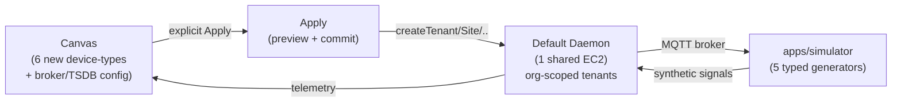

# Change: Default Daemon Sandbox for IoT Pipeline Testing

## Why

Today, every new organization defaults to a `mock` provisioner that displays `Version: mock-0.0.0` with no real signals flowing through the pipeline. Users cannot configure the broker, ingest, or TimescaleDB directly from the canvas; they cannot test the full pipeline end-to-end before hardware arrives. Factory boards shipped with pre-flashed credentials have nowhere to land and no admin visibility — blocking the factory QA workflow.

This spec delivers a single shared default daemon that every organization auto-receives at signup, where users can drag-and-drop canvas nodes (real or simulated), hit Apply, and immediately see synthetic signals flowing through the broker → ingest → TSDB → dashboard pipeline. Factory boards land in a visible admin view.

## What Changes

### Core Changes

- **Deployment**: 1 shared EC2 instance, `controlai` binary via systemd, TLS via Caddy + Let's Encrypt at `default.daemons.controlai.io` (not containerized; not ECS).
- **Multi-tenancy**: One tenant per `Organization` (direct `tenantId = Organization.id`). Special `factory-qa-unclaimed` tenant for factory boards pre-boot.
- **Bootstrap**: Every new org auto-creates a singleton `ControlaiInstance` row at signup (better-auth hook), pre-populated with default daemon URL + bearer token from env vars.
- **UI**: Hide existing `Create instance` button; replace with read-only health status pill. Mark existing mock instances `legacy=true`, hidden from default listings.
- **Canvas Extensions** (6 new device-type manifests, vendor-neutral, under `core/generic-*`):
  - `generic-main-gateway` (gateway, root node)
  - `generic-sensor-input` (sensor, child of gateway, supports RS-485 x2 + noise-meter attach)
  - `generic-tilt-linear` (sensor, child of gateway, chainable via `chainLength` config 1..16)
  - `generic-vibration-tilt-standalone` (sensor, child of gateway)
  - `generic-control-485x2` (sensor, child of gateway, 2 RS-485 child slots)
  - `generic-vibrating-wire-sensor-input` (sensor, child of gateway)
  - `generic-noise-meter` (sensor, attached child of `generic-sensor-input` only, CPU-less)
- **Apply Pipeline**: Explicit `Apply` button only (no autosave-apply). Reuse existing `apply.preview` → `apply.commit` modal. Extend plan ops to include broker-kind (Mosquitto/EMQX) + TimescaleDB retention (days) + ingest settings. No new daemon `/v1/reload` endpoint; reuse existing `createTenant` / `createSite` / `configureDriver` / `updateSite` ops idempotently for reset semantics per org. Best-effort rollback (sandbox = data-loss-acceptable).
- **Synthetic Signals**: Extend `apps/simulator` with 5 typed generator classes (~300 LOC, pure TS, no new deps): `TiltGenerator`, `VibrationGenerator`, `CrackEncoderGenerator`, `NoiseMeterGenerator`, `VibratingWireGenerator`. Math models per research doc. Per-node config: `intervalMs` (default 1000), `valueMin`, `valueMax` in node-config-dialog. Generators authenticate via existing per-gateway mTLS cert provisioning (no new auth code). MQTT only (no HTTP-direct-ingest alternative).
- **Visual Feedback**: Dashed border + ghost icon for `UNREGISTERED` nodes (synthetic), solid border for `REGISTERED` nodes (real factory boards). Mixed real+synthetic on same canvas = first-class. Inline per-node sparkline showing last 30s telemetry (extend existing `canvas-store.updateNodeTelemetry` + SSE).
- **Admin View**: New `/admin/unclaimed-boards` route (org-admin-only auth) listing factory boards in `factory-qa-unclaimed` tenant showing `realUuid`, `lastSeenAt`, last-signal preview. (Board claim/OTA flow deferred to follow-up spec.)
- **Deferred**: The shipped `add-ec2-container-provisioner` code stays on disk but unused until daemon containerization spec lands. `INSTANCE_PROVISIONER=mock` remains default for any non-default-daemon instances.

### Acceptance Gate

User drags **1 main-gateway + 3 sensor-input (each with attached noise-meter) + 1 tilt-linear** onto canvas → clicks **Apply** → preview shows diff → confirms → sees synthetic signals **appear in inline sparklines within 10 seconds end-to-end** (browser → tRPC → daemon REST → broker → ingest → TSDB → SSE → sparkline).

## Impact

- **Affected specs** (existing, **MODIFIED**): `instance-management`, `device-type-registry`, `device-lifecycle`, `gateway-board-provisioning`
- **Affected specs** (new): `default-daemon-sandbox`
- **New env vars**: `DEFAULT_DAEMON_BASE_URL` (e.g. `https://default.daemons.controlai.io`), `DEFAULT_DAEMON_BEARER_TOKEN` (encrypted)
- **DB migrations**: Add `ControlaiInstance.legacy Boolean @default(false)` column; `Device` attachment-child parent-child semantics (no schema change; existing `Device.parentDeviceKey` FK reused)
- **Cost**: ~$30–50/mo single t3.medium + Caddy + Let's Encrypt (operator-owned). Simulator co-located or separate EC2 (operator choice).
- **Security**: Factory-wide shared MQTT mTLS cert for unclaimed boards (accepted trade-off; per-board mTLS deferred). Default daemon bearer token stored encrypted per org's `ControlaiInstance` row.
- **Blast radius**: Per-org tenant isolation inside daemon. Canvas Apply mutates only the calling org's tenant slice. Other orgs unaffected.

### Out of Scope (Explicit Non-Goals)

- Per-org ECS-provisioned daemons (deferred `add-ec2-container-provisioner` remains unused)
- Daemon containerization (separate spec in `../controlai`)
- Board claim/OTA flow (follow-up `add-board-claim-flow` spec)
- Per-tenant retention policy enforcement on daemon side
- Advanced TimescaleDB knobs (chunk size, compression policies)
- Subscription tiering or billing / cost recovery
- Multi-region or geo-routing
- Per-board mTLS isolation (factory-wide shared cert accepted)
- Audit-trail surfacing in admin UI (basic audit logs continue; no new admin routes for them)
