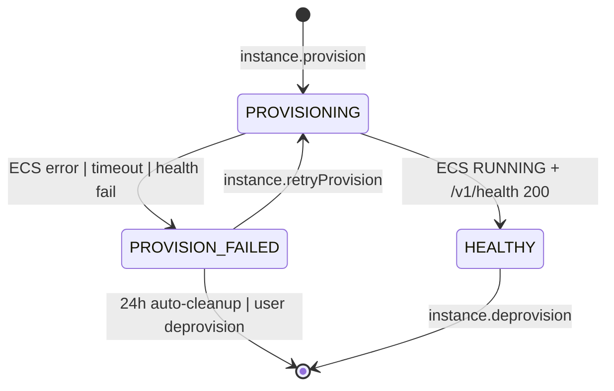
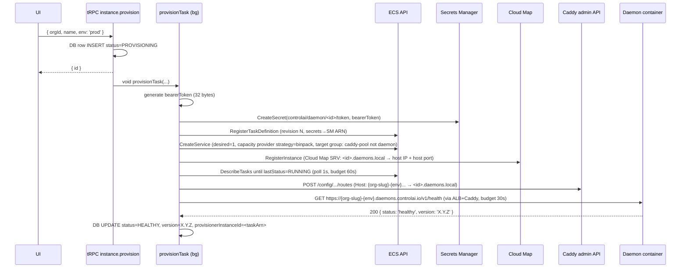

# Design: Ec2ContainerProvisioner

## Context

The parent change `add-instance-auto-provisioning` (archived 2026-05-28) defined the `InstanceProvisioner` contract — a 4-input / 4-output interface with `provision()` and `deprovision()` methods. v1 shipped only a `MockProvisioner` and explicitly deferred the real backend to this follow-up. The repo has **zero AWS prior art** (no SDK deps, no IaC), so this change introduces the entire AWS surface in one cohesive cut: the SDK calls in the provisioner, the CDK infra, the env-var bootstrap, the docs, and the cleanup-cron orphan detection.

**Constraints honored:**

- The `InstanceProvisioner` interface is **immutable**. Only one new field is allowed on `ProvisionArgs.onProgress` — already added during the progress-indicator slice and stable. The new EC2 implementation slots in with no contract change.
- BYO (`instance.register`) path remains byte-for-byte unchanged.
- The dashboard-side flow (tRPC procedures, dialog, status pills) does not change — the provisioner change is invisible to the UI except for new progress-log stage names.
- All existing tests pass; new tests use `aws-sdk-client-mock`, never real AWS.

**Stakeholders:** dashboard team (this repo), the daemon image team (ships `controlai-daemon:stable` to ECR), AWS account owner (CDK deploy + IAM bootstrap).

## Goals / Non-Goals

### Goals
- Replace `mock` with real bin-packed ECS-on-EC2 daemons in `ap-northeast-2`.
- Single shared AWS account, single VPC, single ECS cluster, single ALB for all envs.
- < 90 s p95 provision time (warm host) including daemon health check.
- < $0.60 / daemon / mo amortized compute cost at 50 daemons / host density (excluding Secrets Manager $0.40 / secret / mo).
- Caddy reverse proxy pool avoids ALB 100-target-group hard limit.
- Strict deprovision with full AWS-side teardown (ECS service + task def revisions + Secrets Manager secret + Caddy route).
- All AWS IaC committed in `packages/infra/` (TypeScript CDK).
- Unit tests cover all provisioner happy + sad paths without real AWS calls.

### Non-Goals
- Region geo-routing (still single-region).
- Multi-AWS-account isolation (single shared account is sufficient for v1).
- Token rotation (deferred — separate concern).
- Per-daemon IAM role (deferred — shared task role suffices since daemons don't call AWS APIs).
- Per-daemon CloudWatch alarms (deferred — cluster-level alarms only).
- Fargate fallback when ASG is at max (deferred — fail with `INSUFFICIENT_CAPACITY`, operator bumps ASG max).
- Customer-BYO custom domain.
- Bulk migration of existing mock rows (operator manually deprovisions).
- LocalStack-based integration tests (defer; aws-sdk-client-mock is sufficient).

## Decisions

### 1. Compute = ECS-on-EC2 bin-pack
Cheapest viable backend at scale (~$0.60 / daemon / mo at 50 daemons per t3.medium). ECS Capacity Provider + Auto Scaling Group manages host count between 1 and 10. **Bridge network mode with `hostPort: 0`** for dynamic port allocation lets multiple daemons coexist on one host. Daemons run as **ECS Services with desiredCount=1**, so ECS supervises and auto-restarts on container exit.

**Alternative considered — Fargate:** ~15× cost (~$9/daemon/mo). Simpler ops, but cost shock at scale.
**Alternative considered — App Runner:** AWS has put App Runner in maintenance mode; no new customers after April 30, 2026.

### 2. Ingress = Caddy reverse proxy pool behind ALB with wildcard ACM cert
ALB's 100-target-group-per-listener limit kills the naive "one rule per daemon" pattern at scale. Caddy runs as a 2-replica ECS Fargate service (its own dedicated TG behind the ALB), terminates TLS via the wildcard cert, and dispatches by `Host` header to the daemon container resolved via Cloud Map private DNS (each daemon registers itself in the `daemons.local` namespace as `<instanceId>.daemons.local`).

The provisioner calls **Caddy's admin API** (`POST http://caddy.daemons.local:2019/config/...`) to add a route mapping `{org-slug}-{env}.daemons.controlai.io` → `<instanceId>.daemons.local`. Route add/remove is sub-second; no AWS API churn per provision.

**Alternative considered — raw ALB rules:** 100-target-group hard limit. Needs ALB sharding at 1000+ daemons (~10× ALB cost).
**Alternative considered — Traefik:** equivalent shape but less control over Caddyfile-style routes; ECS-discovery mode forces a label convention that bleeds into task definitions.
**Alternative considered — NLB + SNI routing:** L4 routing complicates wildcard cert mgmt; not needed at our scale.

### 3. Secrets = AWS Secrets Manager (cost accepted)
User chose Secrets Manager over SSM Parameter Store SecureString. Cost note: $0.40 / secret / mo × 1000 daemons ≈ $400/mo. Justification: native rotation primitive available for future token rotation, cleaner audit story via CloudTrail `secretsmanager:*` events, and one consistent secret backend across the app.

Each daemon's bearer token is stored at `arn:aws:secretsmanager:ap-northeast-2:<acct>:secret:controlai/daemon/<instanceId>/token`. The task definition references it via:

```json
{
  "secrets": [
    { "name": "DAEMON_BEARER_TOKEN", "valueFrom": "arn:aws:secretsmanager:.../controlai/daemon/<instanceId>/token" }
  ]
}
```

The token also lives in DB as `bearerTokenEnc` (existing AES-256-GCM) — the dashboard reads from DB to call the daemon, never from Secrets Manager.

### 4. Region = ap-northeast-2 (Seoul)
Lowest latency for Korean customers (visible in the existing dashboard org names). All resources single-region.

### 5. VPC = new dedicated, defined in CDK
NetworkStack creates a fresh VPC: 10.20.0.0/16, 2 AZs, 2 private subnets (daemons + Caddy), 2 public subnets (ALB). **Single NAT gateway in az-a** ($32/mo) — accepts AZ-failure risk for cost (mitigated by VPC endpoints for ECR / Secrets Manager / CloudWatch Logs / S3 so daemon outbound traffic to AWS doesn't need NAT).

### 6. IAM = shared task role for daemons, scoped least-privilege for controlai-web
- **Daemon task role** (`controlai-daemon-task-role`) — empty policy (daemons make no AWS API calls today; only egress to broker/customer endpoints via security-group egress).
- **Daemon task execution role** (`controlai-daemon-execution-role`) — `secretsmanager:GetSecretValue` scoped to `controlai/daemon/*`, `kms:Decrypt` on the daemons KMS key, `logs:CreateLogStream` + `logs:PutLogEvents` on `/aws/ecs/controlai-daemons:*`, `ecr:GetAuthorizationToken` + `ecr:BatchGetImage` for image pulls.
- **controlai-web task role** (production) — full JSON policy in design.md §IAM Appendix.

### 7. IaC = AWS CDK (TypeScript) in `packages/infra/`
New workspace package. Stacks split for clean diff/deploy: NetworkStack → EcsStack → DnsStack → IngressStack → MonitoringStack. Stack outputs published to SSM Parameter Store (`/controlai/infra/<output-name>`) so controlai-web reads them at boot via SDK instead of hard-coded env vars where convenient.

### 8. SLA = 90s server-side budget, 120s UI poll cap
ECS task → RUNNING typically completes in 30–60s on a warm host (image pull skipped via ECR cache + same-region transfer); ASG cold-start adds ~120s but is rare. The 90s budget fails fast in the cold-start case; the operator clicks Retry once the new host has joined the cluster. The 120s UI cap leaves margin so the polling UI doesn't time out before the server-side `provisionTask` has finished failing.

### 9. State machine
Unchanged from parent spec. Adds two new ProvisionerError codes (`INSUFFICIENT_CAPACITY`, `IMAGE_PULL_FAILED`) surfaced in the dialog progress log.



### 10. Provision flow



### 11. Deprovision flow (strict)
1. Caddy admin API → `DELETE /config/.../routes/<route-id>`.
2. ECS → `UpdateService(desired=0)` then `DeleteService(force=true)`.
3. Cloud Map → `DeregisterInstance`.
4. Task definition family revision → keep (revisions inexpensive; bulk cleanup is a separate ops task). Spec includes a CDK helper `pnpm --filter @controlai-web/infra purge-task-revisions` for periodic ops cleanup.
5. Secrets Manager → `DeleteSecret(forceDeleteWithoutRecovery=true)`.
6. DB → `DELETE` row.
7. Audit `instance.deprovision` with `{ taskArn, secretArn, awsRegion }`.

Any failure surfaces as TRPCError `INTERNAL_SERVER_ERROR` so user knows AWS-side may need manual cleanup. The hourly orphan-detection pass picks up any leftover ECS tasks tagged `controlai-org-id` whose DB row was deleted.

### 12. Orphan reconciliation (hourly)
Extends existing `apps/web/lib/cron/cleanup-failed-provisions.ts` with a second pass: `ListTasks(cluster, tag:controlai-org-id)` → cross-reference with DB rows. Outcomes:
- Task tagged with `controlai-instance-id` that has no DB row → `StopTask` + `DeregisterTaskDefinition` + `DeleteSecret`. Audit `instance.orphanCleanup`.
- DB row stuck `PROVISIONING` > 10 min with no live task → mark `PROVISION_FAILED`, append progress-log entry `Provisioning timed out [ORPHAN_RECONCILIATION]`. The existing 24h cleanup eventually deletes the row.

### 13. Image registry = ECR
Image lives at `<account>.dkr.ecr.ap-northeast-2.amazonaws.com/controlai-daemon:stable`. CDK creates the ECR repo. Daemon CI pushes there. Single `:stable` tag — no per-daemon image pinning in v1.

### 14. Logs = single shared CloudWatch Log Group
`/aws/ecs/controlai-daemons`. Each task gets a log stream named `<instanceId>/<containerName>/<taskId>`. 30-day retention. Cluster-level alarms only.

### 15. Removal of FlyProvisioner
The archived spec listed Fly as a non-shipping alternative in design.md §28: "Provider alternatives (Fly.io / Railway / Render / K8s as separate backends) — interface allows them but none ship." During apply, FlyProvisioner was incorrectly added. This change removes it: class deleted, env vars deleted, tests rewritten. Audit metadata loses `provisionerBackend: 'fly'` enum value (no rows in prod use it).

## Risks / Trade-offs

| Risk                                                                                   | Mitigation                                                                                                                                                            |
| -------------------------------------------------------------------------------------- | --------------------------------------------------------------------------------------------------------------------------------------------------------------------- |
| ASG cold-start when no host has capacity → ~120 s provision (exceeds 90 s SLA)         | Document in `instance-provisioning.md` troubleshooting. Operator can keep ASG min=2 instead of 1 to maintain headroom. Future warm-pool work deferred.                |
| Caddy pool crash → all daemons unreachable for ~3–5 s during restart                   | 2 replicas behind ALB target group with deregistration draining. Health-check failure trips ALB to other replica. Spec adds CloudWatch alarm on Caddy 5xx.            |
| Secrets Manager $0.40 / secret / mo dominates cost at 1000 daemons (~$400/mo)          | Documented; accepted per user decision. Future spec can migrate to SSM Parameter Store if cost matters.                                                               |
| AWS region outage in ap-northeast-2                                                    | Single-region by design. Multi-region is a follow-up spec.                                                                                                            |
| Single NAT gateway is single point of failure for daemon outbound traffic              | Documented. VPC endpoints for AWS services (ECR, Secrets Manager, Logs, S3) keep most traffic off NAT. Cross-AZ NAT is a $64/mo upgrade if needed.                    |
| CDK drift (someone hand-edits AWS console)                                             | Spec docs include `cdk diff` in deploy runbook; ops convention "no console clicks for managed resources".                                                             |
| Existing mock rows in production confuse operators                                     | Migration section in docs/instance-provisioning.md instructs manual deprovision. The 24 h cleanup cron will eventually sweep them if marked `PROVISION_FAILED`.       |
| Wildcard ACM cert provisioning via DNS validation can take minutes on first deploy     | One-time setup, documented in `ec2-container-provisioner-setup.md`. CDK uses `Certificate` construct which waits for validation.                                      |
| Image pull from ECR fails on cold-start host (network race)                            | Documented as `IMAGE_PULL_FAILED` error code. Retry typically succeeds. ECS task definition uses `essential: true` so ECS auto-replaces failed pull.                  |
| Daemon container needs more than 256 MB / 0.25 vCPU                                    | Task definition values configurable via CDK params; bumping requires a CDK deploy (cluster ASG sizing follows).                                                       |
| `aws-sdk-client-mock` does not cover all AWS SDK behaviors                             | Acceptable for unit-test coverage. The full integration story is the manual smoke test against a real AWS sandbox account, documented in the verification task list. |
| controlai-web's IAM role over-permissioned                                             | Spec includes the exact JSON policy in design.md §IAM Appendix and instructs CDK to attach it. CI lints `iam-policy.json` for star-actions.                           |
| Caddy admin API exposed inside VPC; if compromised, attacker can rewrite all daemon routes | Caddy admin endpoint only listens on the daemons.local Cloud Map name (private VPC DNS), bound to the Caddy service security group which only accepts traffic from controlai-web's SG. |

## Migration Plan

1. **Pre-flight**: AWS account ready, `aws configure --profile controlai` set up by operator, CDK bootstrap done (`cdk bootstrap aws://<account>/ap-northeast-2`).
2. **Push daemon image to ECR**: `docker buildx build --platform linux/amd64 -t <account>.dkr.ecr.ap-northeast-2.amazonaws.com/controlai-daemon:stable .` → `docker push ...`.
3. **CDK deploy**: `pnpm --filter @controlai-web/infra cdk deploy --all` — provisions VPC, ECS cluster, ALB, Caddy service, DNS zone (operator delegates `daemons.controlai.io` NS records to Route53), wildcard cert.
4. **Update controlai-web env** with stack outputs (`AWS_ACCOUNT_ID`, `ECS_CLUSTER_NAME`, `ECS_TASK_ROLE_ARN`, etc.) → restart controlai-web.
5. **Flip env**: `INSTANCE_PROVISIONER=ec2`.
6. **Smoke test**: provision one daemon for a test org → poll until HEALTHY → click daemon URL → 200 from real container → deprovision → all AWS resources removed.
7. **Production cutover**: announce to existing customers using mock instances that they need to deprovision and re-provision to get real daemons.
8. **Monitor**: CloudWatch dashboard + audit log review for first 24 h.

**Rollback**: flip `INSTANCE_PROVISIONER` back to `mock`. New provisions revert to synthetic. Existing EC2-backed rows continue to work (controlai-web's daemon-client doesn't care about backend). Operator can deprovision EC2 daemons manually via `pnpm --filter @controlai-web/infra teardown:all` (CDK helper) if needed.

## Open Questions

- Does the daemon team confirm port 8080 + `DAEMON_BEARER_TOKEN` env as the only contract for the image, or are there additional env vars (e.g. `DAEMON_LISTEN_ADDR=0.0.0.0:8080`)? Spec assumes only `DAEMON_BEARER_TOKEN`.
- Does the daemon image emit JSON logs to stdout, or does it write to a file? Spec assumes stdout (CloudWatch awslogs driver default).
- Does the daemon respond to SIGTERM gracefully for clean ECS deprovision? Spec assumes yes (10 s graceful period default).
- Should controlai-web call ECR's `GetAuthorizationToken` itself, or rely solely on the task execution role? Spec uses the execution role (no SDK calls from controlai-web for ECR).

## IAM Appendix — controlai-web task role policy (JSON)

```json
{
  "Version": "2012-10-17",
  "Statement": [
    {
      "Sid": "EcsLifecycle",
      "Effect": "Allow",
      "Action": [
        "ecs:RegisterTaskDefinition",
        "ecs:DeregisterTaskDefinition",
        "ecs:CreateService",
        "ecs:UpdateService",
        "ecs:DeleteService",
        "ecs:DescribeServices",
        "ecs:DescribeTasks",
        "ecs:ListTasks",
        "ecs:StopTask",
        "ecs:TagResource"
      ],
      "Resource": "*",
      "Condition": {
        "StringEquals": {
          "aws:ResourceTag/controlai:cluster": "controlai-daemons"
        }
      }
    },
    {
      "Sid": "EcsClusterRead",
      "Effect": "Allow",
      "Action": ["ecs:DescribeClusters", "ecs:ListServices"],
      "Resource": "arn:aws:ecs:ap-northeast-2:*:cluster/controlai-daemons"
    },
    {
      "Sid": "PassDaemonRoles",
      "Effect": "Allow",
      "Action": "iam:PassRole",
      "Resource": [
        "arn:aws:iam::*:role/controlai-daemon-task-role",
        "arn:aws:iam::*:role/controlai-daemon-execution-role"
      ],
      "Condition": {
        "StringEquals": {
          "iam:PassedToService": "ecs-tasks.amazonaws.com"
        }
      }
    },
    {
      "Sid": "Secrets",
      "Effect": "Allow",
      "Action": [
        "secretsmanager:CreateSecret",
        "secretsmanager:DeleteSecret",
        "secretsmanager:DescribeSecret",
        "secretsmanager:UpdateSecret",
        "secretsmanager:TagResource"
      ],
      "Resource": "arn:aws:secretsmanager:ap-northeast-2:*:secret:controlai/daemon/*"
    },
    {
      "Sid": "CloudMap",
      "Effect": "Allow",
      "Action": [
        "servicediscovery:RegisterInstance",
        "servicediscovery:DeregisterInstance",
        "servicediscovery:GetInstance",
        "servicediscovery:ListInstances"
      ],
      "Resource": "*",
      "Condition": {
        "StringEquals": {
          "aws:ResourceTag/controlai:namespace": "daemons.local"
        }
      }
    },
    {
      "Sid": "LogsRead",
      "Effect": "Allow",
      "Action": [
        "logs:DescribeLogGroups",
        "logs:DescribeLogStreams",
        "logs:GetLogEvents"
      ],
      "Resource": "arn:aws:logs:ap-northeast-2:*:log-group:/aws/ecs/controlai-daemons:*"
    }
  ]
}
```
