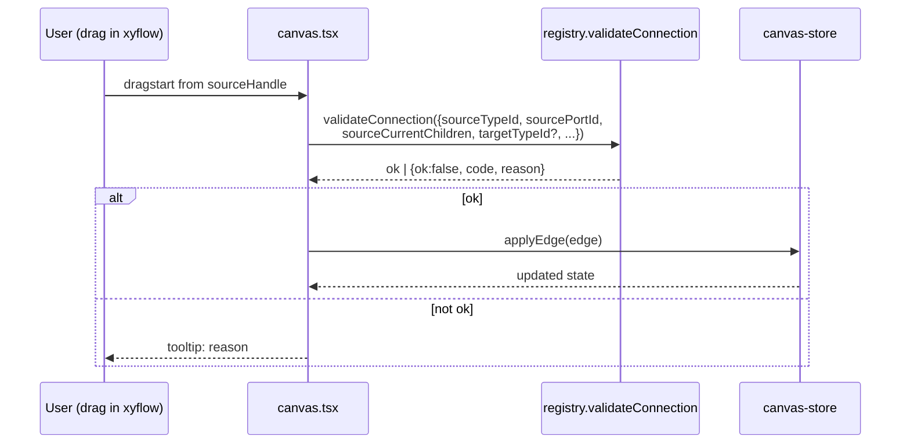

# Design: add-plugin-device-type-registry

## 1. Goals and non-goals

### Goals

- Replace the hardcoded six-type enum + `CONNECTION_MATRIX` constant with a **manifest-driven registry** consumed by canvas, palette, validator, apply-planner, and simulator.
- Make adding a new device type a **single-file PR**: drop one `.ts` manifest under `packages/shared-types/src/device-types/manifests/<vendor>/<type>.ts`, no other code touches.
- Express **typed ports + per-port capacity** so the canvas can enforce real connection rules ("DAEJAK_MAIN.rs485-1 accepts ≤16 modbus-rtu children") rather than category-pair allow-lists.
- Survive an unknown-`deviceTypeId` on disk by surfacing an **orphan-type UI** rather than crashing, mirroring today's Site-orphan pattern.
- Preserve every existing dashboard / SSE / apply behavior; this spec is **catalog plumbing only**.

### Non-goals

- DB-stored manifests, admin UI, runtime hot-reload, multi-tenant catalog namespacing.
- Firmware/board-side reality (boards are dumb to this catalog; cloud is authoritative).
- Manifest versioning, semver, deprecation policy (revisit in a future spec).
- Replacing the existing `Gateway.sensors` JSONB at this stage — sensor row promotion lives in spec 2.

## 2. Architecture

```mermaid
flowchart LR
    subgraph SharedTypes [packages/shared-types/src/device-types]
        S[schema.ts<br/>Zod DeviceTypeSchema] --> R[registry.ts<br/>register/get/list/validateConnection]
        M[manifests/&lt;vendor&gt;/*.ts<br/>each calls registerDeviceType] -- side-effect import --> R
        PT[port-types.ts<br/>rs485-bus | mqtt-topic | analog-4-20ma] --> S
        PF[protocol-families.ts] --> S
    end

    subgraph Web [apps/web]
        Palette[node-palette.tsx<br/>listDeviceTypes by category]
        Canvas[canvas.tsx<br/>isValidConnection]
        Nodes[nodes/*.tsx<br/>DeviceNode reader]
        Store[canvas-store.ts<br/>addNode by deviceTypeId]
    end

    subgraph Api [packages/api]
        AP[apply-planner.ts<br/>resolve manifest by id]
        NC[nodeConfig.ts<br/>save validates deviceTypeId]
    end

    Sim[apps/simulator/manager.ts<br/>defaultSignal lookup]

    R --> Palette
    R --> Canvas
    R --> Nodes
    R --> Store
    R --> AP
    R --> NC
    R --> Sim
```

Registry is **in-process, in-memory, import-time-populated**. No I/O, no network, no DB.

## 3. Data shapes

### 3.1 `DeviceTypeSchema` (Zod)

```ts
// packages/shared-types/src/device-types/schema.ts
export const Category = z.enum(['sensor', 'gateway', 'broker', 'ingest', 'tsdb', 'monitoring']);
export const PortType = z.enum(['rs485-bus', 'mqtt-topic', 'analog-4-20ma']);
export const ProtocolFamily = z.enum([
  'mqtt', 'modbus-rtu', 'modbus-tcp', 'lorawan',
  'analog-4-20ma', 'analog-0-10v', 'rs485-serial-generic',
]);

export const DevicePortSchema = z.object({
  id: z.string().regex(/^[a-z][a-z0-9-]*$/),       // 'rs485-1', 'uplink-mqtt'
  direction: z.enum(['in', 'out', 'bidirectional']),
  portType: PortType,
  maxCount: z.number().int().positive(),            // capacity for this port
  acceptsProtocols: z.array(ProtocolFamily).nonempty(),
  // For rs485-bus: max address space (1..maxCount). For mqtt-topic: max distinct topics.
  // analog-4-20ma: 1 channel per maxCount port slot.
});

export const DefaultSignalSchema = z.object({
  rateMs: z.number().int().min(100).max(60_000),    // honors per-device floor 100ms
  format: z.enum(['cbor', 'json', 'sparkplug-b']),
  units: z.string(),                                // 'celsius', 'kPa', etc.
  range: z.object({ min: z.number(), max: z.number() }),
});

export const DeviceTypeSchema = z.object({
  id: z.string().regex(/^[a-z0-9][a-z0-9-]*[a-z0-9]$/), // 'daejak-main-v1'
  displayName: z.string().min(1),
  manufacturer: z.string().min(1),
  model: z.string().min(1),
  category: Category,
  firmwareTypeIds: z.array(z.string()).default([]), // 'DAEJAK_VM', 'DAEJAK_MAIN'
  ports: z.array(DevicePortSchema).default([]),
  defaultSignal: DefaultSignalSchema.optional(),     // required for sensor + gateway categories
  datasheet: z.object({
    firmwareVersion: z.string().optional(),
    datasheetUrl: z.string().url().optional(),
    certifications: z.array(z.string()).default([]),
  }).default({}),
  visual: z.object({
    iconRef: z.string(),                             // lucide-react icon name
    accentColor: z.string().regex(/^#[0-9a-fA-F]{6}$/),
    badge: z.string().optional(),                    // small label e.g. 'BETA'
    componentRef: z.string().optional(),             // optional custom React component key
  }),
  registrationHints: z.object({
    autoMatchSignature: z.string().optional(),
    expectedChildCount: z.number().int().nonnegative().optional(),
    expectedChildTypeIds: z.array(z.string()).default([]),
  }).default({}),
  constraints: z.object({
    maxSimulatedRateMs: z.number().int().min(100).optional(),
    minIntervalMs: z.number().int().min(100).default(100),
    maxPayloadBytes: z.number().int().positive().optional(),
  }).default({}),
}).strict();

export type DeviceType = z.infer<typeof DeviceTypeSchema>;
```

Category-specific refinements (Zod `.superRefine`):

- `category: 'sensor'` → `defaultSignal` required; ports MUST be empty OR contain only `direction: 'out'` entries.
- `category: 'gateway'` → at least one `rs485-bus` OR `mqtt-topic` port required; `defaultSignal` optional.
- `category: 'broker'` → exactly one `mqtt-topic` port required; `defaultSignal` forbidden.
- `category: 'ingest' | 'tsdb' | 'monitoring'` → ports MUST be empty; `defaultSignal` forbidden.

### 3.2 Registry API

```ts
// packages/shared-types/src/device-types/registry.ts
const registry = new Map<string, DeviceType>();
const registrationCallSite = new Map<string, string>(); // for dup-id error

export function registerDeviceType(manifest: unknown): void {
  const parsed = DeviceTypeSchema.parse(manifest); // throws on invalid
  if (registry.has(parsed.id)) {
    throw new Error(
      `Duplicate device-type id: ${parsed.id}. First registration: ${registrationCallSite.get(parsed.id)}`
    );
  }
  registry.set(parsed.id, parsed);
  registrationCallSite.set(parsed.id, captureCaller());
}

export function getDeviceType(id: string): DeviceType | undefined {
  return registry.get(id);
}

export function listDeviceTypes(filter?: { category?: Category }): DeviceType[] {
  const all = [...registry.values()];
  return filter?.category ? all.filter(t => t.category === filter.category) : all;
}

export function assertKnownDeviceType(id: string): DeviceType {
  const found = registry.get(id);
  if (!found) {
    const err = new Error(`Unknown device-type: ${id}`);
    (err as any).code = 'UNKNOWN_DEVICE_TYPE';
    (err as any).deviceTypeId = id;
    throw err;
  }
  return found;
}

export type ConnectionValidationResult =
  | { ok: true }
  | { ok: false; code: string; reason: string };

export function validateConnection(args: {
  sourceTypeId: string;
  sourcePortId?: string;
  sourceCurrentChildren: number; // count of edges already exiting this source port
  targetTypeId: string;
  targetPortId?: string;
  targetCurrentParents: number;
}): ConnectionValidationResult {
  // 1. Both types must exist.
  // 2. Source must have an outgoing port (or be a sensor with implicit 'out').
  // 3. Target must accept the source's protocol family in the target port.
  // 4. Source.maxCount not exceeded (sourceCurrentChildren + 1 <= port.maxCount).
  // 5. Category-pair sanity (sensor->gateway/broker, gateway->broker/ingest, etc.) — derived from manifests' acceptsProtocols rather than hardcoded list.
}
```

### 3.3 Manifest registration pattern

```ts
// packages/shared-types/src/device-types/manifests/daejak/daejak-main-v1.ts
import { registerDeviceType } from '../../registry';

registerDeviceType({
  id: 'daejak-main-v1',
  displayName: 'DAEJAK MAIN (v1)',
  manufacturer: 'DAEJAK',
  model: 'MAIN',
  category: 'gateway',
  firmwareTypeIds: ['DAEJAK_MAIN'],
  ports: [
    { id: 'rs485-1', direction: 'in', portType: 'rs485-bus', maxCount: 16,
      acceptsProtocols: ['modbus-rtu', 'rs485-serial-generic'] },
    { id: 'uplink-mqtt', direction: 'out', portType: 'mqtt-topic', maxCount: 1,
      acceptsProtocols: ['mqtt'] },
  ],
  datasheet: { firmwareVersion: '1.2.0' },
  visual: { iconRef: 'router', accentColor: '#3b82f6' },
  registrationHints: { expectedChildTypeIds: ['daejak-vm'] },
});
```

Aggregator (`index.ts`):

```ts
// packages/shared-types/src/device-types/index.ts
import './manifests/core/generic-sensor';
import './manifests/core/generic-gateway';
import './manifests/core/generic-broker';
import './manifests/core/generic-ingest';
import './manifests/core/generic-tsdb';
import './manifests/core/generic-monitoring';
import './manifests/daejak/daejak-main-v1';
import './manifests/daejak/daejak-vm';

export * from './schema';
export * from './registry';
export * from './port-types';
export * from './protocol-families';
```

A contract test enumerates files under `manifests/**/*.ts` via `globby` and asserts each path appears in `index.ts`.

## 4. Connection validation flow



Source `currentChildren` is computed by counting `edges.filter(e => e.source === sourceNodeId && e.sourceHandle === sourcePortId)`. Both endpoints' port IDs are stored on the xyflow edge as `sourceHandle` / `targetHandle`.

## 5. Orphan-type handling

When `nodeConfig.load` returns a NodeConfig containing nodes whose `data.deviceTypeId` is not in the registry:

1. The canvas store marks those nodes `__orphan: true` (transient field, not persisted).
2. `DeviceNode` renders the orphan state: greyscale chrome, "Unknown device type: `<id>`" badge, kebab menu with **Migrate** (opens dialog to pick a replacement from the same category) and **Delete**.
3. Canvas `save()` is disabled while any orphan exists. The save button's tooltip lists the orphan count.
4. Apply is disabled while any orphan exists (apply-planner refuses).

This is the only failure mode where the canvas blocks the user; everything else is non-blocking.

## 6. Default-data factory

```ts
// packages/shared-types/src/device-types/default-data.ts
export function defaultNodeData(deviceTypeId: string): NodeData {
  const m = assertKnownDeviceType(deviceTypeId);
  return {
    deviceTypeId: m.id,
    category: m.category,
    label: m.displayName,
    visual: m.visual,
    config: m.defaultSignal ? { signal: m.defaultSignal } : {},
    status: 'idle',
    msgPerSec: 0,
  };
}
```

Apps/web's `useCanvasStore.addNode(deviceTypeId, position)` calls this to seed `node.data`.

## 7. Migration from legacy `type` enum

Existing NodeConfig rows persist `node.type ∈ {sensor, gateway, broker, ingest, timescaledb, monitoring}`. The mapping is:

| Legacy `type`  | New `deviceTypeId`     |
| -------------- | ---------------------- |
| `sensor`       | `core-generic-sensor`     |
| `gateway`      | `core-generic-gateway`    |
| `broker`       | `core-generic-broker`     |
| `ingest`       | `core-generic-ingest`     |
| `timescaledb`  | `core-generic-tsdb`       |
| `monitoring`   | `core-generic-monitoring` |

Migration is performed on-read inside `nodeConfig.load`: any node missing `data.deviceTypeId` but having a known legacy `type` gets `deviceTypeId` set from the table above. The persisted JSON is rewritten on next `save`. No standalone migration script is needed.

A second pass — explicitly upgrading specific generic-sensor / generic-gateway nodes to DAEJAK manifests — is deferred to **spec 3** (the registration handshake), where the firmware reply gives us authoritative type identification.

## 8. Performance budgets

- Registry initialization (import-time, ~10 manifests v1, expected ~100 manifests within a year): ≤ 50 ms cold.
- `validateConnection`: pure-function, O(1) lookups, ≤ 0.5 ms per call. Canvas typically calls ~10 times per drag.
- `listDeviceTypes({category})`: O(n) over registry; for n=200 manifests, ≤ 1 ms.
- Palette render with 200 manifests across 6 category tabs: ≤ 100 ms (matches the cross-spec canvas budget).

## 9. Telemetry & observability

- Each `registerDeviceType` call emits a `pino` debug log at module init: `{ event: 'device-type-registered', id, category, manufacturer, model }`. Aggregated count logged once at app boot.
- `validateConnection` emits a structured `info` log for each rejection (rare, user-driven): `{ event: 'connection-rejected', code, reason, sourceTypeId, targetTypeId }`. Powers a dev-tools panel for catalog-authoring.
- An `/internal/registry` HTTP endpoint (gated by `NODE_ENV !== 'production'`) dumps the loaded registry for live inspection.

## 10. Open questions deferred to follow-up specs

| Question                                                                                    | Where it lands                  |
| ------------------------------------------------------------------------------------------- | ------------------------------- |
| Per-instance config overrides at register-time (e.g. relabel a sensor)                      | spec 2 (lifecycle)              |
| Mapping firmware-reported type strings → manifest IDs at register time                      | spec 3 (handshake)              |
| Driver-side manifests for broker kinds (HiveMQ, AWS IoT Core)                               | spec 4 (broker-driver registry) |
| Manifest deprecation lifecycle (mark a manifest deprecated; warn on existing usage)         | future                          |
| Internationalization of manifest `displayName` (Korean + English)                           | future                          |
| Manifest signing / supply-chain trust when a future DB-loaded variant lands                 | future                          |
