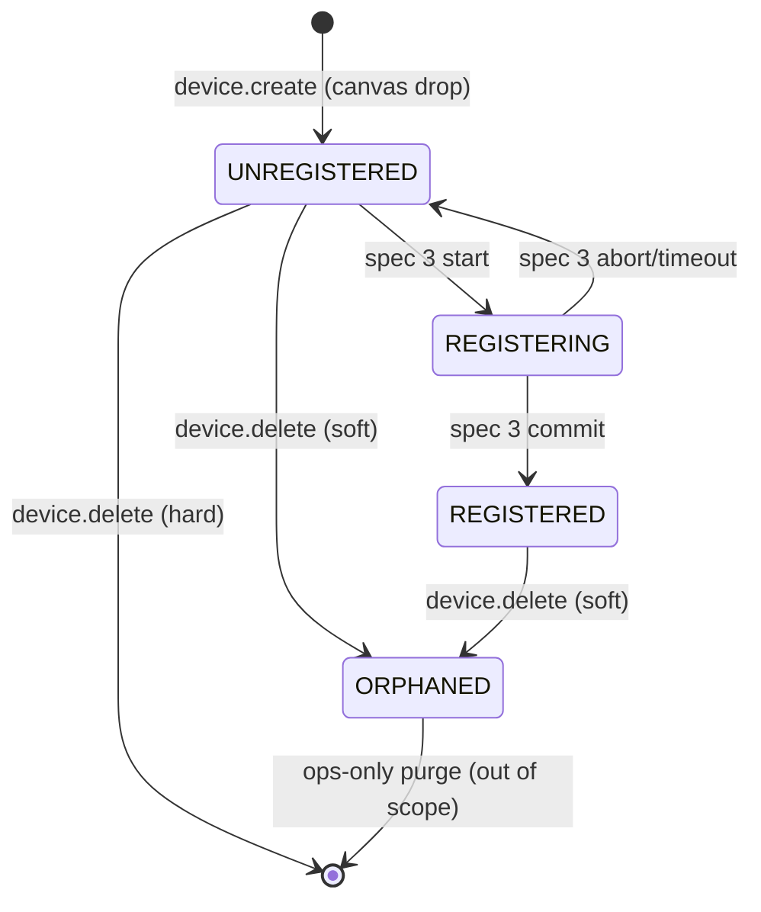
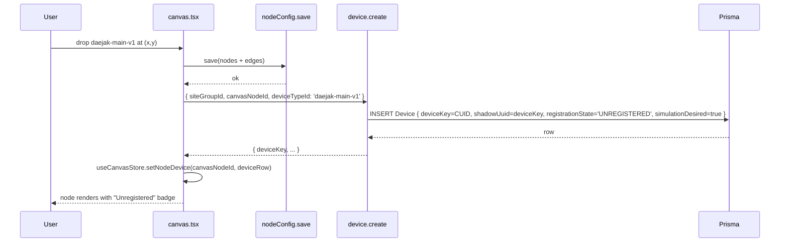
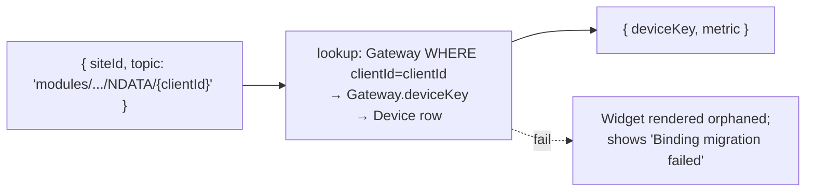

# Design: add-unregistered-device-lifecycle

## 1. Goals and non-goals

### Goals

- Introduce a first-class `Device` row materializing every canvas node as a stable, lifecycle-tracked entity with an immutable `device_key` (CUID).
- Promote sensors from `Gateway.sensors` JSONB to individual `Device` rows so each sensor can hold its own lifecycle state, simulation toggle, and shadow→real UUID alias pair.
- Lock in the cross-spec invariant: **`device_key` is immutable from drop to delete**. Spec 3's UUID swap mutates `realUuid`, not `device_key`.
- Migrate dashboard widget bindings from `{ siteId, topic }` to `{ deviceKey, metric }` so widgets survive the topic-schema rewrite in spec 4 without manual user action.
- Add a SiteGroup-level simulation toggle (you chose this UX) with per-Device override for debugging.
- Cap per-SiteGroup simulator publish rate at 1,000 msg/s; per-Device floor at 100 ms intervals (the v1 perf budget).

### Non-goals

- Performing the actual UUID swap — that is spec 3.
- Replacing the legacy `modules/…` topic schema — that is spec 4.
- Plugin-style broker drivers — spec 4.
- Hard delete of registered devices (we soft-archive to preserve TSDB history).
- Cross-Site device migration (deferred).

## 2. State machine



State invariants enforced by `device.update` and the registration flow (spec 3):

- `UNREGISTERED → REGISTERING`: only via the registration handshake initiator (server-side procedure introduced in spec 3); cannot be set directly by `device.update`.
- `REGISTERING → REGISTERED`: requires a successful `gateway.commitRegistration` call (spec 3); sets `realUuid`, `registeredAt`, `registeredByUserId`, `simulationDesired = false`.
- `REGISTERED → UNREGISTERED`: not allowed (a registered device cannot be "de-registered" without re-registration in spec 3, which goes through REGISTERING).
- `* → ORPHANED`: via `device.delete`; the row stays in the DB, its TSDB partition is preserved, the canvas marks it visually orphaned (mirrors spec 1's orphan-type pattern).
- Config edits (`device.update({ patch: { config } })`): allowed only while `UNREGISTERED`; locked once `REGISTERED` (config edits to a registered device must go through a separate ops path, out of scope here).
- `simulationDesired` is freely toggleable in any state; semantics differ — see §5.

## 3. Schema

```mermaid
erDiagram
    SiteGroup ||--o{ Device : contains
    Device ||--o{ Device : parent
    Device ||--o| Gateway : "1:1 (when category=gateway)"
    Site ||--o{ Device : "binds (when registered)"
    DeviceType }o--o{ Device : "manifest"

    Device {
        string device_key PK "CUID, immutable"
        string siteGroupId FK
        string canvasNodeId
        string siteId FK "nullable"
        string deviceTypeId "manifest id"
        enum   registrationState
        string shadowUuid "= deviceKey at insert; swap by spec 3"
        string realUuid "nullable; set by spec 3"
        string parentDeviceKey FK "nullable"
        json   portBindings "[{ parentPortId, address }]"
        json   config "per-instance overrides"
        bool   simulationDesired
        datetime registeredAt
        string registeredByUserId
        datetime lastSeenAt
        datetime createdAt
        datetime updatedAt
    }

    Gateway {
        string id PK "existing CUID"
        string deviceKey UK FK "NEW; 1:1 with Device row"
        bool   simulationDesired "NEW; aggregate convenience"
        string ...existing... "endpointURL, certs, etc."
    }
```

### 3.1 Why `shadowUuid` is stored separately

At insertion time, `shadowUuid === deviceKey`. We keep them separate because:

1. **Spec 3 swaps `shadowUuid` for `realUuid`.** Specifically, the alias pair becomes `{ shadowUuid: <CUID original>, realUuid: <board STM32 ID> }`. The `deviceKey` stays as the CUID.
2. **TSDB and topics always key off `deviceKey`** (set in spec 4). The "alias table" is the Device row itself; spec 3 needs a slot to record the human-facing original placeholder vs. the human-facing real ID.
3. **Forensic auditability.** "What was the shadow placeholder this device booted as?" is answered without joining the audit log.

In short: `deviceKey` is the operational primary key; `realUuid` is the post-register human-facing ID; `shadowUuid` is the pre-register human-facing placeholder.

### 3.2 Sensor → Device migration mapping

For each existing Gateway G with `sensors: SensorConfig[]`:

```
1. Create Device row { deviceKey: G.id-or-new-CUID, canvasNodeId: <existing gateway canvas node>,
                       deviceTypeId: 'core-generic-gateway' (or daejak-main-v1 when firmware match),
                       category: derived from manifest, registrationState: 'REGISTERED' if G has certs else 'UNREGISTERED',
                       realUuid: G.clientId, shadowUuid: G.id, ... }
2. UPDATE Gateway SET deviceKey = <new Device.deviceKey>.
3. For each sensor in G.sensors:
   Create Device row { deviceKey: new CUID, canvasNodeId: G.canvasNodeId + ':sensor:' + sensor.id,
                       parentDeviceKey: gateway.deviceKey,
                       deviceTypeId: 'core-generic-sensor',
                       registrationState: G's state, ... }.
4. Audit row 'device.migrated' written with before-count + after-count.
5. Gateway.sensors JSONB retained (read-only) until task 2.7 drops the column.
```

The migration is idempotent: it checks `Device.deviceKey = G.deviceKey` before inserting, and per-sensor checks via `Device.canvasNodeId` containing the synthetic `:sensor:<idx>` suffix. Running twice produces no diff.

## 4. Lifecycle wiring in the canvas



The drop is **eventually consistent**: `nodeConfig.save` and `device.create` are sequential. If `device.create` fails, the canvas store's `nodeDevices` map lacks an entry and the canvas renders the node in a transient "pending" state with a retry button. There is no compensating delete of the node from `nodeConfig`; the user can retry or remove the node manually.

A scheduled reconciliation job (every 60s, configurable; lives in `packages/api/src/jobs/device-canvas-reconcile.ts`) detects orphan canvas nodes (in NodeConfig but no Device row) and orphan Device rows (in DB but no canvas node) and writes alerts to the audit log; **it does not auto-create or auto-delete** — that's an explicit operator action via a future `/admin/reconcile` page (out of scope here).

## 5. Simulation lifecycle

Three layers cascade:

1. **SiteGroup-level switch** — `apps/web/components/canvas/canvas.tsx` toolbar toggle. Calls `device.setSiteGroupSimulation({ siteGroupId, desired })` which writes `simulationDesired = desired` to ALL Device rows in the SiteGroup AND posts `POST /sitegroups/:siteGroupId/simulation` to the simulator. UI toggle is single-source: the canvas store reflects the latest `device.list` value, polled / invalidated after the mutation.
2. **Per-Device override** — `device.update({ deviceKey, patch: { simulationDesired } })`. The node-config dialog exposes this on the Device's detail pane.
3. **Registration auto-stop** — spec 3's commit step writes `simulationDesired = false` to the registered Device row. The simulator's reconciliation loop (next tick after the DB write) observes the change and stops publishing for that Device.

The simulator runs a reconciliation loop every 5 s that loads all Devices with `simulationDesired = true` for the SiteGroups it is managing and reconciles its per-Device publishing tasks. Per-SiteGroup token-bucket caps aggregate publish rate at 1,000 msg/s; if the bucket is empty, the manager logs `{ event: 'sim-rate-cap-exceeded', siteGroupId }` and *delays* (does not drop) the next batch.

## 6. Dashboard widget binding migration



On first load of a dashboard whose widgets reference legacy `{ siteId, topic }`:

1. The web client calls `dashboard.load` which now returns widgets with two parallel fields: `binding` (legacy) and `bindingV2` (new, may be null).
2. For each widget where `bindingV2` is null and `binding` is legacy, the server resolves the legacy topic by parsing the `clientId` segment and looking up `Gateway.clientId === clientId`. If found, it sets `bindingV2 = { deviceKey, metric: parseMetricFromTopic(topic) }`.
3. If resolution succeeds, the next `dashboard.save` persists the new binding. If it fails (no matching Gateway, malformed topic), `bindingV2` stays null and the widget renders with a "Binding migration needed — click to fix" overlay that opens the binding-picker dialog.

After this change deploys, all NEW widgets created via `add-widget-dialog.tsx` populate `bindingV2` only (no legacy `binding`). The legacy field stays in the schema until spec 4 archive (one minor release later).

## 7. tRPC `device` router shape

```ts
// packages/api/src/routers/device.ts
export const deviceRouter = router({
  list: orgProcedure
    .input(z.object({
      siteGroupId: z.string().cuid(),
      filter: z.object({
        registrationState: DeviceRegistrationStateEnum.optional(),
        parentDeviceKey: z.string().optional(),
        deviceTypeId: z.string().optional(),
      }).optional(),
    }))
    .query(async ({ input, ctx }) => { ... }),

  get: orgProcedure
    .input(z.object({ deviceKey: z.string().cuid() }))
    .query(...),

  create: orgProcedure
    .input(z.object({
      siteGroupId: z.string().cuid(),
      canvasNodeId: z.string(),
      deviceTypeId: z.string(),
      parentDeviceKey: z.string().cuid().optional(),
      portBindings: z.array(z.object({
        parentPortId: z.string(),
        address: z.union([z.number(), z.string()]).optional(),
      })).optional(),
      config: z.record(z.any()).optional(),
    }))
    .mutation(...),

  update: orgProcedure
    .input(z.object({
      deviceKey: z.string().cuid(),
      patch: z.object({
        label: z.string().optional(),
        config: z.record(z.any()).optional(),       // rejected if state != UNREGISTERED
        simulationDesired: z.boolean().optional(),
        portBindings: z.array(...).optional(),       // rejected if state != UNREGISTERED
      }),
    }))
    .mutation(...),

  delete: orgProcedure
    .input(z.object({ deviceKey: z.string().cuid() }))
    .mutation(...),

  setSiteGroupSimulation: orgProcedure
    .input(z.object({ siteGroupId: z.string().cuid(), desired: z.boolean() }))
    .mutation(...),
});
```

Every mutation writes an `AuditLog` row with action prefix `device.*` and metadata `{ deviceKey, siteGroupId, before?, after? }`.

## 8. Simulator changes in detail

```ts
// apps/simulator/src/manager.ts (sketch)
async function reconcileSiteGroup(siteGroupId: string) {
  const devices = await prisma.device.findMany({
    where: { siteGroupId, simulationDesired: true },
    include: { manifest: true },     // resolved via device-type registry
  });
  const gateways = devices.filter(d => d.deviceTypeId.endsWith('gateway') || resolveManifest(d).category === 'gateway');
  for (const gw of gateways) {
    const children = devices.filter(c => c.parentDeviceKey === gw.deviceKey);
    await ensureGatewayRuntime(gw, children);
  }
}
```

The legacy code path that reads `Gateway.sensors` JSONB remains as a fallback during the migration window: if `Device.findMany` returns no children for a Gateway whose `sensors[]` is non-empty, the manager logs `{ event: 'sim-falling-back-to-jsonb', gatewayId }` and uses the JSONB. The fallback is removed in task 2.7 when JSONB is dropped.

## 9. Per-SiteGroup rate cap

A `TokenBucket` per `siteGroupId` lives in the simulator process. Capacity 1,000, refill 1,000/s. Every NDATA publish acquires 1 token; if the bucket is empty, the publisher awaits the next refill tick.

If a single SiteGroup has more Devices than the bucket can sustain, the simulator does **not** silently drop messages; it lowers the *effective* rate by delaying each publish. A `/metrics` counter `sim_rate_cap_delays_total{siteGroupId}` exposes the delay count.

## 10. Observability

- Every Device row mutation logged as JSON via `pino`: `{ event: 'device.<verb>', deviceKey, siteGroupId, userId, before?, after? }`.
- OpenTelemetry: `device.create` span includes child spans for `nodeConfig.save` correlation; `device.setSiteGroupSimulation` includes a span per Device updated and a parent span covering the simulator HTTP roundtrip.
- Prometheus on the simulator: `sim_devices_active{siteGroupId, deviceTypeId, category}` gauge; `sim_publishes_total{siteGroupId}` counter; `sim_rate_cap_delays_total{siteGroupId}` counter.
- A `device.lastSeenAt` write happens in the mqtt-bridge (transitional) and in the tsdb-writer (spec 4). For this change, mqtt-bridge gains a side-effect write throttled to once per 30s per `deviceKey`.

## 11. Open questions deferred

| Question                                                                                | Where it lands |
| --------------------------------------------------------------------------------------- | -------------- |
| When does an ORPHANED row's TSDB partition get truncated?                               | Future ops spec |
| Should a registered device's config edits go through a "diff & re-register" flow?       | Future         |
| Are nested gateways (gateway parented to another gateway) ever valid?                   | Future         |
| How does multi-Site spawn a Device from a non-broker canvas node before broker is bound?| Spec 4 reconciles |
