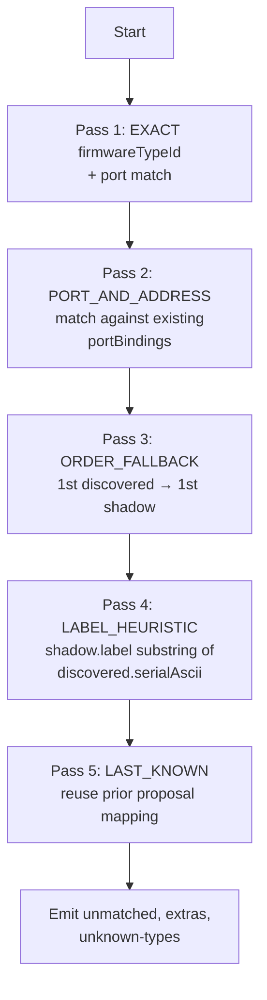
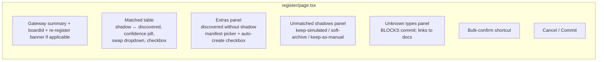

# Design: extend-gateway-register-handshake

## 1. Goals and non-goals

### Goals

- Close the loop on the existing gateway-board-provisioning capability by adding the FETCH (read board's real UUID) + DISCOVER (enumerate downstream RS-485 children) + COMMIT (atomic identity rewrite) steps.
- Use the existing DAEJAK firmware `status` CLI output (per the operator's pasted board dump) as the SOLE source of truth for register; do not require new firmware-side commands.
- Drive the per-sensor checklist UX from a server-computed match plan with ranked confidence levels.
- Preserve the cross-spec invariant: `deviceKey` is immutable; only `realUuid`, `registrationState`, `simulationDesired`, `registeredAt`, `registeredByUserId` mutate on commit.
- Provide explicit Re-register support: same canvas node + same `deviceKey`, new `realUuid` and new cert, audit row links the previous registration.
- Be transactionally safe across tab-close: any abandoned `REGISTERING` state auto-recovers within 30 minutes.

### Non-goals

- Network-based registration (Web Serial only in v1).
- Multi-gateway batch registration.
- Tailing-sensor discovery over LoRaWAN, Zigbee, BLE, OPC-UA (RS-485 only in v1).
- Cert rotation outside the explicit re-registration path.
- Firmware-side rescan commands (`bus485 rescan` etc.); rely on the existing `status` output.
- Migrating the legacy `modules/...` topic schema (spec 4).

## 2. End-to-end flow

```mermaid
sequenceDiagram
    autonumber
    participant U as User
    participant Web as Web client<br/>(register/page.tsx)
    participant CLI as Web Serial<br/>(cli-session)
    participant Board as Board (DAEJAK)
    participant API as gateway router
    participant DB as Prisma

    U->>Web: click "Register Device"
    Web->>API: beginRegistration({ gatewayDeviceKey })
    API->>DB: tx { gw.state=REGISTERING; children.state=REGISTERING }
    API-->>Web: { registrationSessionId }
    Web->>CLI: open port; send `status\n`
    CLI->>Board: status\r\n
    Board-->>CLI: multi-line status reply
    CLI-->>Web: raw text
    Web->>Web: parseStatusOutput(raw) → { boardId, bus485.children[], ... }
    Web->>API: proposeRegistration({ ..., boardReportedUuid, discoveredChildren })
    API->>DB: load shadow Devices for gw
    API->>API: registrationMatcher.proposeMatch(shadows, discovered)
    API->>DB: INSERT RegistrationProposal { state: PROPOSED, matchPlanJson }
    API-->>Web: { matchPlan, unmatchedShadows, extras, unknowns }
    Web-->>U: per-sensor checklist UI
    U->>Web: confirm / edit / decide
    Web->>API: commitRegistration({ registrationSessionId, decisions })
    API->>DB: TRANSACTION:<br/>1. gw.realUuid = boardId<br/>2. for each matched child: child.realUuid = discovered<br/>3. for each accepted extra: insert Device + canvas node<br/>4. for each rejected shadow: soft-archive<br/>5. all → state=REGISTERED, simulationDesired=false<br/>6. RegistrationProposal.state=COMMITTED<br/>7. AuditLog rows
    API-->>Web: final state
    Web-->>U: success; canvas badges flip
```

## 3. Wire shapes

### 3.1 Server-side types

```ts
// packages/api/src/lib/registration-matcher.ts
export type DiscoveredChild = {
  raw: string;                       // '0B0003000F5355533936302D'
  address: number;                   // 11
  firmwareTypeCode: string;          // '0003000F'
  serialAscii: string;               // 'SUS960-'
  reportedTypeLabel: string;         // 'DAEJAK_VM'
  portId: 'rs485-1';                 // v1 always rs485-1; spec future for multi-bus boards
};

export type ChildMatch = {
  shadowDeviceKey: string;
  discovered: DiscoveredChild;
  confidence: 'EXACT' | 'PORT_AND_ADDRESS' | 'ORDER_FALLBACK'
              | 'LABEL_HEURISTIC' | 'LAST_KNOWN' | 'NONE';
  resolvedDeviceTypeId: string;      // from manifest.firmwareTypeIds lookup
  proposedPortBindings: { parentPortId: string; address: number };
};

export type MatchPlan = {
  gatewayMatch: { boardReportedUuid: string };
  childMatches: ChildMatch[];
  unmatchedShadows: { deviceKey: string; reason: string }[];
  extraChildren: DiscoveredChild[];   // discovered but no shadow
  unknownTypes: DiscoveredChild[];    // discovered but no manifest claims firmwareTypeCode
};

export type RegistrationDecisions = {
  confirmedMatches: { shadowDeviceKey: string; discoveredRaw: string }[];
  acceptExtras: { discoveredRaw: string; deviceTypeId: string; placeOnCanvas: boolean }[];
  rejectShadows: { shadowDeviceKey: string; action: 'soft-archive' | 'keep-simulated' | 'keep-as-manual' }[];
  // unknownTypes block commit; user must add manifest first or remove from canvas
};
```

### 3.2 RegistrationProposal model

```prisma
model RegistrationProposal {
  id                       String   @id @default(cuid())
  gatewayDeviceKey         String
  gateway                  Device   @relation(fields: [gatewayDeviceKey], references: [deviceKey])
  boardReportedUuid        String
  discoveredChildrenJson   Json     // DiscoveredChild[]
  matchPlanJson            Json     // MatchPlan
  userDecisionsJson        Json?    // RegistrationDecisions; set on commit/abort
  state                    RegistrationProposalState
  expiresAt                DateTime
  createdAt                DateTime @default(now())
  committedAt              DateTime?
  abortedAt                DateTime?

  @@index([gatewayDeviceKey, state])
  @@index([expiresAt])
}

enum RegistrationProposalState {
  PROPOSED
  COMMITTED
  ABORTED
  EXPIRED
}
```

The 30-minute auto-expire job runs every 5 minutes (`packages/api/src/jobs/registration-proposal-expire.ts`): selects `PROPOSED` rows with `expiresAt < NOW()`, flips them to `EXPIRED`, and resets the corresponding gateway + children from `REGISTERING → UNREGISTERED`.

## 4. Parsing the board `status` output

Given the user's pasted output:

```
[Board Status]
  Board ID:    2C004A001351353230363438
  Board Type:  MAIN
  Firmware     DAEJAK_MAIN v1.2.0
  IP Address:  192.168.39.71
  State:       NORMAL
  RTC Time:    2026-05-27 17:54:54

[MQTT Status]
  connected: connected
  broker:   mqtts://api.52-79-241-139.nip.io:8883
  port:     8883
  clientid: 2C004A001351353230363438
  subs:     2 topic(s)
    [1] modules/modules/NCMD/2C004A001351353230363438
    [2] modules/modules/DCMD/2C004A001351353230363438/+

[MQTT]
  group_id:      modules
  edge_node_id:  2C004A001351353230363438
  collection_period:     600 sec
  collection_align:      on

[485 Bus Status]
  Registered: 1
  [1] 0B0003000F5355533936302D  type=DAEJAK_VM
```

`parseStatusOutput(raw: string): ParsedBoardStatus` SHALL be a pure function operating on this exact section-headed text format. Sections delimited by `\n[...]\n`. Each section parsed line-by-line via a small section-specific regex table. Unrecognised lines within a recognised section MUST be appended to a `_unparsed: string[]` array on the result so we don't silently drop firmware additions.

Children parser (`parseDiscoveredChild`):

```
input:  '0B0003000F5355533936302D'
        |  |       |
        |  |       └─ ASCII hex of 'SUS960-' (14 hex chars = 7 ASCII)
        |  └────── 8-hex firmware type code '0003000F'
        └────────── 2-hex bus address 0x0B = 11

output: { address: 11, firmwareTypeCode: '0003000F', serialAscii: 'SUS960-', raw, reportedTypeLabel: 'DAEJAK_VM' }
```

Validation: total length MUST be exactly 24 hex characters (96 bits). The ASCII tail MUST decode without producing control characters; if it does, the parser flags `serialAscii: null` and the matcher demotes that child's confidence by one level.

## 5. Auto-match algorithm

`proposeRegistrationMatch(shadows: Device[], discovered: DiscoveredChild[]): MatchPlan` runs a priority cascade. For each pass, only previously-unmatched shadows and discovered children are considered.



After each pass, paired shadows + discovered are removed from the candidate pool. Ties (e.g. two shadows of identical manifest on the same port at the same address — impossible if portBindings are unique) are broken by lowest `createdAt`.

Confidence levels are reported to the UI; the per-sensor checklist defaults to checked for `EXACT` and `PORT_AND_ADDRESS`, unchecked for `ORDER_FALLBACK` / `LABEL_HEURISTIC` / `LAST_KNOWN`.

## 6. UI: per-sensor checklist



Selected match defaults:

- `EXACT` → checked.
- `PORT_AND_ADDRESS` → checked.
- `ORDER_FALLBACK` / `LABEL_HEURISTIC` / `LAST_KNOWN` → unchecked, with explanatory tooltip.
- Confidence pill colors mirror the design system (existing high-contrast technical interface): green for EXACT, amber for PORT_AND_ADDRESS, gray for the rest, red for NONE.

Commit button enabled rules:

1. Zero rows in the Unknown Types panel (or all unknown rows have been explicitly removed from the canvas pre-flow — opening the canvas).
2. At least the gateway's own match (boardReportedUuid) is confirmed (always auto-checked because confidence=EXACT for the gateway itself).
3. Every Extra row either has a manifest selected + "auto-create canvas node" checked, or has been explicitly skipped (a "Skip" toggle marks it as not committed).
4. Every Unmatched shadow row has an action selected.

## 7. COMMIT transactional contract

```ts
// Pseudo-code inside packages/api/src/routers/gateway.ts commitRegistration mutation
await prisma.$transaction(async (tx) => {
  // 1. Gateway Device row
  await tx.device.update({
    where: { deviceKey: gatewayDeviceKey },
    data: {
      realUuid: proposal.boardReportedUuid,
      registrationState: 'REGISTERED',
      simulationDesired: false,
      registeredAt: new Date(),
      registeredByUserId: ctx.user.id,
    },
  });

  // 2. Matched children
  for (const m of decisions.confirmedMatches) {
    await tx.device.update({
      where: { deviceKey: m.shadowDeviceKey },
      data: {
        realUuid: m.discovered.raw,                     // 24-hex
        registrationState: 'REGISTERED',
        simulationDesired: false,
        registeredAt: new Date(),
        registeredByUserId: ctx.user.id,
        portBindings: [m.proposedPortBindings],
        deviceTypeId: m.resolvedDeviceTypeId,           // may upgrade from core-generic-sensor → daejak-vm
      },
    });
  }

  // 3. Accepted extras (auto-create canvas nodes)
  for (const e of decisions.acceptExtras.filter(x => x.placeOnCanvas)) {
    const newCanvasNodeId = createId();
    const newDevice = await tx.device.create({
      data: {
        deviceKey: createId(),
        siteGroupId: gateway.siteGroupId,
        canvasNodeId: newCanvasNodeId,
        deviceTypeId: e.deviceTypeId,
        parentDeviceKey: gatewayDeviceKey,
        realUuid: e.raw,
        shadowUuid: e.raw,        // no shadow phase for this Device; placeholder
        registrationState: 'REGISTERED',
        simulationDesired: false,
        registeredAt: new Date(),
        registeredByUserId: ctx.user.id,
        portBindings: [{ parentPortId: 'rs485-1', address: e.address }],
      },
    });
    // Append to current active NodeConfig version (mutates JSON; out of band of canvas store)
    await appendNodeToNodeConfig(tx, gateway.siteGroupId, {
      id: newCanvasNodeId, type: 'device', position: nearGatewayPosition,
      data: { deviceKey: newDevice.deviceKey, deviceTypeId: e.deviceTypeId },
    });
  }

  // 4. Rejected shadows
  for (const r of decisions.rejectShadows) {
    if (r.action === 'soft-archive') {
      await tx.device.update({ where: { deviceKey: r.shadowDeviceKey }, data: { registrationState: 'ORPHANED' } });
    } else if (r.action === 'keep-simulated') {
      await tx.device.update({ where: { deviceKey: r.shadowDeviceKey }, data: { registrationState: 'UNREGISTERED' } });
    } else if (r.action === 'keep-as-manual') {
      await tx.device.update({ where: { deviceKey: r.shadowDeviceKey }, data: { registrationState: 'UNREGISTERED', simulationDesired: false } });
    }
  }

  // 5. RegistrationProposal flips
  await tx.registrationProposal.update({
    where: { id: registrationSessionId },
    data: { state: 'COMMITTED', committedAt: new Date(), userDecisionsJson: decisions },
  });

  // 6. AuditLog rows
  await writeAuditLogs(tx, /* full before/after digests */);
});
```

If the transaction throws, the gateway and children remain in `REGISTERING` until either (a) the user retries from the same RegistrationProposal (still PROPOSED), (b) the user clicks Abort, or (c) the 30-minute auto-expire job runs.

## 8. Re-registration

When the user clicks "Re-register Board" (the CTA only renders when `Gateway.deviceKey` is set AND `Device.realUuid` is non-null):

1. `beginRegistration` is called as usual.
2. The flow follows the same steps but the matching auto-checkbox defaults flip:
   - The gateway's own match is auto-checked ONLY IF `boardReportedUuid !== Device.realUuid` (a true swap). If equal, the UI surfaces "Same board detected — no change to gateway identity."
   - Child matches default to checked only if their address matches an existing `portBindings.address` on a registered child. Otherwise the user explicitly confirms.
3. On COMMIT, the cert revocation step runs **first** (server calls daemon `DELETE /v1/tenants/{tenantId}/certs/{fingerprint}`, capturing errors as warnings if the daemon does not support revocation), then the existing provisioning step re-issues a fresh cert (reusing the existing `gateway.issueFromDaemon` flow), then the Device-update transaction above.
4. Audit row action is `gateway.re-register-success` and includes `previousRealUuid`, `newRealUuid`, `previousCertFingerprint`, `newCertFingerprint`.

## 9. Tab-close / abort semantics

| Trigger                                      | DB action                                                                                                                  | UI surface                                                                                                                                       |
| -------------------------------------------- | -------------------------------------------------------------------------------------------------------------------------- | ------------------------------------------------------------------------------------------------------------------------------------------------ |
| User clicks Cancel before COMMIT             | `abortRegistration({ reason: 'user-cancel' })`                                                                              | Toast: "Registration cancelled. Devices returned to unregistered."                                                                              |
| User closes the tab during AWAITING_USER     | None at close time. Proposal sits in `PROPOSED`. 30-min job flips to `EXPIRED` and resets devices.                          | Next time user opens the gateway: banner "A previous registration was abandoned. [Resume] [Abort]." Resume re-loads the proposal if not expired. |
| Browser disconnects mid-Web-Serial           | None; the server is unaware. Same recovery as tab-close.                                                                   | Same banner.                                                                                                                                     |
| COMMIT throws mid-transaction                | Postgres rolls back the transaction. Gateway + children stay in `REGISTERING`. RegistrationProposal stays `PROPOSED`.       | Toast: "Commit failed: {message}. Retry possible."                                                                                                |
| 30 min elapses while `PROPOSED`               | Job flips proposal `EXPIRED`; gateway + children flipped `UNREGISTERED → ... wait, REGISTERING → UNREGISTERED` precisely.    | User on the page sees "Session expired" toast on next interaction.                                                                              |
<!-- table cells trimmed for readability -->

## 10. Observability

- Every step emits structured logs with `traceId` carried from the inbound HTTP request:
  - `gateway.register-begin`, `gateway.status-parsed`, `gateway.match-proposed`, `gateway.commit-start`, `gateway.commit-end`, `gateway.commit-error`.
- OpenTelemetry: a parent span per `registrationSessionId` covers begin → commit/abort; child spans for the Prisma transaction and each daemon call (cert revocation, cert issuance).
- Prometheus: counter `gateway_registrations_total{outcome}` with labels `success | failed | aborted | expired`.
- Audit log (DB): one row per state change as enumerated in §10 of the proposal.

## 11. Open questions deferred

| Question                                                                                  | Where it lands |
| ----------------------------------------------------------------------------------------- | -------------- |
| Multi-bus boards (gateway with > 1 RS-485 port)                                            | Future         |
| Tailing sensors on LoRaWAN / Zigbee / BLE / OPC-UA                                         | Future         |
| Network-based registration (post-provisioning re-register over MQTT)                       | Future         |
| Bulk multi-gateway register (e.g. provisioning 50 boards at once)                          | Future         |
| Cert rotation policy without a board swap                                                  | Future         |
| Reading the board's collection_period back into a per-Device config and surfacing it in UI | Future         |
