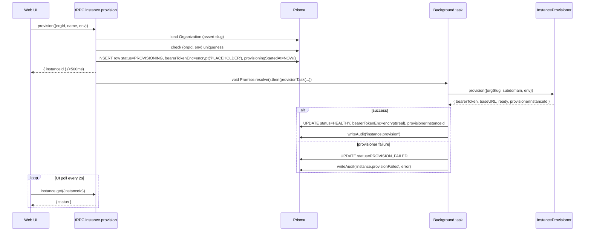
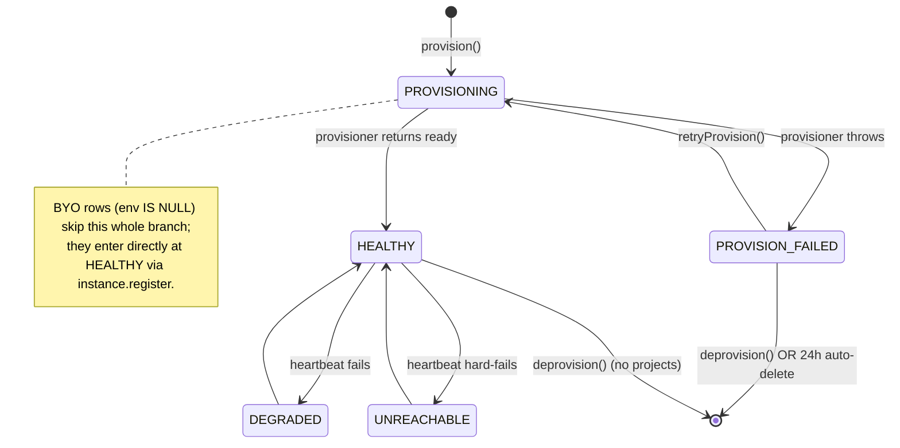

# Design: add-instance-auto-provisioning

## Context

ControlAI daemons are long-running HTTPS services (~256MB / 0.25 vCPU effective) that the dashboard talks to over a small REST surface. Today they are stood up by hand on bin-packed EC2 instances (multiple daemon containers per box), and the bearer token is handed to customers manually. We want a deterministic, programmatic way to spawn one per customer org on a derived URL, capture the token, and store it encrypted.

This spec deliberately scopes to the **dashboard-facing contract** (DB schema, tRPC procedures, UI, pluggable provisioner interface, mock implementation). The **real EC2 container scheduler** that picks a node, allocates a port, wires ingress, and injects the token is a non-trivial follow-up design that warrants its own spec — we do not pre-commit to its shape here.

The provisioner interface is provider-agnostic by construction: the follow-up implementation can be an EC2 bin-pack scheduler, a Nomad/k3s/ECS adapter, or anything else that fits the contract. Nothing in v1 needs to change when that lands.

## Goals / Non-Goals

**Goals**
- One-click provision flow for org owner/admin: pick env → click Provision → row created, UI polls until `HEALTHY` or `PROVISION_FAILED`.
- Server-derived URLs (`{slug}-{env}.{DAEMON_BASE_DOMAIN}`); user never types a URL.
- Plaintext bearer token never persisted; only `encryptToken()` output goes to DB.
- BYO path (`instance.register`) stays bit-for-bit identical.
- Pluggable `InstanceProvisioner` interface so the real EC2 backend can ship without changing the procedure layer.
- Mock implementation is fully functional for tests, local dev, and end-to-end UI verification before the real scheduler exists.

**Non-Goals**
- Real EC2 bin-pack container scheduler — separate follow-up spec.
- Region geo-routing — URL shape is forward-compatible.
- Token rotation.
- Customer-BYO custom domain for the dashboard.
- Daemon version upgrades / blue-green redeploys.
- Multi-daemon-per-(org,env) — explicit 409 today.
- Provider alternatives (Fly.io / Railway / Render / K8s as separate backends) — interface allows them but none ship.

## Decisions

### Subdomain derivation

`baseURL = https://${org.slug}-${env}.${DAEMON_BASE_DOMAIN}`

- `org.slug` already exists `@unique` on `Organization` (schema.prisma:78), satisfies `/^[a-z][a-z0-9-]{1,63}$/`. **Immutable** once set; org rename does not change slug. Enforced socially in v1 (no UI to edit slug); a future change can add coordinated URL migration if ever needed.
- `env ∈ { 'prod', 'staging', 'dev' }`, enum-validated by Zod.
- `DAEMON_BASE_DOMAIN` is the apex (e.g. `daemons.controlai.io`). The DNS + TLS strategy for terminating this wildcard is the follow-up scheduler spec's problem — not v1's.
- Region is **not** part of v1's URL but the format `{slug}-{env}[-{region}]` is forward-compatible: adding a region segment later is purely additive.

### Collision rule

One managed daemon per `(orgId, env)`. Enforced via a partial unique index:

```sql
CREATE UNIQUE INDEX "ControlaiInstance_orgId_env_unique"
  ON "ControlaiInstance" ("orgId", "env")
  WHERE "env" IS NOT NULL;
```

Attempting to provision a second daemon for the same (org, env) returns 409 CONFLICT. BYO rows (`env IS NULL`) are exempt and may co-exist with managed rows of any env.

### Provision flow (async, return-immediately)



The "background task" in v1 is `void Promise.resolve().then(() => provisionTask(...))` fired from the procedure — a deliberately minimal in-process job. We do not introduce a queue (BullMQ, pg-boss, etc.) yet; the operation is O(1) per request and the mock impl is synchronous-fast. The real scheduler's spec will decide whether durable queueing is needed.

If the Next.js process is killed mid-provision, the row stays in `PROVISIONING` indefinitely until `instance.retryProvision` is invoked. We rely on the stuck-row UI flag (>10min in `PROVISIONING`) and operator-driven retry rather than a durable queue.

### State machine



### Provisioner contract

`packages/api/src/lib/instance-provisioner.ts`:

```ts
export interface InstanceProvisioner {
  provision(args: {
    orgId: string;
    orgSlug: string;
    subdomain: string;                // already-derived
    env: 'prod' | 'staging' | 'dev';
  }): Promise<{
    bearerToken: string;              // plaintext, immediately encrypted by caller
    baseURL: string;                  // https://${subdomain}.${DAEMON_BASE_DOMAIN}
    ready: boolean;                   // true if daemon already responded to /healthz
    provisionerInstanceId: string;    // opaque ID for deprovision (container id, machine id, pod id, etc.)
  }>;
  deprovision(args: {
    provisionerInstanceId: string;
    baseURL: string;
  }): Promise<void>;
}

export function getProvisioner(): InstanceProvisioner;
```

The factory keys on `process.env.INSTANCE_PROVISIONER`. v1 only accepts `mock` (or unset, defaulting to `mock`). Any other value throws at startup with a clear error pointing at the follow-up spec.

We persist `provisionerInstanceId` (nullable text) on `ControlaiInstance` so `deprovision()` knows what to tear down. Mock returns `mock-${cuid()}`; real impls will return a container id / machine id / pod id depending on backend.

### Why no real provisioner in v1

The real backend will run **bin-packed daemon containers across multiple EC2 instances**. That implementation has its own design surface:

- Capacity discovery: which EC2 hosts have free CPU/RAM/port range?
- Scheduling: which host to place the next daemon on?
- Networking: container port allocation + ingress routing (ALB host rules vs nginx/Caddy reverse proxy on each box).
- TLS: wildcard `*.daemons.controlai.io` cert termination strategy.
- Token bootstrap: env var injection vs SSM Parameter Store vs in-container fetch.
- BYO-domain hooks: customers will later point their own domain at the monitoring dashboard surface; the ingress layer must accommodate this.
- Lifecycle: container restart on host failure, draining for host maintenance.
- Observability: per-daemon resource usage, eviction policy under contention.

Cramming any of that into this spec would either rush the design or balloon the scope. Shipping the contract + mock first means the dashboard side is real and demoable, the data model is locked, and the follow-up spec can focus purely on the scheduler.

### Stuck-row policy

A periodic cleanup tick (in-process `setInterval` started from `apps/web/instrumentation.ts` with a global-symbol guard to survive HMR):

- `PROVISIONING` rows older than 10 minutes → flag in UI ("stuck — retry?") but do not auto-delete; user may still want to recover via retryProvision.
- `PROVISION_FAILED` rows older than 24 hours with no retry attempt → call `provisioner.deprovision()` if `provisionerInstanceId` is set (best-effort, errors swallowed), then delete the DB row and write audit `instance.autoCleanup`.

The cleanup transaction re-reads the row before deletion so a user-driven retry mid-tick is not stomped.

### Audit actions

- `instance.provision` — on success, metadata `{ env, baseURL, provisionerBackend }`.
- `instance.provisionFailed` — on failure, metadata `{ env, error: { code, message }, provisionerBackend }`.
- `instance.retryProvision` — metadata `{ previousStatus }`.
- `instance.deprovision` — metadata `{ provisionerBackend, projectsCheckedCount }`.
- `instance.autoCleanup` — metadata `{ reason: 'failed-24h', deprovisionAttempted }`.

### Migration strategy

Hand-written SQL (shadow DB broken — follow precedent of prior specs):

```sql
-- <timestamp>_add_instance_provisioning/migration.sql
ALTER TYPE "InstanceStatus" ADD VALUE IF NOT EXISTS 'PROVISIONING';
ALTER TYPE "InstanceStatus" ADD VALUE IF NOT EXISTS 'PROVISION_FAILED';

ALTER TABLE "ControlaiInstance"
  ADD COLUMN "env" TEXT,
  ADD COLUMN "provisioningStartedAt" TIMESTAMP(3),
  ADD COLUMN "provisionerInstanceId" TEXT;

CREATE UNIQUE INDEX "ControlaiInstance_orgId_env_unique"
  ON "ControlaiInstance" ("orgId", "env")
  WHERE "env" IS NOT NULL;
```

Backwards compatible: existing rows get `env=NULL`, exempted from the partial unique index, untouched by all new procedures.

## Risks / Trade-offs

| Risk                                                                                         | Mitigation                                                                                                                   |
| -------------------------------------------------------------------------------------------- | ---------------------------------------------------------------------------------------------------------------------------- |
| In-process background task lost on Next.js crash → row stuck in PROVISIONING               | 10-minute UI flag + retryProvision; the follow-up scheduler spec can introduce a durable queue if needed.                    |
| Mock provisioner masks real-world failure modes from the UI                                  | Mock returns `ready: true` but is intentionally crude. Manual QA against the real backend happens in the follow-up spec's verification phase. |
| Slug squatting (one org reserves "acme" before the real Acme signs up)                     | Out of scope; rely on existing org-create UX and admin recovery. Slug uniqueness is already enforced.                        |
| Plaintext token in memory during the brief window between provisioner response and `encryptToken()` | Encrypt synchronously in the same async tick; never log; redact in DaemonError stack traces.                                 |
| Auto-delete of PROVISION_FAILED races with user clicking Retry                              | Cleanup re-reads row + status in a transaction; if status changed, skip.                                                     |
| Cost runaway from abusive provisions                                                         | Per-(org,env) uniqueness caps at 3 managed daemons per org (one per env). Future: per-org daemon-count quota.                |
| Provisioner contract changes once the real backend is designed                              | Interface kept deliberately small (4 input fields, 4 output fields). If a field must change, that's a follow-up migration; the v1 mock would be updated in lockstep. |

## Migration Plan

1. Land schema migration (additive, zero downtime).
2. Ship `mock` provisioner + procedures + UI — internal testing with `INSTANCE_PROVISIONER=mock`.
3. End-to-end QA: provision → poll → HEALTHY → deprovision flow works against mock.
4. Ship the follow-up `Ec2ContainerProvisioner` spec separately when scheduler design is ready.
5. Flip `INSTANCE_PROVISIONER=ec2` in staging then production.
6. Rollback at any point = revert env var to `mock` (no schema rollback needed; nullable columns).

## Open Questions

None remaining for v1. All decisions answered upfront via user interview:
- Real provisioner deferred to follow-up spec; v1 ships contract + mock only.
- Immutable slug, async-return-and-poll, 409 collision, deprovision with project-guard, 24h auto-delete failed rows, no feature flag, no region in v1.

Follow-up spec (`add-ec2-container-provisioner`, name TBD) will resolve:
- Capacity discovery + scheduling algorithm.
- Ingress / TLS termination strategy.
- Token bootstrap mechanism.
- BYO custom-domain hook points.
- Per-host lifecycle (restart, drain, evict).
