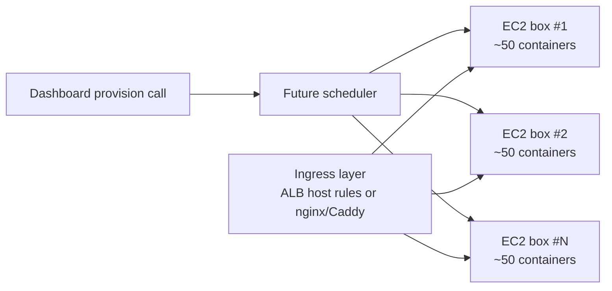

# Research References — add-instance-auto-provisioning

## Why the real provisioner is deferred to a follow-up spec

The dashboard contract (DB schema, tRPC procedures, provisioner interface, UI) and the actual container-scheduling implementation are two separable design surfaces. Forcing them into one spec would either rush the scheduler design or balloon this change. v1 ships the dashboard-facing contract + a mock provisioner that is fully exercisable for tests, local dev, and demoable UI. The real backend lands in a dedicated follow-up.

## Target architecture (informational, for the follow-up spec)

The chosen direction (decided in the design interview) is **bin-packed daemon containers across existing EC2 instances**:

Cost target: ~$0.60/daemon/mo at 50 daemons per t3.medium (~$30/mo). 3–4× cheaper than any managed PaaS at the same per-customer isolation level, and leverages an EC2 operational surface the team already owns.

## Why not Fly.io / Railway / Render / K8s as the v1 real backend

Earlier draft of this spec proposed Fly.io as the v1 real backend (research doc at `.slash/workspace/research/cost-daemon-provisioner-providers.md`). That recommendation was made before the bin-pack-on-existing-EC2 architecture was disclosed. Once that context surfaced, the comparison flipped:

| Option                                  | $/daemon/mo | Why not for v1                                                                      |
| --------------------------------------- | ----------- | ----------------------------------------------------------------------------------- |
| **Bin-packed EC2 containers (chosen, deferred)** | **~$0.60**      | Right answer; needs its own spec                                                    |
| Fly.io Machines (1 machine = 1 daemon)  | ~$2.00      | Anti-bin-pack model. New control plane + bill on top of existing AWS surface.       |
| Railway hobby                           | $7.57       | GraphQL-only API, more friction, no advantage.                                      |
| Render starter                          | $7.00       | Custom-domain story limited per service.                                            |
| GKE bin-packed                          | ~$2.00      | Only wins at 1000+ daemons; adds ops complexity vs already-owned EC2.               |
| One EC2 per customer (no bin-pack)      | ~$3-7.50    | Stronger isolation but burns money at small scale.                                  |

## What the follow-up scheduler spec will cover

Open design surface deferred to `add-ec2-container-provisioner` (or similar name):

- **Capacity discovery:** which EC2 hosts have free CPU/RAM/port range? Static config? Tags? SSM inventory?
- **Scheduling algorithm:** least-loaded? round-robin? fixed assignment by org id hash?
- **Networking:** container port allocation strategy; ingress routing via ALB host rules vs nginx/Caddy reverse proxy on each box.
- **TLS termination:** wildcard `*.daemons.controlai.io` cert — at ALB via ACM, or at per-host Caddy via Let's Encrypt?
- **Token bootstrap:** container env var at start vs SSM Parameter Store fetch on boot.
- **Lifecycle:** restart on host failure, drain for host maintenance, eviction under contention.
- **Observability:** per-daemon resource usage, host-level capacity dashboards.
- **Customer-BYO custom domain hook:** ingress must accommodate customers pointing their own domain at the dashboard monitoring surface.

## Provisioner contract stability

The interface defined in `instance-provisioner.ts` (4 input fields, 4 output fields, plus `deprovision`) is deliberately minimal. The follow-up backend must fit this contract; if the contract proves insufficient, that's a follow-up migration plus a mock impl update — but the procedure layer, DB schema, audit actions, and UI are insulated.

## Prior art for the async-return-and-poll UX

- **Vercel** project provisioning — instant URL on create, status polling, retry on failure.
- **Render** "Deploy from Repo" — async create with status pill.
- **Supabase** project provisioning — multi-minute waits with progress UI; informs our 60s soft budget choice.
